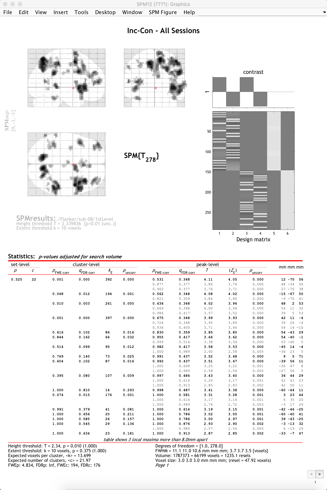

.. _SPM_06_Stats_Running_1stLevel_Analysis:

===========================================
Chapter 6: Running the First-Level Analysis
===========================================

---------

Specifying the Model
********************

Having created the timing files in the :ref:`previous chapter <SPM_05_Creating_Timing_Files>`, we can use them in conjunction with our imaging data to create statistical parametric maps. These maps indicate the strength of the correlation between our ideal time-series (which consists of our onset times convolved with the HRF) and the time-series that we collected during the experiment. The amount of modulation of the HRF is represented by a beta weight, and this in turn is converted into a t-statistic when we create contrasts using the SPM contrast manager.

To begin, from the SPM GUI click on ``Specify 1st-Level``. Note that the first field that needs to be filled in is the ``Directory`` field. To keep our results organized, go to the Matlab terminal, navigate to the ``sub-08`` directory, and type ``mkdir 1stLevel``. Then double-click on ``Directory`` and select the ``1stLevel`` directory you just created. All of the output of the 1st-level analysis will go into this folder.

Next, we will fill in the Timing parameters section. Under ``Units for design``, select ``Seconds``, and enter a value of ``2`` for ``Interscan Interval``. Then click on ``Data & Design``, and click twice on ``New: Subject/Session`` to create two new sessions. For the ``Scans`` of the first session, go to the ``func`` directory and use the Filter and Frames fields to select all 146 volumes of the warped functional data (i.e., those files beginning with ``swar``). Do the same for the volumes in the second session.

Go back to the field for the first session. There are two conditions in the experiment, and both conditions occur in each run. Click on ``Conditions`` and then ``New: Condition`` twice to create two new Condition fields. For the first condition, double-click on ``Name`` and type ``Inc``.

We will now need the onset times for each occurrence of the Incongruent condition. From the Matlab terminal, navigate to the ``func`` directory and type:

::

  IncRun1 = importdata('incongruent_run1.txt', ' ');
  IncRun1(:,1)
  
Which will return the onset times for the Incongruent condition of run 1. Double-click on the ``Onsets`` field, and copy and paste the onset times into the window. Click ``Done``. 

In this experiment each trial lasted for 2 seconds. We can therefore enter the number ``2`` in the ``Durations`` field, and SPM will assume that it is the same duration for every trial.

Now do the same procedure for the Congruent condition for run 1, and the Incongruent and Congruent conditions for run 2, remembering to enter a duration value of 2 for all of them. Here is the code to display the onset times for each of the remaining onset times that you will need:

::

  ConRun1 = importdata('congruent_run1.txt', ' ');
  ConRun1(:,1)
  IncRun2 = importdata('incongruent_run2.txt', ' ');
  IncRun2(:,1)
  ConRun2 = importdata('congruent_run2.txt', ' ');
  ConRun2(:,1)

You can use the names "Inc" and "Con" for both runs if you want; the names will be stored in a file called ``SPM.mat`` which we will look at later in more detail.

When you are done, click the green Go button. The model estimation should only take a few moments. When it is finished, you should see something like this:

.. figure:: 05_06_Design_Review.png

  The General Linear Model for a single subject. The first two columns shows the ideal time-series for the Incongruent and Congruent conditions for the first session, while the next two show the ideal time-series for the conditions of run 2. The last two columns are basline regressors capturing the mean signal for each run. In this representation, time runs from top to bottom, and lighter colors represent more activity.
  
  
Estimating the Model
********************

Now that we have created our GLM, we will need to **estimate** the beta weights for each condition. From the SPM GUI click ``Estimate``, and then double-click on the field ``Select SPM.mat``. Navigate to the ``1stLevel`` directory and select the SPM.mat file, and then click the green Go button. This will take a few minutes to run.

The Contrast Manager
********************

When you have finished estimating the model, you are ready to create **contrasts**. If we estimate a beta weight for the Incongruent condition and a beta weight for the Congruent condition, for example, we can take the difference between them to calculate a **contrast estimate** at each voxel in the brain. Doing so for each voxel will create a **contrast map**.

To create these contrasts, click on the ``Results`` button of the SPM GUI, and select the SPM.mat file that was generated after estimating the model. You will see the design matrix on the right side of the panel. Click on ``Define New Contrast``, and in the ``Name`` field type ``Inc-Con``. In the contrast vector window, type ``0.5 -0.5 0.5 -0.5``, and then click ``submit``. If the contrast is valid, you should see green text at the bottom of the window saying "name defined, contrast defined". Make sure that you contrast manager looks like the figure below, and then click ``OK`` to create the contrast.

.. note::

  If you forgot which column corresponds to which condition, hold down the right click button while hovering over one of the columns. You should see text that specifies which condition that column belongs to.
  You may have also noted that we used **contrast weights** of 0.5 and -0.5. Why those numbers, instead of the traditional 1 and -1? In this case, we are accounting for the number of runs in our study - To make our results comparable to other subjects or other studies that may have different amounts of runs, we will divide our contrast weights of 1 and -1 by the number of runs that we have: e.g., 1/2 = 0.5, and -1/2 = 0.5. If we used a contrast vector of [1 -1 1 -1], the resulting t-statistic would be the same, but the contrast estimate would be inflated in proportion to the number of runs in our study.

Examining the Output
********************

Double-click on the contrast ``Inc-Con`` to open the Results window. You will first need to set a few options:

::

  apply masking: Set this to "none", as we want to examine all of the voxels in the brain, and we do not want to restrict our analysis to a mask.
  p value adjustment to control: Click on "none", and set the uncorrected p-value to 0.01. This will test each voxel individually at a p-threshold of 0.01.
  & extent threshold {voxels}: Set this to 10 for now, which will only show clusters of 10 or more contiguous voxels. Right now we're doing this to eliminate specks of voxels most likely found in noisy regions, such as the ventricles; later on we will learn how to do **cluster correction** at the group level to appropriately control for the number of individual statistical tests.
  

When you have finished specifying the options, you will see your results displayed on a **glass brain**. This shows your results in standardized space in three orthogonal planes, with the dark spots representing clusters of voxels that passed our statistical threshold. In the top-right corner is a copy of your design matrix and the contrast that you are currently looking at, and at the bottom is a table listing the coordinates and statistical significance of each cluster. The first column, **set-level**, indicates the probability of seeing the current number of clusters, *c*. The **cluster-level** column shows the significance for each cluster (measured in number of voxels, or *kE*) using different correction methods. The **peak-level** column shows the t- and z-statistics of the peak voxel within each cluster, with the main clusters marked in bold and any sub-clusters listed below the main cluster marked in lighter font. Lastly, the MNI coordinates of the peak for each cluster and sub-cluster is listed in the rightmost column.

If you left-click on the coordinates for a cluster, the coordinates will be highlighted in red and the cursor in the glass brain view will jump to those coordinates. You can click and drag the red arrow header in the glass brain if you like, and then right-click on the brain and select any of the options for jumping to the nearest suprathreshold voxel or the nearest local maximum.

To view the results on an image other than the glass brain, in the results window in the lower left (which contains the fields "p-values", "Multivariate", and "Display"), click on ``overlays`` and then select ``sections``. Navigate to the ``spm12/canonical`` directory, and choose any of the T1 brains that you like. In this case, I will select the avg152 brain.

You will now see the results displayed as a heatmap on the template, and you can click and drag the crosshairs as you do in the Display window. If you place the crosshairs over a particular cluster and click the "current cluster" button in the Results window, the statistical table will reappear, highlighting the coordinates of the cluster you have selected.

.. note::

  If you want to quickly reload the display of the results on the template brain, click on ``overlays`` and select ``previous sections``.

Exercises
*********

1. Open the contrast manager window again by clicking the ``Results`` button, and create contrasts of "Con-Inc", "Inc", and "Con". Try figuring out the contrast vectors on your own before reading the correct ones provided below:

::

  Con-Inc: [-0.5 0.5 -0.5 0.5]
  Inc: [0.5 0 0.5 0]
  Con: [0 0.5 0 0.5]
  
Estimating the beta weight for each condition individually will be important later on when we do Region of Interest analysis to determine what is driving our contrasts.

Next Steps
**********

When you have finished running the preprocessing and first-level analyses, we will then need to run this for each subject in our study. To speed up the process, we will learn about **scripting**, to which we now turn.

Video
*****
