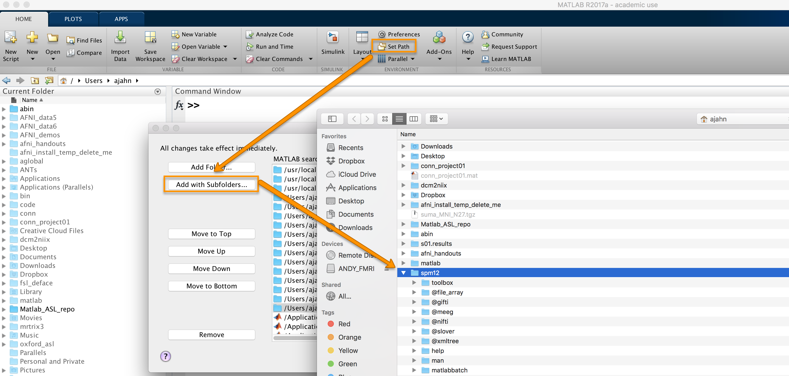
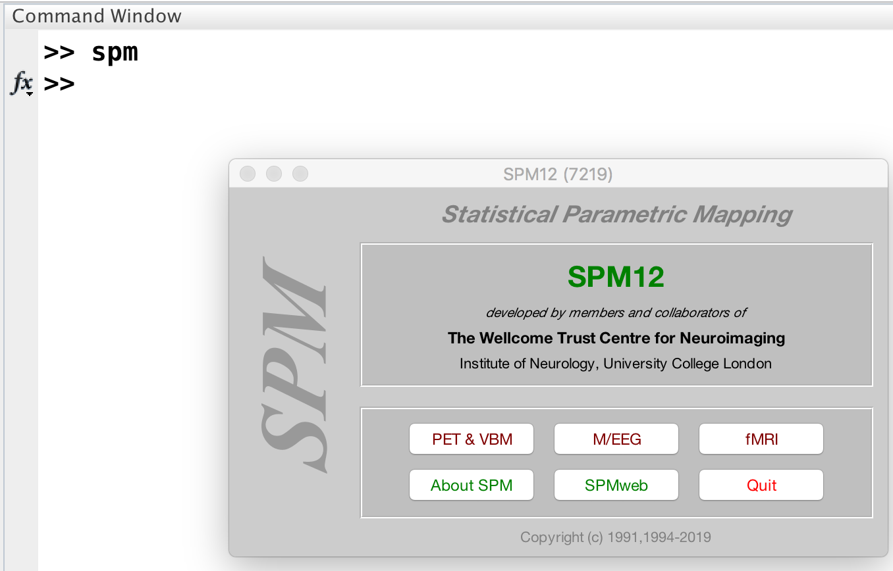

.. _SPM_fMRI_Intro:

==============
Introduction to AFNI
==============

------------

This course will show you how to analyze an fMRI dataset from start to finish. We will begin by **downloading a sample dataset** and inspecting the anatomical and functional images for each subject. We will then **preprocess the data**, which removes noise and enhances the signal in the images. Once the images have been preprocessed, we will create a model representing what we think the :ref:`BOLD signal <BOLD_Response>`, a measure of neural activity, should look like in our images. During **model fitting** we compare this model with the signal in different areas of the image. This model fit is a measure of the strength of the signal under different conditions - for example, we can take the difference of the signal between conditions A and B of the experiment to see which condition leads to a larger BOLD response.

Once a model has been created for each subject and the BOLD response has been estimated for each condition, we can do any kind of group analysis we like: Paired t-tests, between-group t-tests, interactions, and so on. The goal of this course is to calculate a simple within-subjects contrast between two conditions, and test whether it is significant across subjects. You will also learn how to create figures showing whole-brain analyses, similar to what you see published in the neuroimaging journals, and how to do a region of interest (ROI) analysis.

This course is designed to build your confidence in working with fMRI data, increase your fluency with the basic terms of fMRI analysis, and help you make educated choices during each step. Some chapters have exercises to help you practice what you've learned and to prepare you for the next chapter. Once you have mastered the fundamentals of this course, you will be able to apply them to other datasets of your choosing.

Downloading and Installing SPM
******************************

Unlike AFNI or FSL, SPM is able to run on any operating system as long as it has Matlab installed. Matlab is proprietary software that is muy expensivo, but if you are a student or university employee you may be able to obtain a copy for free. Once you have installed Matlab, the `SPM website <https://www.fil.ion.ucl.ac.uk/spm/software/spm12/>`__ has instructions on how to install the software package. Click on the "download form" button to fill out some personal details such as your position and what you will be using the software for, which will enable you to download the software.

Once you have downloaded the SPM package, place it your home directory. Open up Matlab, click on the "Home" tab, and then click the "Set Path" button. Select the ``spm12`` direcotry, and then click open. Click the "Save" button to ensure that the path is set every time Matlab is opened, and then close the window.

After you have set the path, type the following from the Matlab terminal:

::

  spm
  
Which will open up the following window:

Click on the fMRI button to open the SPM fMRI GUI.

.. note::

  Assuming that you are just using the fMRI part of the SPM package, you can type ``spm fmri`` from the command line to open up the fMRI analysis GUI.
  
You are now ready to download the Flanker dataset, which we now turn to.

.. note::
    This course will not be covering MRI physics in depth. For a review of that topic, I recommend chapters 1-5 of the book *Functional Magnetic Resonance Imaging*, by Huettel, Song, & McCarthy (3rd Edition). Also see Allen Elster's excellent `MRI Questions <http://mriquestions.com/index.html>`__ website for useful illustrations of MRI concepts.

Video
******
