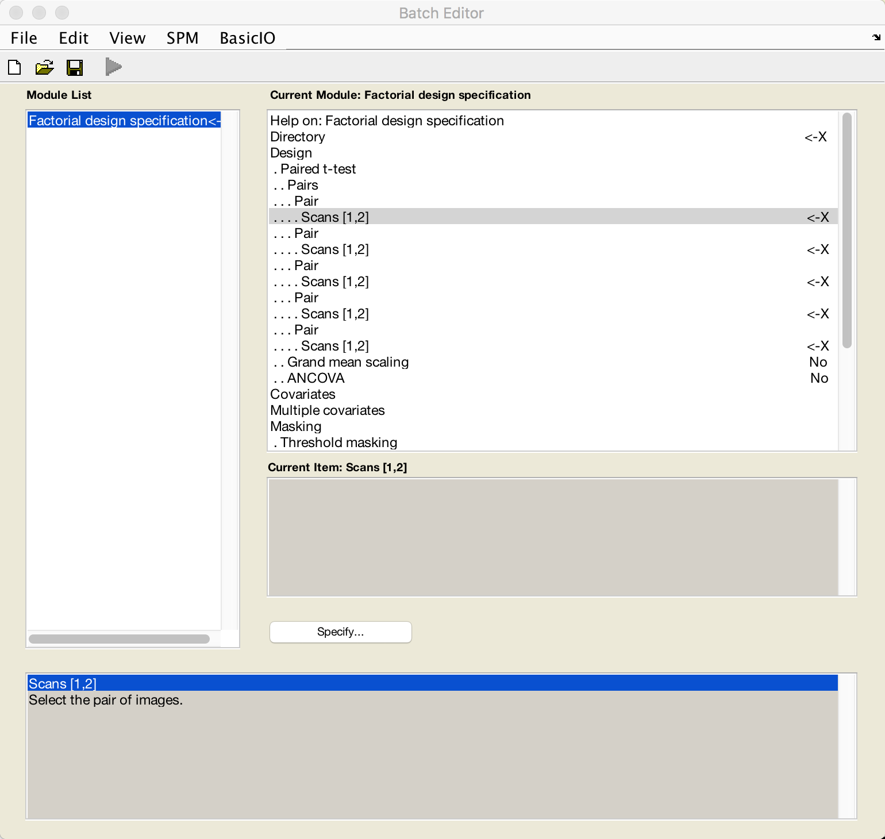
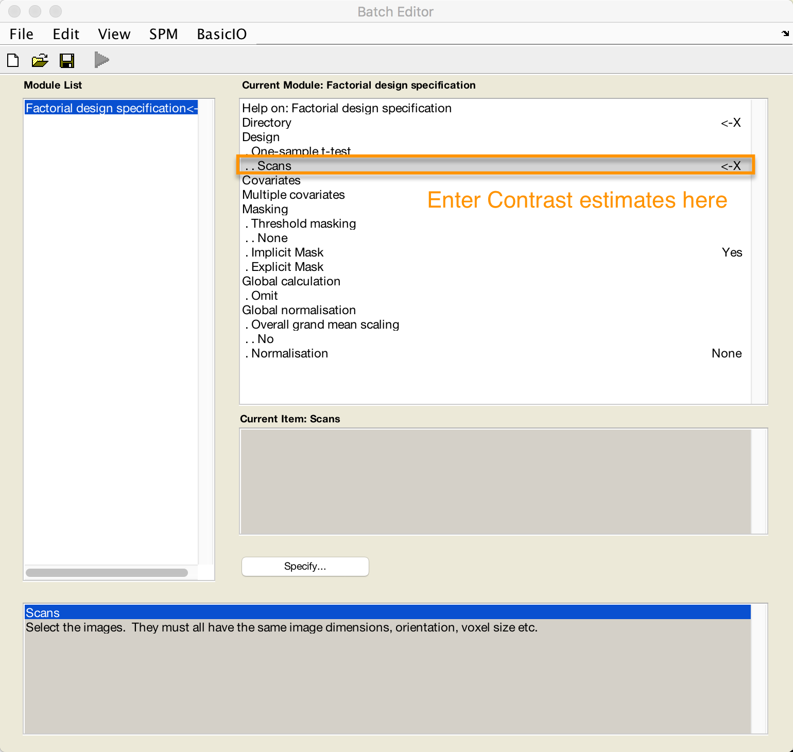

.. _SummaryStatistics:

==============================
Appendix A: Summary Statistics
==============================

-----------

For a paired-samples t-test in SPM, you have two options:

1. Enter each pair of images (e.g., beta weight A and beta weight B) for each subject for the second-level analysis. From the SPM GUI, if you click on "Specify 2nd-level", and then from the "Design" menu select "Paired t-test", you will be prompted to select a pair of images for each subject.

2. You can use the **Summary Statistics** approach, which performs a one-sample t-test on the contrast of each pair for each subject. This would mean taking the contrast between each pair of beta weights to get a single contrast image per pair, and then doing a one-sample t-test on those contrast estimates. If the variance between the beta weights is identical (or at least very similar), this approach is valid. The summary statistics approach is robust against violations of this assumption of equal variance.

