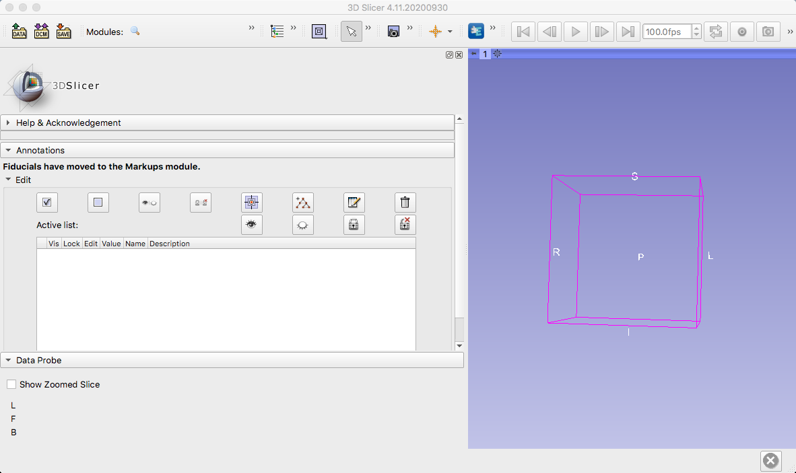

.. _Slicer_Overview.rst

===============
Slicer Overview
===============

---------------

What is Slicer?
***************

`Slicer <https://download.slicer.org/>`__ is an open-source program for visualizing medical data, including fMRI, diffusion weighted images, and structural images. You can download extensions to perform more advanced analyses as well, such as Image Guided Therapy (IGT).

The following chapters will step through each of the dependencies and pieces of code you will need to register an object (e.g., a phantom) with the Slicer GUI. When you are finished, you will be able to visualize how a tracker, such as a stylus, is represented within the image - for example, by being able to see the location of the stylus within a three-dimensional MRI of the image you are probing.

.. toctree::
   :maxdepth: 1
   :caption: Start to Finish Analysis with SPM

   Slicer_Short_Course/Slicer_00_Download_Extensions
   Slicer_Short_Course/Slicer_01_PLUS_Config
   Slicer_Short_Course/Slicer_02_Motive
