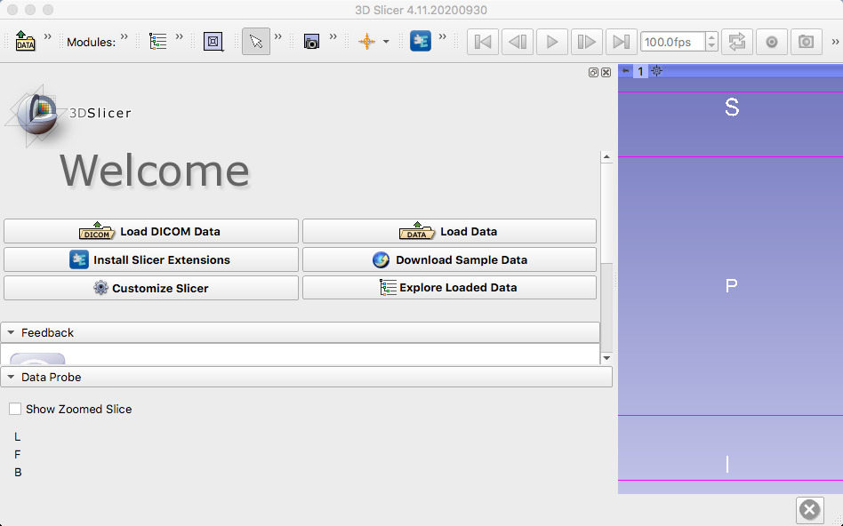
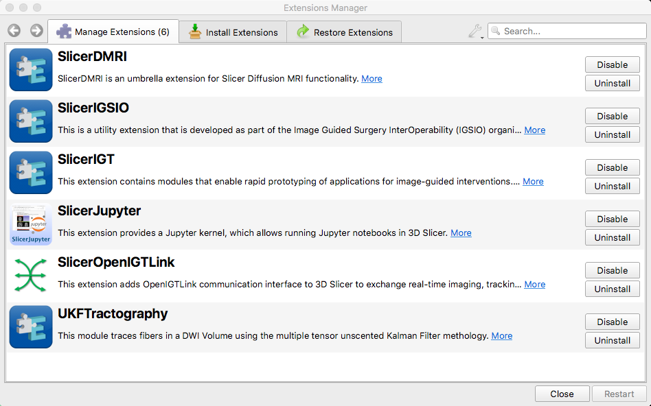

.. _Slicer_01_Download_Extensions:

===========================================
Slicer Tutorial #1: Download and Extensions
===========================================

Overview
--------

Slicer can be downloaded `here <https://download.slicer.org/>`__. Select the version the corresponds to your operating system, and you should be able to open it like any other application.

Once you have downloaded slicer and opened it up, the home GUI will look something like this:

Extensions can be downloaded by clicking on the "Install Slicer Extensions" button. You will need to install the following extensions:

1. SlicerIGT
2. SlicerOpenIGTLink
3. SlicerJupyter

When you are finished, the Manage Extensions tab should look like this:

These extensions, and in particular SlicerOpenIGTLink, allows Slicer to communicate with an intermediary between the software package and an external optical tracking software, such as OptiTrack. To see how to download this intermediary software, known as PLUS, click the ``Next`` button.
