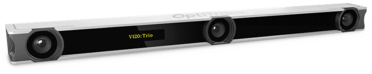
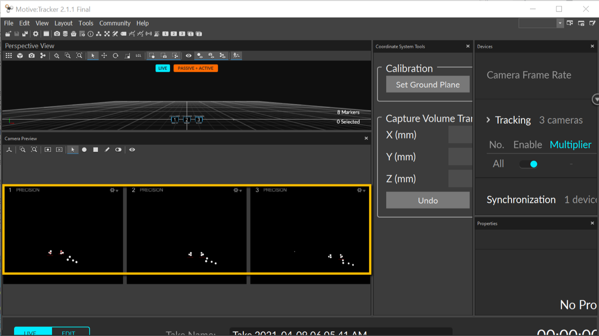
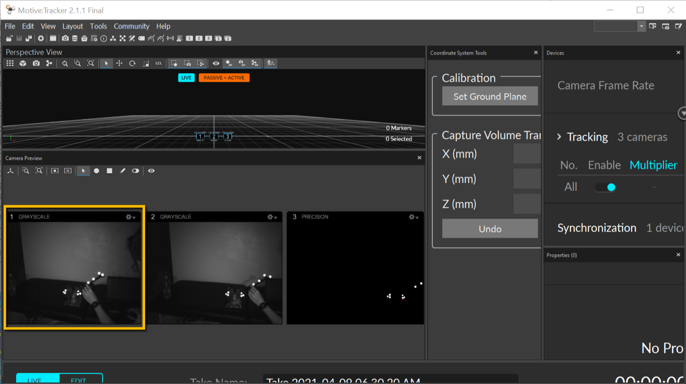
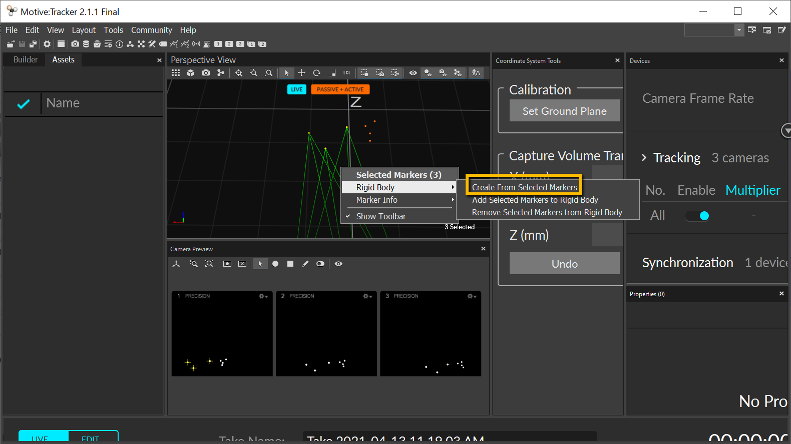
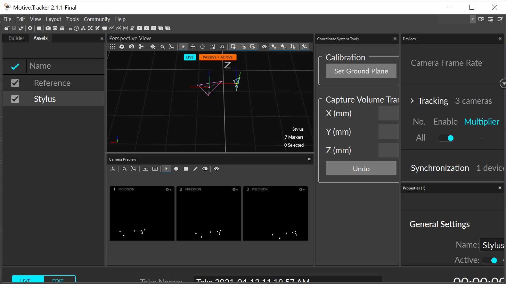

.. _Slicer_03_Motive:

==========================
Slicer Tutorial #3: Motive
==========================

----------

Overview
********

Motive is a software package that is used with the OptiTrack tracking system. For example, in this walkthrough I am using an OptiTrack Trio system, which contains three cameras. This setup is designed to provided high-resolution imaging on an object from different angles, in order to use it with a tracking object such as a **stylus**.

  The OptiTrack Trio system.

The OptiTrack cameras are sensitive to high-reflective surfaces, which will show up in high contrast to the background. Small, reflective-coated balls called **markers** are placed on the objects you want to image, such as the stylus or the reference object. Since the relative distance between the markers of an object should be constant, OptiTrack will be able to track them no matter at what angle the object is presented.

.. figure:: 02_Stylus.png

Creating a Profile XML File
***************************

Previous versions of Motive (1.x) used **projects** to organize the data that was being viewed at a given time. For more recent versions of Motive (2.x), the data is saved as a **profile** in .xml format.

When you first open Motive, you will see the following layout:

The top window pane is the **Perspective View**, a combination of all of the three cameras on a viewing plane. The three windows highlighted in orange are the views in each individual camera; the default, **Precision View**, is sensitized to the reflective markers, which show up as bright dots against a black background. For a better picture of the entire scene, you can right-click in any one of the viewing windows and select **Grayscale**, which will display a grayscale recording from that particular camera's feed:

In order to create a profile that can be read by PLUS (which we will cover in the next chapter), we will need to create **rigid bodies** that can be detected by OptiTrack, no matter what angle they are being viewed from. Within the perspective view, hold down the right-click button and drag to change the tilt of the perspective, and use the mouse wheel or scroll function of your mousepad in order to zoom in or out. Find a perspective that includes both the stylus and the reference object, and then left-click and drag to select the three markers of the reference object. They will now be highlighted, with lines indicating how each camera is focused on each marker of the object. Right click anywhere in the perspective window and select ``Create from Selected Markers``. Do the same procedure for the Stylus object.

Now click on ``View -> Assets Pane`` to see each rigid body that has been highlighted. Rename the first item in the list to ``Reference``, and the second object to ``Stylus``. These labels will be used in the XML file to indicate which object we will be focusing on in Slicer.

When you have renamed your rigid body objects, click on ``File -> Export Profile As...``, and save the project as ``MyProfile``. (In this tutorial, I will be saving the profile and any related files into a directory I created on my Desktop called ``MyExp``; you can call the folder whatever you want that helps you stay organized.)

Next Steps
**********

After you have saved your profile that contains your objects, we will be moving on to PLUS and Slicer for the remaining tutorials. You might return to Motive in order to see how the movement of the objects is updated on the screen, or to create new objects, but for the most part you will just need it running the background while you use Slicer. Make sure that the objects are on a dark, well-lighted surface, and that there are no other objects in the view of the cameras.

To see how to open the link between OptiTrack and Slicer, click the ``Next`` button.
