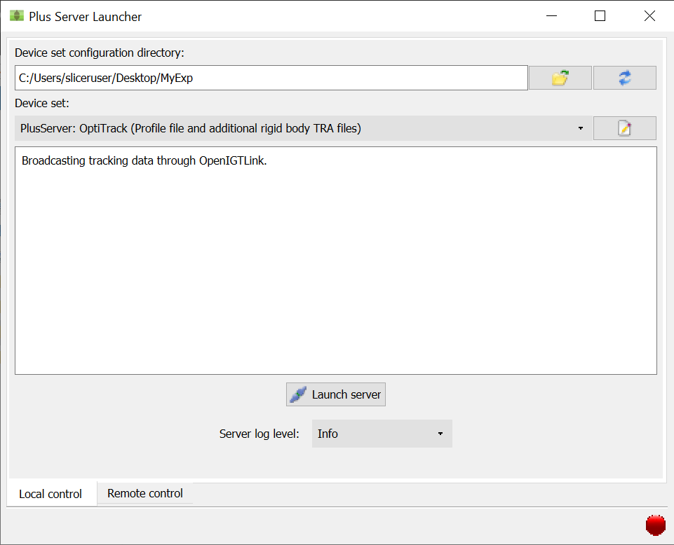
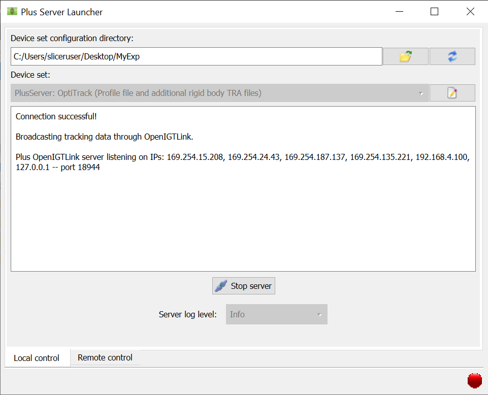

.. _Slicer_04_OpeningPLUSConnection:

===============================================
Slicer Tutorial #4: Opening the PLUS Connection
===============================================

---------------------

Opening the Connection
**********************

Now that we have both a profile XML file from Motive and a configuration XML file, we are ready to open a channel that lets the data being livestreamed from OptiTrack to be read by Slicer. As we mentioned before, PLUS is the intermediary between the two, creating a server that sends the data from OptiTrack to Slicer.

Search for ``PLUS Server Launcher`` and open the application. When it opens, you should see something like this:

Click on the folder icon, and then select the folder ``MyExp``. This will update the ``Device set`` dropdown menu with a selection of all available XML configuration files within the folder. (The pencil and paper icon to the right of the dropdown menu allows you to edit the currently selected configuration file if you want to.) The description of the currently selected configuration file will be displayed in the ``Device set`` field; select ``PlusServer: OptiTrack (Profile file and additional rigid body TRA files)``.

Launching the Server
********************

Now click the ``Launch server`` button. If everything is working correctly, you should see the following screen:

If there is an error, you can click on the red button in the lower right-hand corner to see a detailed error message; usually this is because either the profile file isn't in the current directory, or the port number is mis-specified. For the current tutorial, make sure that the port number in the configuration file is set to ``18944``. And lastly, if you need to stop the server at any time, just click the ``Stop server`` button.

Next Steps
**********

With a server listening to OptiTrack, we will now send the data from this connection to Slicer. To see how to do that, click the ``Next`` button.
