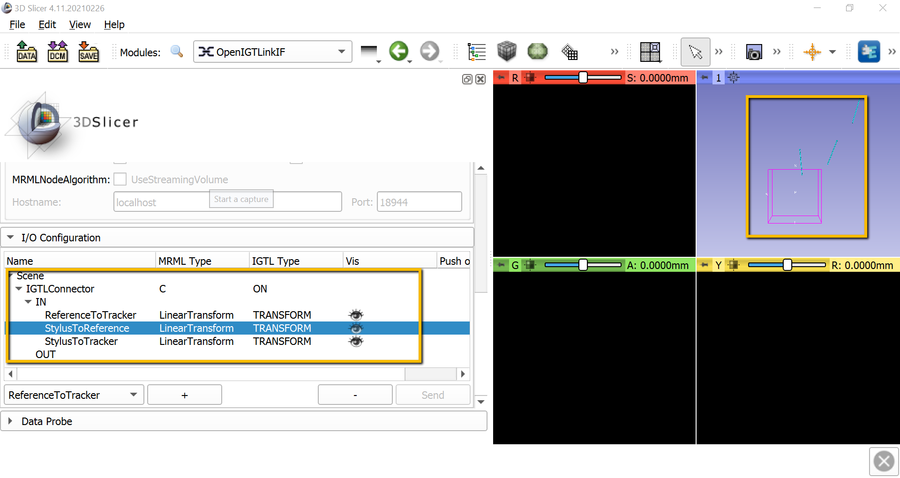
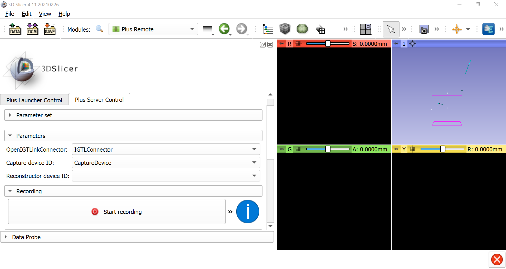
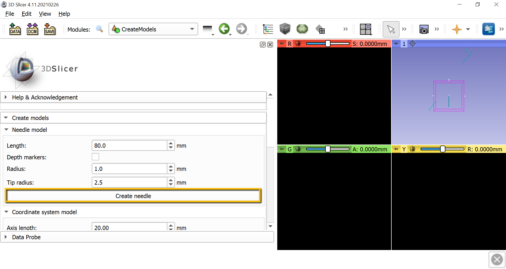
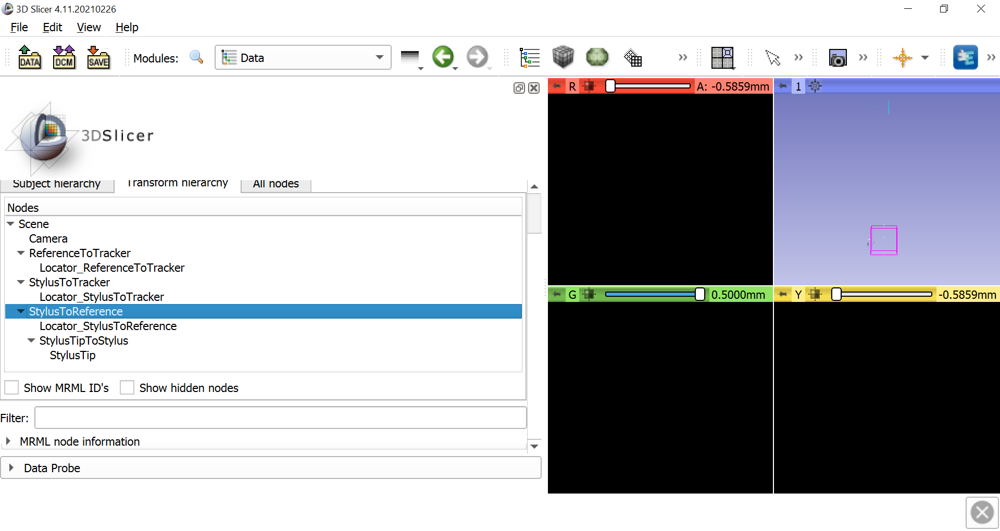
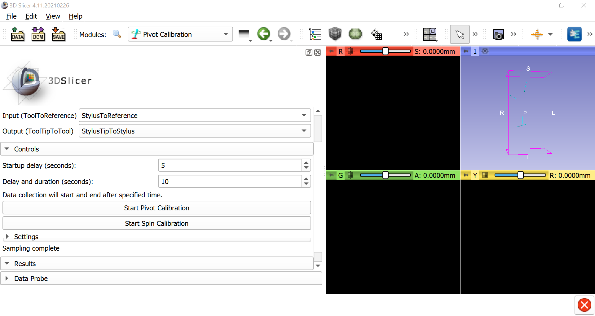

.. _Slicer_05_Calibration:

=======================================================================
Slicer Tutorial #5: Receiving the Connection and Calibrating the Stylus
=======================================================================

------------

Receiving the Connection
************************

With both OptiTrack and the PLUS server running in the background, we will open a receiving connection with Slicer. From the Modules dropdown menu, select ``IGT -> OpenIGTLinkIF``. This will display all of the available connectors; click the ``+`` sign to add a new one, and then scroll down and check the box next to ``Active``. If the connection has been opened successfully, you should see something like this:

.. figure:: 05_OpenConnection.png

Also scroll down to I/O Configuration, and click on the down arrow next to IGTLConnector, and click on the down arrow next to ``IN``. Click on each of the shut eyes next to ``ReferenceToTracker``, ``StylusToReference``, and ``StylusToTracker``. You should see light blue lines representing each of these objects in the 3D viewing pane.

.. note::

  If the markers don't show up anymore in one of the cameras in Motive, try right-clicking on the window pane for that camera in motive, select ``Settings``, and reduce the threshold until you can see the markers.

When the connection has been established, go back to the Modules dropdown window and select ``IGT -> Plus Remote``. Select the ``Plus Server Control`` tab, and under the ``Parameters`` section make sure that ``IGTLConnector`` is selected for the LinkConnector, and that ``CaptureDevice`` is selected for the Capture device ID. This will enable you to record the motion of the stylus and the reference object, and to replay it back as a **sequence** file later on.

Calibrating the Stylus
**********************

Our next step will be to **calibrate** the stylus. You may notice that the stylus has a tip, a handle, and four markers. The markers allow the stylus to be viewed by OptiTrack, but ultimately we want to know the position of the tip of the stylus, which we will use to probe certain areas of the reference object. If we assume that the distance between the tip of the stylus and the markers is constant (because it is a rigid body), we can calibrate the image by moving it in different directions in front of the OptiTrack cameras. By sampling the image from different angles, the cameras will know where both the body of the stylus and the tip of the stylus is at all times.

To calibrate the stylus, we will first need to create a **needle model** to represent the distance between the tip of the stylus and the body of the stylus. go to the module dropdown menu and select ``IGT -> CreateModels``.  In the screen that is now displayed, click the ``Create needle`` button. This will generate another blue line in the 3D window.

Now select the ``Data`` module from the dropdown menu and click on the ``Transform hierarchy`` tab. Right-click anywhere in the ``Nodes`` window pane and select ``Insert new transform``. Rename the new transform to ``StylusTipToStylus``, and click and drag the ``NeedleModel`` to go within the new transform. Rename NeedleModel to ``StylusTip``.

Once this is done, select ``IGT -> Pivot Calibration``. Change the Input to ``StylusToReference`` and the Output to ``StylusTipToStylus``. Then click on ``Start Pivot Calibration``, wait until the countdown finishes, and begin pivoting the stylus tip around a fixed point, either on the table or on the reference object. Make slow, smooth motions in a circle with the body of the stylus. After pivoting the stylus for the duration of the next countdown, you should see the Root-mean-square error in the Results section. This should be around 0.5mm, which represents the amount of error to expect when using the stylus as a tracker on an object.

You can do the same procedure for spin calibration; click on ``Start Spin Calibration`` and simply turn the body of the stylus from left to right and right to left continuously around a fixed point. The root-mean-squared error should also be very low, around 0.1 or less.

.. note::

  To improve the root-mean-square error, try increasing the ``Delay and duration`` field to a higher number, such as 10; more samples of pivoting and spinng will reduce the error. Also make sure the lighting is good, and make sure that the camera displays in the Motive application are thresholded appropriately.
  
  
Next Steps
**********

Once the stylus has been calibrated, we are ready to **coregister** a three-dimensional image of an object, such as a brain, with a physical model of the brain itself. To see how to do that, click the ``Next`` button.
