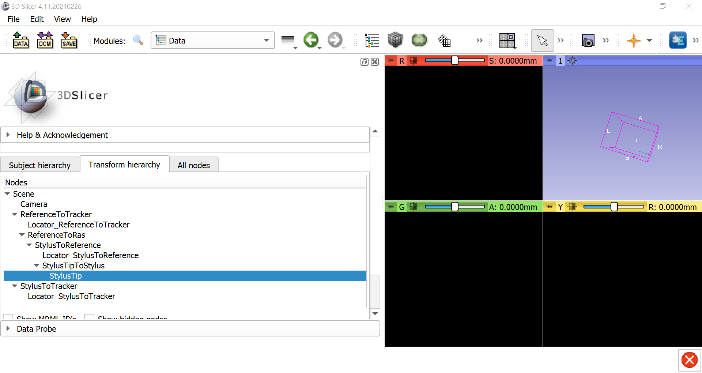
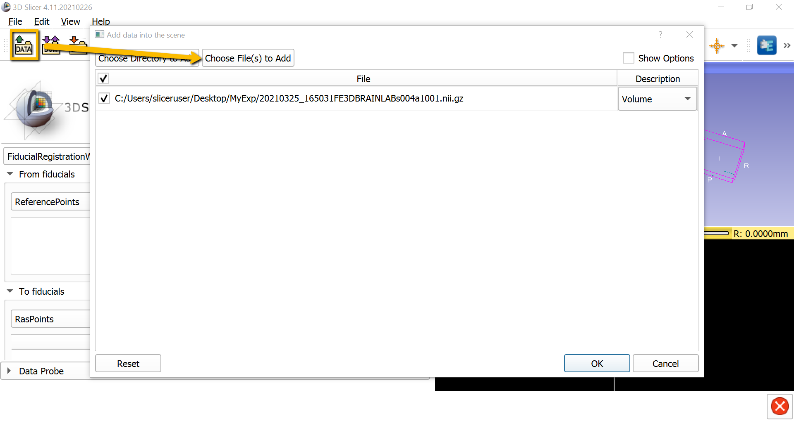
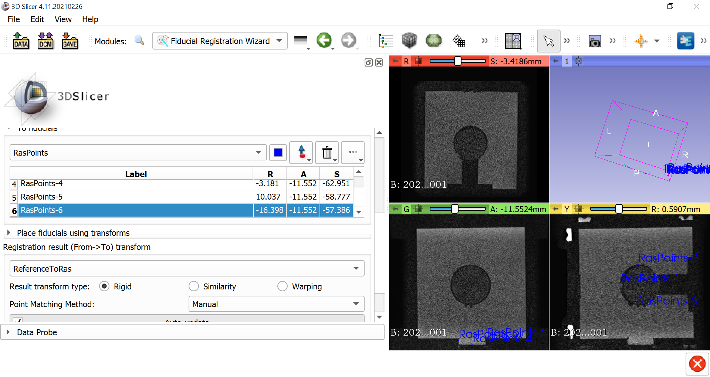
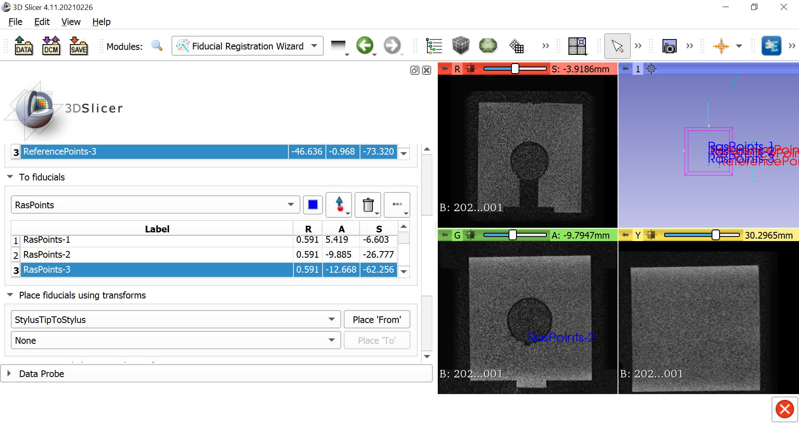

.. _Slicer_06_Coregistration:

==================================
Slicer Tutorial #6: Coregistration
==================================

--------------

Overview
********

**Coregistration** is the alignment of two different imaging modalities. In fMRI, for example, it is common to coregister a T1-weighted and a T2-weighted image; they have different contrast patterns - for example, white matter is brighter in a T1-weighted image, and darker in a T2-weighted image - but they can be brought into alignment using a coregistration algorithm.

Likewise, with Slicer we will coregister an MRI of an image to the stylus which is touching the physical object that the image represents. This is done through creating fiducial points indicating how far apart the image and the physical object are, correcting for that distance, and then observing how the location of the stylus in the real world is updated on the MRI.

Creating the Transforms
***********************

Go back to the ``Data`` module, and click on the ``Transform Hierarchy`` tab. Create a new transform, and call the new transform ``ReferenceToRas``. Click and drag the transforms until the hierarchy looks like this:

Setting the Fiducials
*********************

Now from the modules dropdown menu select ``IGT -> Fiducial Registration Wizard``. Click on ``Data``, ``Choose File(s) to Add``, and select the MRI of the phantom. click ``OK`` to load the MRI into the three orthogonal viewing panes.

In the FiducialRegistrationWizard ``From fiducials`` display window, click on the dropdown menu and select ``Create new MarkupsFiducial``. Then click on ``Rename current MarkupsFiducial`` from the same dropdown menu, and call it ``ReferencePoints``. Do the same procedure for the ``To fiducials`` window, calling it ``RasPoints``.

Now click on the icon of the blue arrow with the red dot, and then left-click on the MRI where you want to place a fiducial. In this case, place them on different sides of the ball in the center of the cube, and maybe one on the plastic circle pasted on the side of the cube. The more fiducials you place, the better the coregistration between the images will be.

Expand the arrow next to ``Place fiducials using transforms``, and in the dropdown menu next to ``Place 'From'``, select ``StylusTipToStylus``. Highlight the first fiducial in the list of RasPoints that you created, place your stylus in the same location on the physical object as you placed the fiducial in the MRI, and click ``Place 'From'``. This will created a new reference point. Do the same procedure for as many fiducials as you created; when you have finished, click on the dropdown menu under ``Registration result (From-To) transform``, and select ``ReferenceToRas``. Uncheck the box next to ``AutoUpdate``; your RMS after doing all of this should be around 1-5mm.

Next Steps
**********

With the fiducials placed on the MRI and the physical object, we are now ready to see how our stylus updates in real time with regard to the MRI. To see how this is done, click the ``Next`` button.
