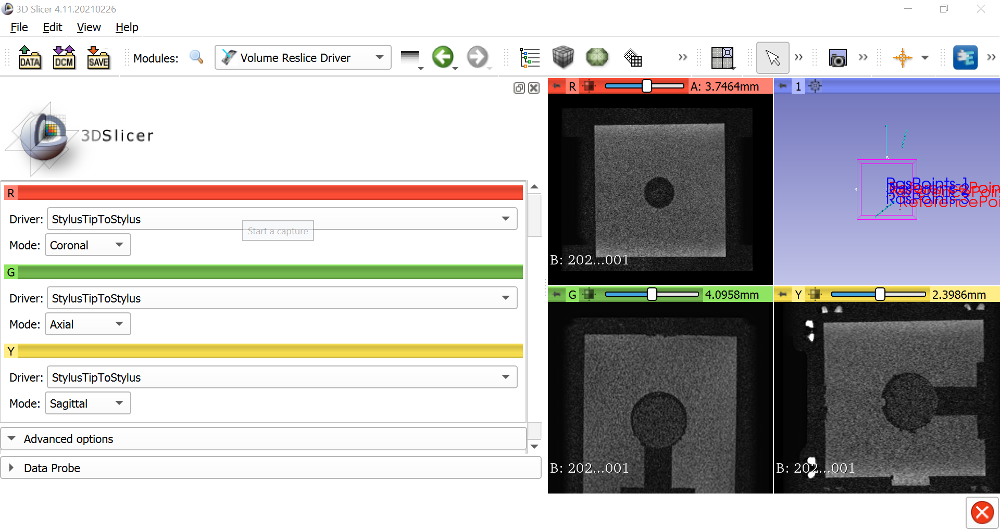
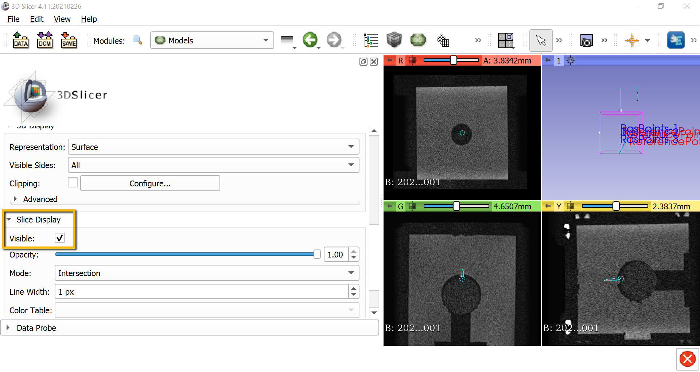

.. _Slicer_07_RealTimeViewing:

=====================================
Slicer Tutorial #7: Real-Time Viewing
=====================================

-----------

We are now ready to see how moving our stylus in the real world updates our view of the MRI in real time. From the module dropdown menu select ``IGT -> Volume Reslice Driver``. The colors of the orthogonal viewing panes correspond to the following views:

1. Red: Coronal
2. Green: Axial
3. Yellow: Sagittal

From the ``Reslicing Driver`` window, click on the dropdown menu in the Red section, and change the Driver to ``StylusTipToStylus``. Change the Mode to ``Coronal``, and do the same for the other colors (e.g., Green Mode to Axial, and Yellow Mode to Sagittal). As you move your stylus around, you will see the image in the three orthogonal panes update in real-time.

If you select the ``Models`` module and scroll down to ``Slice Display``, you can check the box next to ``Visible`` to see a model of the stylus on the MRI:

Summary
*******

These steps should help you to establish a connection between OptiTrack and Slicer, and eventually see how the tracker is moving through the image in real-time. Try it out with a variety of different object/MRI combinations to get more comfortable with image-guided tracking. Good luck!
