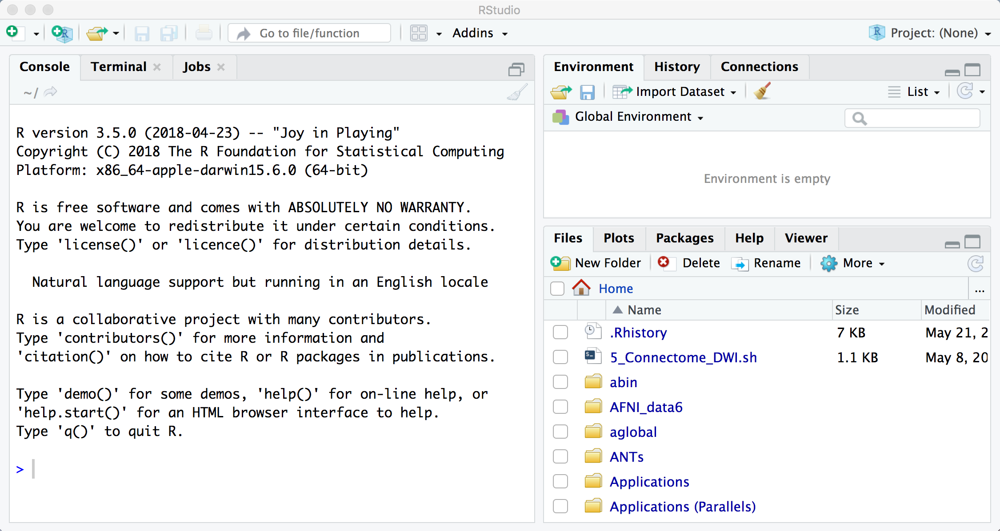
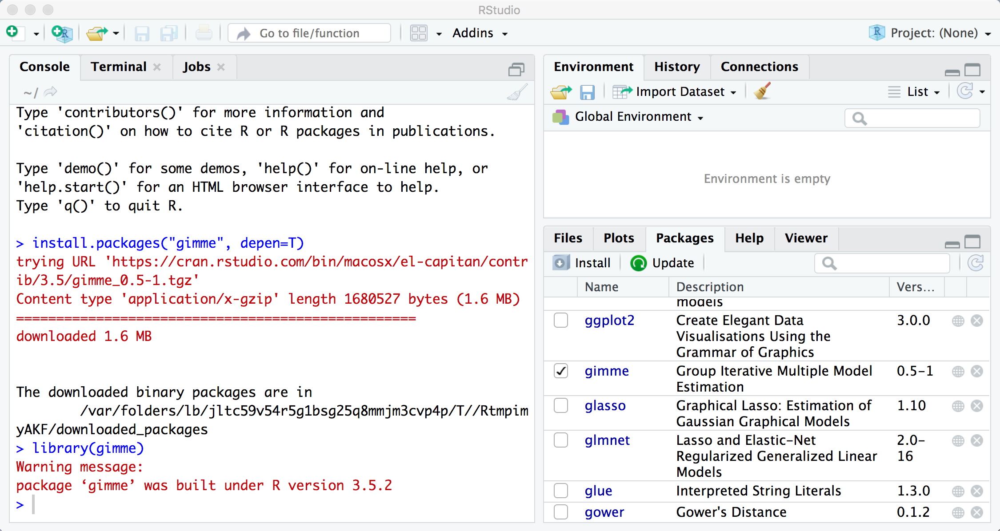

.. _GIMME_00_InstallR:

Before you Begin: Installing R
===============

-----------

Overview
********

GIMME is run from R, a statistical software package. In order to download R, visit `this page https://www.rstudio.com/products/rstudio/download/>`__ and scroll down to find the link for your operating system. Then click and drag the RStudio icon into your Applications folder, and double-click on the RStudio icon to open the program. The following animation shows you how to do this on a Macintosh computer:

.. figure:: InstallingRStudio.gif

Once you have installed RStudio and opened it, you will see a graphical user interface (GUI) that looks like this:

  The RStudio GUI. The window on the left is the **console**, where you type commands. The window on the upper right is the **Environment** pane, which contains any variables that you have declared; and the window in the lower right shows files in the current working directory, and any packages that are installed.
  

Installing the GIMME Package
*********

Installing the GIMME package is simple. From the command line, type:

::

  install.packages("Gimme", depen=T)
  
Which will take a few seconds to download and install the package. The package contains a **library**, or suite of commands that GIMME uses to run analyses.

To use this library, in the command line type:

::

  library(gimme)
  
Which, if you click on the ``Packages`` tab on the lower right window, will show a checkmark next to the gimme package - indicating that GIMME is now ready to be used.

If this all runs without error, you are ready to begin learning about how to use GIMME. Click on the ``Next`` button to learn what kinds of data GIMME can analyze.
