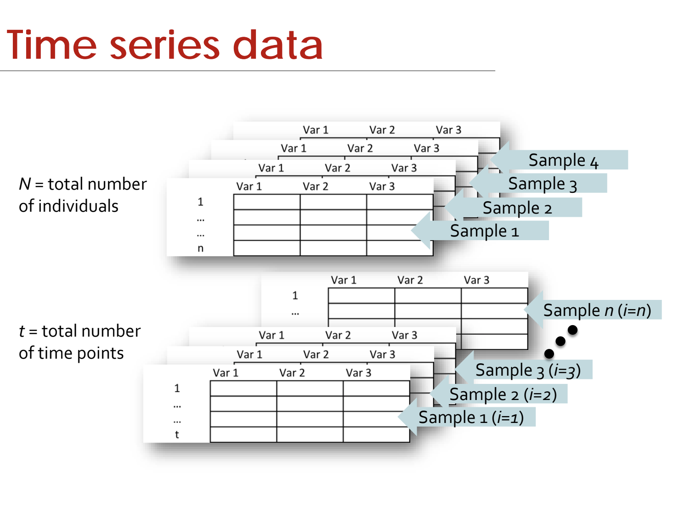

.. _GIMME_01_Data.rst

GIMME Tutorial #1: Which Data to Analyze
************

----------

Overview
^^^^^^^^

GIMME is designed to analyze covariation between variables over time. This means that GIMME requires time-series data - in other words, variables that have been measured at regular intervals over a period of time. For example, measuring someone's heart rate and breathing rate each minute for an hour would result in a time-series, and you could measure that individual's self-reported anxiety every minute as well. In this simple example, you could measure the covariation between the variables, and within the same variable over time.

To summarize, the data must:

1. Be a time-series;
2. Be measured at regular intervals.

The data must NOT:

1. Be a constant, such as a mean, peak, or any other point estimate.

Examples
^^^^^^^^^

Some examples of data that are compatible with GIMME are:

1. Recording one's scores at the end of the day on subjective scales at regular intervals, such as in a diary or a mobile app;

2. The brain activity from a resting-state fMRI dataset measured every second;

3. Measurements of heart rate from an actigraph every 2 hours.

Each of these examples has a different time scale, but they are all measured at regular intervals. The data can come from any source, as long as it meets that requirement.

Data Format
^^^^^^^^^^^

To use your data with GIMME, it must be in a specific format. Each individual can have 3 to 20 variables, and each variable must be measured at multiple time points. This results in an ``n x p`` matrix, in which ``n`` represents the number of variables, and ``p`` represents the number of time points for that particular variable.

For example, say that we have three variables: self-reported measures of anxiety, happiness, and boredom. Each of these are measured every minute for ten minutes. This would give us a 3x10 matrix, with the columns representing anxiety, happiness, and boredom, and the rows representing what the measurement was at the particular timepoint for each variable.

