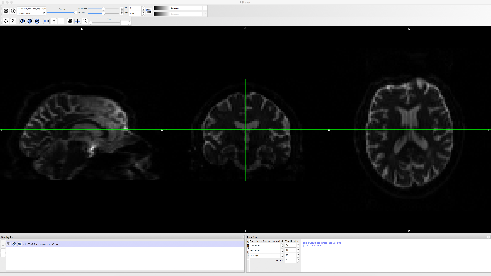
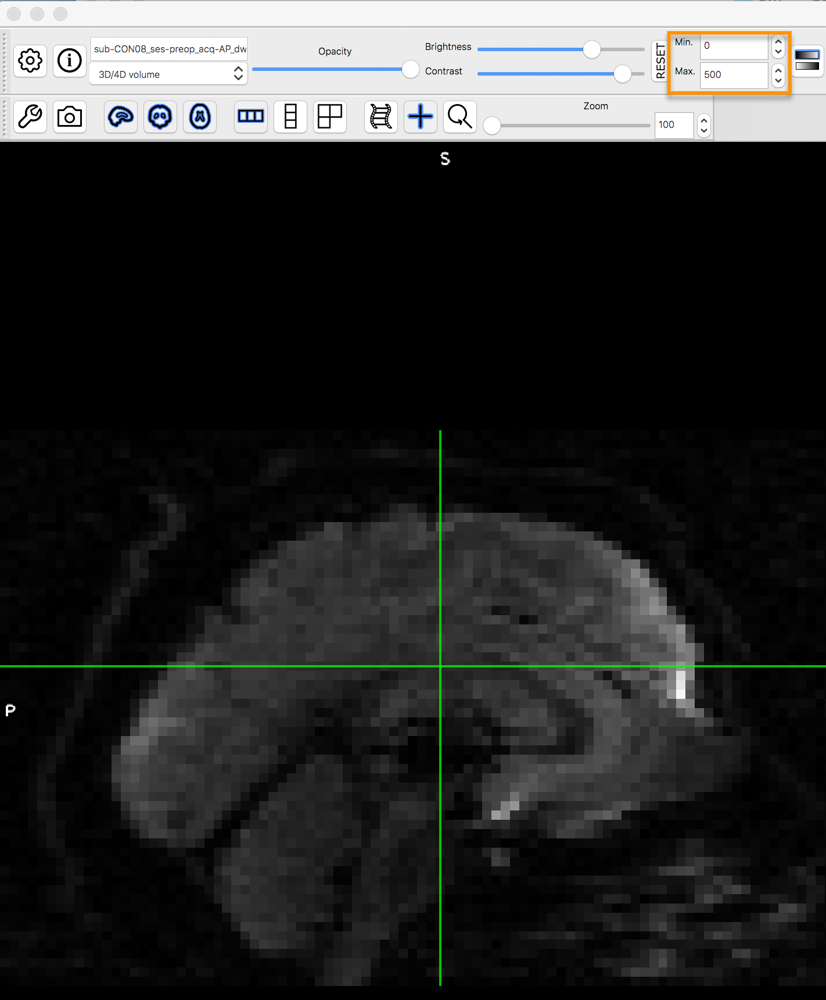

.. _TBSS_03_LookingAtData:

============================
TBSS #3: Looking at the Data
============================

--------------

Reading the Header
******************

If you’ve already gone through the tutorials on the major fMRI software packages, such as SPM, FSL, and AFNI, you may remember that all of them can read and write images in NIFTI format. The data analyzed in TBSS is no different; we will be using several FSL tools to preprocess the data, and TBSS will also read and write all of its images in NIFTI format.

Just as with the fMRI data we analyzed using FSL, we can use the command ``fslinfo`` to print the header information of the diffusion images. Navigate to the directory ``sub-CON08/ses-preop/dwi`` and type the following:

::

  fslinfo sub-CON08_ses-preop_acq-AP_dwi.nii.gz
  
This returns the following information:

::

  data_type	INT16
  dim1		96
  dim2		96
  dim3		60
  dim4		102
  datatype	4
  pixdim1		2.500000
  pixdim2		2.500000
  pixdim3		2.500000
  pixdim4		8.700000
  cal_max		0.000000
  cal_min		0.000000
  file_type	NIFTI-1+
  
This diffusion-weighted image has the label "AP" affixed to it, which means that the data were acquired in the Anterior-to-Posterior phase-encoding direction. A researcher will often collect two sets of diffusion-weighted images, one in a primary phase-encoding direction, and the other in a secondary and opposite phase-encoding direction. The primary phase-encoding direction will be used to collect the majority of the data, while the opposite phase-encoding image will be used to **unwarp** the primary phase-encoded image, which we will review in a later chapter.

We can see that this image is the primary phase-encoded image, since the field ``dim4``, which indicates the number of volumes in the image, is ``102`` - in other words, there are 102 volumes that have been collected for this dataset. The other ``dim`` fields specify the x-, y-, and z-dimensions in voxels, which mean that each volume is composed of a three-dimensional cube with 96x96x60 voxels. The dimensions of each individual voxel can be found in the ``pixdim`` fields, in which we find that each voxel is 2.5x2.5x2.5mm large. The last ``pixdim`` field, ``pixdim4``, is the "size" of the time dimension; in other words, the time it takes to the acquire each volume (an interval known as the repetition time, or TR), is 8.7 seconds.

Bvals and Bvecs
***************

The other files we need to check are the **bvals** and **bvecs** files. (For a more comprehensive review of what these terms mean, see :ref:`this chapter <MRtrix_00_Diffusion_Overview>`.) Briefly, the bvals contain a single number per volume that indicates how large of a diffusion gradient was applied to the data; and the bvecs file contains a triplet of numbers per volume that shows in what directions the gradients were applied. In general, volumes with larger b-values will be more sensitive to diffusion changes, but the images will also be more susceptible to motion and physiological artifacts, as shown in the figure below.

.. figure:: 03_bvals.png

  Three volumes with different b-values. A b-value of 0 is equivalent to a T2-weighted functional scan, while higher b-values lead to lower image quality (but higher sensitivity to diffusion).
  
The most important check is to ensure that the number of bvals and the number of bvecs are the same as the number of volumes in the dataset. For example, we already have seen that the number of volumes for this image is 102. We then compare this with the number of bvals and bvecs by using awk to count the number of columns in each text file:

::

  awk '{print NF; exit}' sub-CON08_ses-preop_acq-AP_dwi.bvec
  awk '{print NF; exit}' sub-CON08_ses-preop_acq-AP_dwi.bval
  
Which should both return a value of 102.

.. note::

  If the number of volumes in your dataset and the number of bvals and bvecs do not match, you should check with your scan technician about the discrepancy; the files may not have been properly uploaded to the server, or maybe the diffusion-weighted image wasn't acquired correctly.
  

Looking at the Data with fsleyes
********************************
  
To visually inspect the diffusion images, we will use FSL's **fsleyes** image viewer. For example, you can view the image that we created above by typing:

::

  fsleyes sub-CON08_ses-preop_acq-AP_dwi.nii.gz
  
Which should return something like this:

By clicking and dragging the crosshairs, you can examine the whole brain from all three viewpoints. Note that we are seeing the first volume of a **time-series**, and that we can flip through the images by clicking on the up or down arrows next to the "Volume" field in order to scroll forward or backward through the volumes. The first volume that is displayed, which has a time-series index of 0 (i.e., 0 indicates the first volumes in the time-series, 1 indicates the second volume, and so on), looks like a typical T2-weighted functional image. We can verify this by comparing it with the b-value for the first volume in the time-series, which should be 0.

Now use the arrows next to the Volume field to load the next volume in the time-series. If you look at the bval file, would you expect this image to look similar to or different from the one that you just saw? Why? Think about this as you load the third and fourth images in the time-series, noting the intensity differences and how they correspond to their respective b-values. If you find that the drop in intensity makes the image too dark to see, you can increase the brightness by clicking on ``Tool -> View options``, and then entering a lower maximum value for the Max field for Intensity Scaling:

Video
*****

You can follow along with this video to learn more about how to check the data.

Next Steps
**********

Once you have practiced looking at the data and seen the relationship between the b-values and the volumes, try the same thing with the diffusion-weighted image with phase-encoding in the PA direction (i.e., sub-CON08_ses-preop_acq-PA_dwi.nii.gz). How many volumes are there in this dataset? What are the b-values? How does it compare to what you saw in the AP diffusion-weighted dataset? You may notice distortions that seem like mirror opposites of each other between the datasets; we will see how to remedy these distortions in the next chapter.

