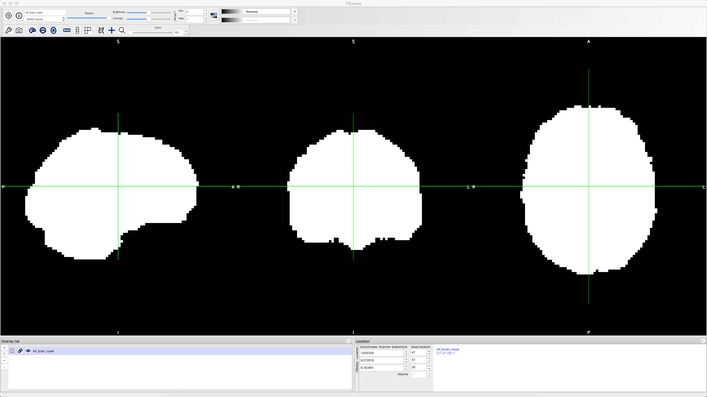

.. _TBSS_04_TopUpEddy:

=======================
TBSS #4: topup and eddy
=======================

--------

Overview
********

Just like other neuroimaging data, diffusion data should be **preprocessed** before it is analyzed. Preprocessing removes sources of noise from the image, such as movement artifacts and other distortions. Diffusion data in particular is susceptible to **warping artifacts** as a result of the phase-encoding direction: In general, the predominant encoding direction - such as Anterior to Posterior, or AP - will make the anterior part of the brain look more "squished", as though a strong headwind is blowing from the Anterior direction. The opposite is true of the Posterior to Anterior, or PA, phase-encoding direction. Sometimes these distortions are very subtle, but other times they are conspicuous:

.. figure:: 04_AP_PA_Comparisons.png

The following commands listed below are common preprocessing steps done with TBSS.

topup
*****

The first preprocessing step we will do is ``topup``, which is designed to correct distortions caused by magnetic field inhomogeneities. These inhomogeneities are particularly noticeable near the sinuses and around the edges of the brain, especially along the axis of the phase-encoding direction. For example, if we collect our images using an anterior-to-posterior phase-encoding direction, the inhomogeneities will be most noticeable at the front and back of the head, as you can see in the image above.

These inhomogeneities are easiest to detect in the images that do not have any diffusion-weighting applied; in other words, the images with a b-value of 0. In this dataset, we have seen that the first volume of the AP and PA datasets both have a b-value of 0. Consequently, we will extract these volumes using the command `fslroi`:

::

  fslroi sub-CON08_ses-preop_acq-AP_dwi.nii.gz AP 0 1
  fslroi sub-CON08_ses-preop_acq-PA_dwi.nii.gz PA 0 1
  
This creates two new files, "AP.nii.gz" and "PA.nii.gz". We then combine them using ``fslmerge``:

::

  fslmerge -t AP_PA AP.nii.gz PA.nii.gz
  
To create the file "AP_PA.nii.gz". Try opening this file in fsleyes and toggling back and forth between the two volumes to see how they have been combined into a single dataset.

We will also need to create a file that indicates the phase-encoding direction and the read-out time. Using a text editor of your choice (I recommend TextWrangler for Macs), enter these numbers:

::

  0 1 0 0.0266003
  0 -1 0 0.0266003
  
And save the file as ``acq_param.txt``.
  
The first three numbers in the first row represent the phase-encoding along the x-, y-, and z-dimensions. Since the first volume was acquired in the A-P direction, we place a "1" in the second column. In the next row, since the second image in this dataset was acquired in the opposite direction, we use a value of "-1". The last column is the read-out time, in milliseconds; if it's the same for both images, you can set it to "1". Otherwise, replace it with the exact read-out time for each volume separately. For the current dataset, this number can be found in the "TotalReadOutTime" field of the ".json" file in the ``dwi`` directory.

Once you have all of these ingredients, you are ready to run ``topup`` to estimate the field inhomogeneity:

::

  topup --imain=AP_PA.nii.gz --datain=acq_param.txt --config=b02b0.cnf --out=AP_PA_topup
  
The option ``--config=b02b0.cnf`` may look out of place, since we didn't create a file with that name; do not worry, however, since this is a default file that is included in FSL's libraries and will be automatically detected if you include it. The configuration parameters specified in the file are designed to work with most diffusion imaging data, so don't change it unless you have a custom configuration file you created yourself.

After a few minutes, you will see a few new files, including one called ``AP_PA_topup_fieldcoef.nii.gz``. These are the inhomogeneity estimations, which you can view in fsleyes if you like. We can now apply them to the original A-P phase-encoded data, which we will be using for our diffusion analysis:

::

  applytopup --imain=sub-CON08_ses-preop_acq-AP_dwi.nii.gz --inindex=1 --datain=acq_param.txt --topup=AP_PA_topup --method=jac --out=AP_Cor

This uses the fieldmap estimated above, as specified by the ``--topup`` option, to unwarp the A-P data. The ``inindex`` option, which we have set to 1, indicates that we are applying the unwarping to the phase-encoded image represented in the first line of the "acq_param.txt" file. ``--method=jac`` uses jacobin modulation, and ``--out`` is used to specify a label for the output image.

When it is finished, you can open the image "AP_Cor.nii.gz" in fsleyes. Load the raw "sub-CON08_ses-preop_acq-AP_dwi.nii.gz" image as well and toggle between the two using the eye icon in the GUI in order to see the image before and after unwarping. If you are satisfied with the results, we can move on to the next preprocessing step of eddy correction.

eddy
****

Diffusion-weighted images, in addition to suffering from field inhomogeneities, have another type of distortion particular to their modality: **eddy currents**, which are distortions that look like ripples in a pond.

To run the command ``eddy``, we will need to create two more files, in addition to what we have already generated. The first is a mask of the image that we will use with eddy, which should be based on the corrected dataset that we generated using topup in the previous section. We will begin by extracting the first volume of that dataset using ``fslroi``:

::

  fslroi AP_Cor.nii.gz AP_1stVol 0 1
  
And then use ``bet`` to create a mask from that image:

::

  bet AP_1stVol.nii.gz AP_brain -m -f 0.2
  
You can view the resulting image, AP_brain_mask.nii.gz, in fsleyes:

We will also have to create a file called ``index.txt``, which contains a 1 for each volume that has the parameters indicated by the first line of the ``acq_params.txt`` file. Since we have 102 volumes, we can quickly create and fill a new file called index.txt with that many 1's by using a for-loop:

::

  for i in {1..102}; do echo "1" >> index.txt; done
  
We can then run eddy with the following code:

::
  
  eddy --imain=sub-CON08_ses-preop_acq-AP_dwi.nii.gz --mask=AP_brain_mask.nii.gz --index=index.txt --acqp=acq_param.txt --bvecs=sub-CON08_ses-preop_acq-AP_dwi.bvec --bvals=sub-CON08_ses-preop_acq-AP_dwi.bval --fwhm=0 --topup=AP_PA_topup --flm=quadratic --out=AP_eddy_unwarped --data_is_shelled

Video
-----

A demonstration of how to apply topup and eddy to your data can be found `here <https://www.youtube.com/watch?v=zp0EOuKO3O0>`__.

Next Steps
**********

