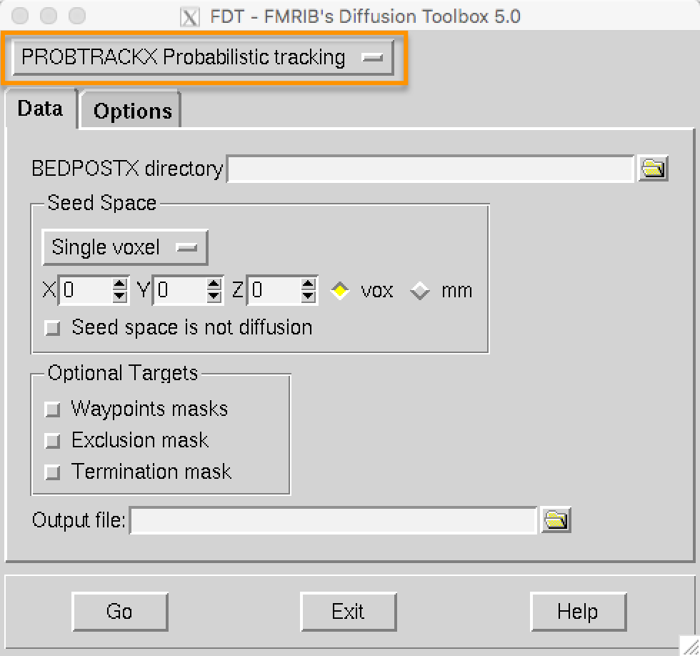
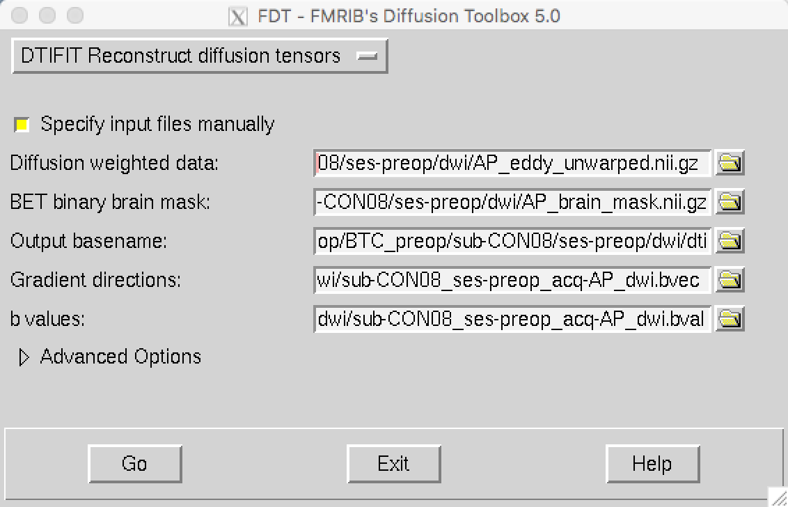
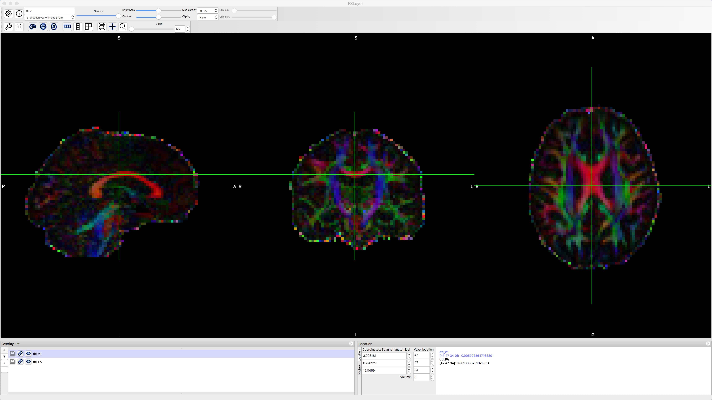

.. _TBSS_05_FittingTensors:

============================
TBSS #5: Fitting the Tensors
============================

--------

Overview
********

Now that we have unwarped and eddy-corrected the data, we are ready to fit a **tensor** at each voxel, representing the direction and the magnitude of diffusion. For a review of what a tensor is and how it is modeled, see the section "Putting it all together: Modeling the tensor" in :ref:`this chapter <MRtrix_00_Diffusion_Overview>`.

Fitting the Tensors with DTIFIT
*******************************

Creating the tensors is done most easily through the GUI; when you have done it once, it will generate code that you can later use for scripting. For now, open the GUI by typing ``Fdt_gui`` and pressing enter. You should see something like this:

  
From the dropdown menu highlighted in the orange box, select "DTIFIT Reconstruct diffusion tensors". You can specify a directory that has all of the files we just created - the unwarped diffusion data, the brain mask, the bvals and bvecs - but they have to be formatted a certain way for DTIFIT to recognize it. Instead, clicking on the box "Specify input files manually" allows you to enter each of these files individually:

*Diffusion weighted data: The unwarped, eddy-corrected diffusion-weighted data (AP_eddy_unwarped.nii.gz)
*BET binary brain mask: The brain mask (AP_brain_mask.nii.gz)
*Output basename: This will be automatically filled in for you with the string "dti"
*Gradient directions: The bvecs file (sub-CON08_ses-preop_acq-AP_dwi.bvec)
*b-values: The bvals file (sub-CON08_ses-preop_acq-AP_dwi.bval)

When you have filled in all of the fields, press the ``Go`` button; this should only take a few moments to finish. When it is done, load the files ``dti_V1`` and ``dti_FA`` in fsleyes. With the file ``dti_V1`` highlighted, click on the "Modulate by" menu and select ``dti_FA``. This will create an image that shows the primary direction of diffusion at each voxel, with red representing diffusion that is primarily left to right, green representing back to forward, and blue representing bottom to top. If the tensors were fit correctly, you should see mostly red in the corpus callosum and blue in the corona radiata, since those fiber bundles are mostly restricted to the left to right and bottom to top directions.

Video
*****

A demonstration of how to fit the tensors can be found here.

Next Steps
**********

With the tensors fitted to the data, we can generate diffusion metrics such as fractional anisotropy. To see how to do that, click the ``Next`` button.
