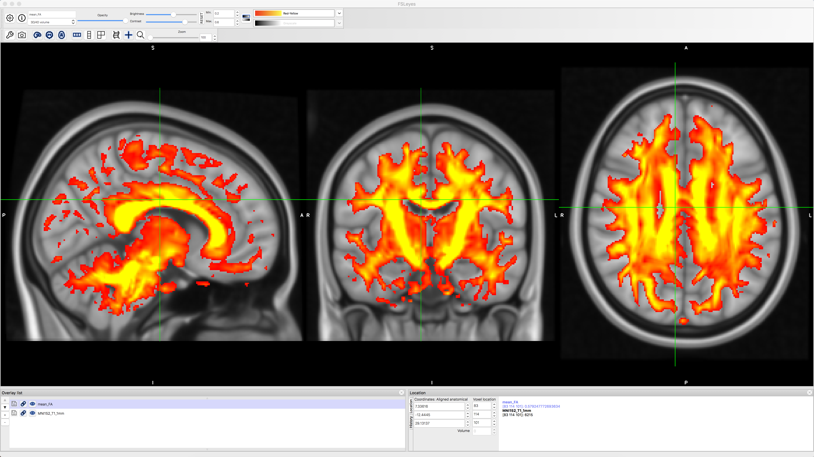

.. _TBSS_06_Preprocessing:

======================
TBSS #6: Preprocessing
======================

--------

Overview
********

Fortunately, each of the preprocessing steps is simple and straightforward to run; each command has the string "tbss" in it, with a number indicating which step to do, and in which order.

First, within the ``dwi`` directory create a new directory called ``tbss`` and then copy the FA image into that directory:

::

  mkdir tbss
  cp dti_FA.nii.gz tbss
  cd tbss
  
Now that you are in the directory, we just need to run through each tbss preprocessing step. The first one, ``tbss_1_preproc``, will clean up the FA images by removing the brighter voxels around the edges of the brain, and then placing the image into a folder called ``FA``:

::

  tbss_1_preproc dti_FA.nii.gz
  
Next, we register the data to MNI space to calculate the warps needed for the transforms:

::

  tbss_2_reg -T
  
With the "-T" option indicating that we will use the FA template "FMRIB58_FA_1mm".

The following step will apply the warps and bring the FA data to MNI space:

::

  tbss_3_postreg -S
  
The "-S" option will create files called "mean_FA" and "mean_FA_skeleton" based on the mean of all of the subjects that have been analyzed in with the previous steps. Since we only have one subject in this case, it will be the same as the single FA image that we have been processing.

You can check the normalization of the FA data by typing the following:

::

  cd stats
  fsleyes -std1mm mean_FA -cm red-yellow -dr 0.2 0.6 &
  
This will navigate into the ``stats`` folder and overlay the mean_FA image onto a standardized 1mm template in MNI space. You should see the FA image have the greatest intensity in the most prominent fiber bundles such as the corpus callosum, longitudinal fasciculus, and corona radiata:

