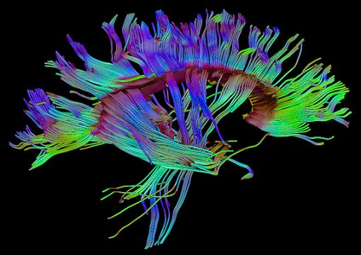

.. _TBSS_Introduction:

=====================================================
Introduction to Tract-Based Spatial Statistics (TBSS)
=====================================================

.. note::

   This page is still under construction. Check back soon!

---------

What is TBSS?
*************

TBSS is a suite of tools for analyzing diffusion data. This software uses a tensor-fitting method to generate different measures of diffusion, such as fractional anisotropy (FA) and mean diffusivity (MD). Once these measurements are created, you can then extract them using :ref:`ROI tools <fMRI_09_ROIAnalysis>` like you would for fMRI data.

The package also includes tools for correctying distortions in the diffusion data; in particular, the commands ``topup`` and ``eddy`` will remove distortions caused by eddy currents and magnetic field inhomogeneities. 

.. note::

   Before beginning, you may want to review the basics of diffusion imaging, which can be found :ref:`here <MRtrix_00_Diffusion_Overview>`. The chapter will review the principles of diffusion, how they are used to generate diffusion-weighted images, and the advantages and disadvantages of fitting tensors to diffusion data.

Goals of This Course
********************

This course will show you how to analyze a sample dataset from start to finish using TBSS. We will be closely following the steps provided on the `FSL TBSS website <https://fsl.fmrib.ox.ac.uk/fsl/fslwiki/TBSS/UserGuide>`__; the goal is to provide you with more experience in how to use this package, and use figures and videos to broaden your understanding of how it works and how it can be applied in other scenarios.

.. toctree::
   :maxdepth: 1
   :caption: Preprocessing Steps
   
   TBSS_Course/TBSS_01_Download_Install
   TBSS_Course/TBSS_02_DataDownload
   TBSS_Course/TBSS_03_LookingAtData
   TBSS_Course/TBSS_04_TopUpEddy
   TBSS_Course/TBSS_05_FittingTensors
   TBSS_Course/TBSS_06_Preprocessing
   TBSS_Course/TBSS_07_Statistics
   TBSS_Course/TBSS_08_Scripting
   TBSS_Course/TBSS_09_ROIAnalysis
