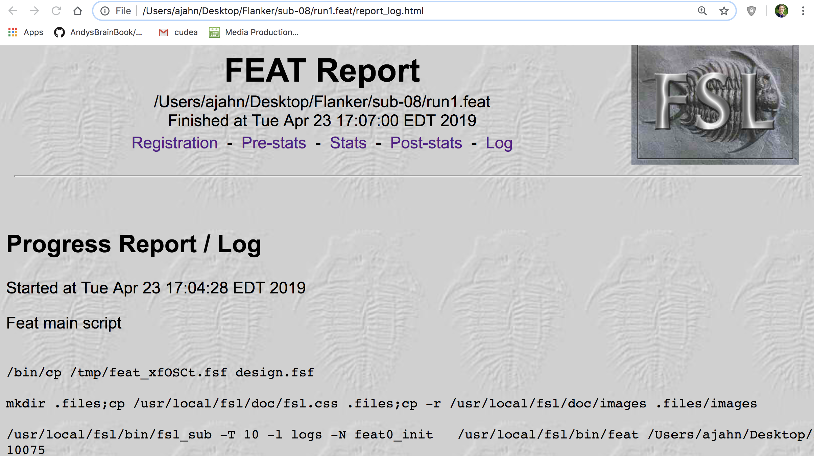
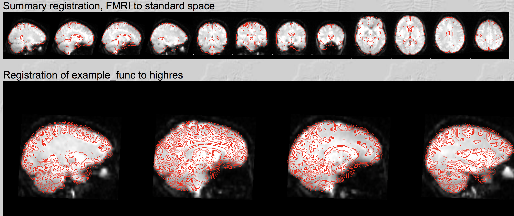
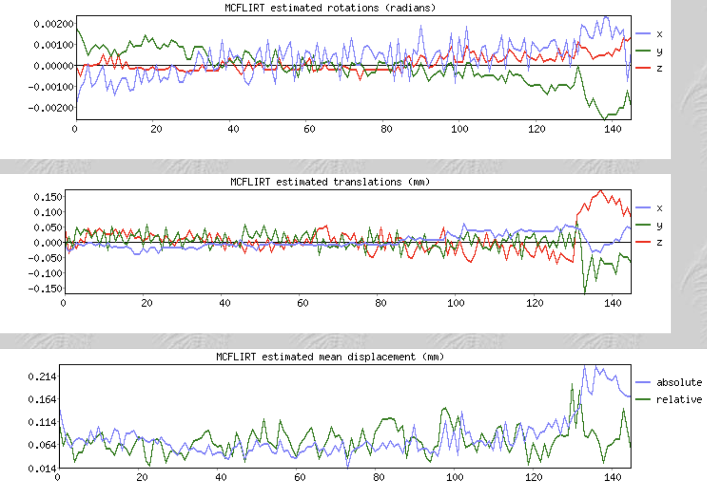

.. _Checking_Preprocessing.rst

Checking your Preprocessed Data
^^^^^^^^^^

Just as we did with the skull-stripped images, we will check our data before and after we have processed them using the FEAT GUI. After you click the ``Go`` button, HTML pages will track the progress for each step.

Checking Registration and Normalization
*********

Recall that since we are only doing preprocessing, we will only have results for the Registration and Pre-stats tabs. Click on the Registration tab to examine the results of each registration and normalization step. If you scroll down the page, you should see images that look like this:

Each image overlays the red outline of a brain onto a greyscale image of another brain. The first image you see, ``Summary Registration``, shows a representative functional image - in this case, the median image in the fMRI time-series - as the underlay, and the template brain as the red lines. This image is shown first, because if there were any problems in any of the previous registration or normalization steps, there would be obvious errors in this image.

Look for whether the red outlines trace the outline of the greyscale image. Also check whether some of the internal structures of the images, such as the ventricles, are aligned. Do these same quality checks for the other alignments, such as the registration of the example functional image to the highres image (i.e., the anatomical image) and the normalization of the highres image to standard space template.

Checking Motion
*********

When you are done looking at the Registration page, click on the Pre-stats link. If you scroll down you will see plots of the motion across the time-series for that run, with volumes indexed on the x-axis, and the amount of motion (in millimeters) shown on the y-axis.

Check for spikes in the motion plots that are greater than half of your voxel resolution, and for drifts that are greater than the size of an entire voxel. If there is relative motion of more than half a voxel or absolute motion of more than a voxel, you may want to consider more advanced correction techniques such as scrubbing, or removing the run from the analysis altogether. So, if you acquired a volume with 3 by 3 by 3 millimeter voxel resolution, you would flag any runs with relative motion of more than 1.5mm from volume to volume, or absolute motion of more than 3mm across the entire run. These are only guidelines, and you may decide to change these depending on the population you’re studying.

-------

Video
*******

For a screencast video on how to check the quality of your data, click `here <https://www.youtube.com/watch?v=dgcZxT83Jdo>`__. This will explain in more detail what exactly you should be looking for in each of the preprocessing tabs.
