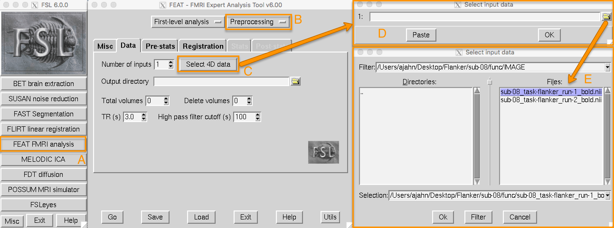

.. _FEAT_GUI.rst

Intermezzo: The FEAT GUI and loading the functional data
^^^^^^^^^^^

The rest of the preprocessing steps (motion correction through normalization) will be carried out in the FEAT GUI. The FEAT button is located the middle of the FSL GUI menu, and clicking on it will open up a window with several tabs.

  Clicking on the FEAT FMRI analysis button (A) opens up the FEAT GUI. For now we will focus on the ``Data``, ``Pre-stats``, and ``Registration`` tabs, which preprocess the data. From the upper-right dropdown menu (B), select ``Preprocessing``. This will grey out the Stats and Post-stats tabs, and allow us to focus only on preprocessing. Click on the ``Select 4D data`` button (C) to load your imaging data (in this example, ``sub-08_task-flanker_run-1_bold.nii.gz``, which is in the ``func`` directory). This will open up a new window (D), which has a folder icon that allows you to select a functional imaging run (E).

When you load a functional image, FSL reads information from the **header** of that image. Think of the image itself as a three-dimensional matrix of numbers, with higher numbers represented as brighter than lower numbers. This contrast allows us to distinguish different structures within the images. The header, on the other hand, is information that you don't see directly in the image, but which is necessary in order to display it - for example, the orientation. The header also contains information about the :ref:`TR <Repetition_Time>` and number of volumes, if it is four-dimensional data (i.e., it is a single dataset containing multiple volumes).

These fields will be automatically entered into the corresponding fields of the FEAT GUI, as shown in the following video:

.. figure:: FEAT_GUI_Demonstration.gif

The next two tabs, Pre-stats and Registration, will be discussed in the following chapters. To resume the tutorial on the preprocessing steps, click the ``Next`` button.
