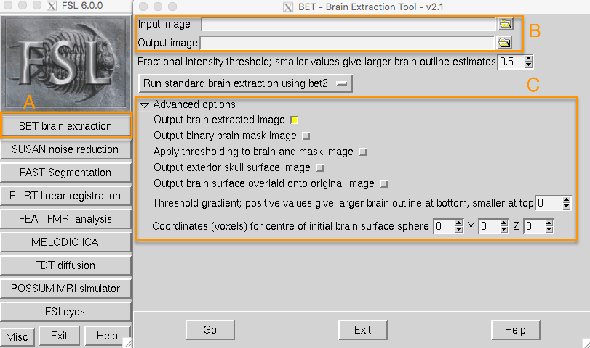

.. _Skull_Stripping.rst

Brain Extraction (or "skull stripping")
^^^^^^^^^^

Since fMRI studies focus on brain tissue, our first step is to remove the skull and non-brain areas from the image. FSL has a tool for this called **bet**, or the Brain Extraction Tool (along with a newer version called ``bet2``). It is the first button listed on the FSL GUI (window A, in the figure below). If you click on this button, another window opens that allows you to specify the Input image to skullstrip and the Output image that has been skullstripped (B), and an expandable sub-window that allows you to specify advanced options (C).

.. note::
  For BET and many of the other FSL tools, you are required to specify an input image and an output image: Some operation is performed on the input image (skullstripping, for example) and the output image is the result of that operation. Usually the other options are set to defaults that work well for the majority of datasets, but you can override them if you want.
  

If you launched the FSL GUI from the ``sub-08`` directory, click on the Folder icon next to the ``Input image`` field and navigate to the ``anat`` directory. Select the file ``sub-08_T1w.nii.gz`` and click the OK button. Notice that the ``Output image`` field is automatically filled in with the word ``brain`` appended to your Input image. This is FSL's default, but you can change the name if you like. For this tutorial, we will leave it as is.

Now click the ``Go`` button at the bottom of the window. You will see some text written to your Terminal showing which commands are being used to run ``bet2``. It is important to understand how the GUI corresponds to the Terminal - later on we will take advantage of this by creating template through the GUI and then modifying that template in the Terminal and automating it to preprocess all of the subjects in our dataset.

Looking at the data
********

When the Terminal says "Finished", ``bet2`` is done. Since you have created a new image you should **look at your data**, which we will do after each preprocessing step.

.. .. warning::
  Newcomers often hear the phrase "Look at your data" intoned like a mantra. Without knowing *how* to look at one's data, the words become meaningless at best, a false comforter at worst. Each of the preprocessing steps in this chapter will be followed by recommendations of what to look for and concrete examples of what is OK and what is a problem - and what to do about it. Although we cannot cover every possible example, as you gain experience you will develop your judgment of what images are of good quality, and which ones need to be either fixed or removed.
  

Click on the ``FSLeyes`` button at the bottom of the GUI. When it opens, click on ``File -> Add from File`` and hold shift to select both the original anatomical image and the skullstripped image you just created. As you saw in the :ref:`previous chapter <fMRI_03_LookingAtTheData>`, you will want to change the contrast to clearly distinguish the grey matter from the white matter.

By loading both images you can compare the image before and after the skull was removed. In the ``Overlay List`` panel in the lower left corner of FSLeyes, click the "eye" icon to hide the corresponding image. For example, if you click on the eye icon next to ``sub-08_T1w``, the original T1 anatomical image will become invisible, and you will only see the skullstripped brain. If you click on the eye again, you will see the original T1. Click around the image with your mouse and practice hiding and revealing the original T1. Observe where there is either too much brain or too little skull that was removed. Remember that we are trying to create an image that has had the skull and face stripped clean away, with only the brain (e.g., cortex, subcortical structures, brainstem, and cerebellum) remaining.

.. figure:: Before_After_BET.png

  The anatomical image before skullstripping (Left) and after (Right). Note that in the frontal cortex, part of the brain has been stripped away. Make sure to check the brain before and after skullstripping in all three viewing panes to see where there are problems.

If you're not happy with the skullstripping, what can you do about it? Recall that the BET window contained options that we could change if we liked. One of the fields, labeled ``Fractional intensity threshold``, is set to 0.5 as a default. The neighboring text explains that smaller values give larger brain outline estimates (and, conversely, larger values give smaller brain outline estimates). In other words, if we think that too much brain has been removed, we should set this to a smaller number, and vice versa if we think too little skull has been removed.

Since it appears that BET had removed too much brain, try changing the fractional intensity threshold to 0.2. Also make sure to change the output name to something that will help you remember what you did - for example, ``sub-08_T1w_brain_f02``. Click the Go button to re-run skullstripping.

.. figure:: BET_f02_GUI.png

When it has finished, load the newest skullstripped image in FSLeyes. Click on the eye icon next to the original anatomical image, and also the eye icon next to the newest skullstripped image that we have just created. Note where more cortex has been preserved, especially in the frontal cortex and parietal cortex. You may also have noticed that more dura mater and bits of skull remain in this image. As a general rule, it is better to err on the side of leaving too much skull, as opposed to removing too much cortex - bits of skull here and there won't cause future preprocessing steps to fail (such as normalization), but once cortex is removed, you cannot recover it.
