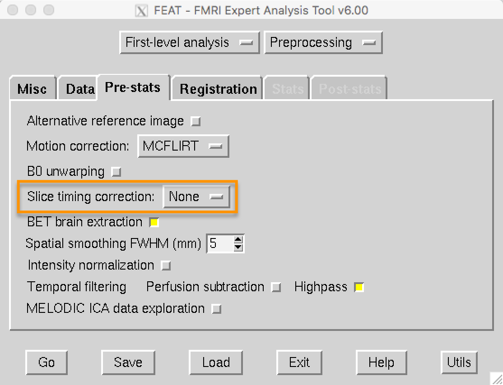

.. _Slice_Timing_Correction.rst

Slice-Timing Correction
^^^^^^^^^^

Unlike a photograph, in which the entire picture is taken in a single moment, an fMRI volume is acquired in slices. Each of these slices takes time to acquire - anywhere from tens to hundreds of milliseconds. As you'll see later on, when we model the data at each voxel we assume that all of the slices were acquired simultaneously. To make this assumption valid, the :ref:`time-series <Time_Series>` for each slice needs to be shifted back in time by the duration it took to acquire that slice.

The two most commonly used methods for creating volumes are sequential and interleaved slice acquisition. Sequential slice acquisition acquires each adjacent slice consecutively, either from bottom to top or top to bottom. Interleaved slice acquisition acquires every other slice, and then fills in the gaps on the second pass. Both of these methods are illustrated in the video below.

.. figure:: SliceTImingCorrection_Demo.gif

Although slice-timing correction seems reasonable, there are some objections:

1. In general, it is best to not interpolate (i.e., edit) the data unless you need to;

2. For TRs of less than two seconds, slice-timing correction doesn't appear to lead to any significant gains in statistical power; and

3. Many of the problems addressed by slice-timing correction can be resolved by using a **temporal derivative** in the statistical model (discussed later in the chapter on model fitting).

FSL's default is to not do slice-timing correction, and to include a temporal derivative instead. Later on, you will do an exercise comparing the data both with and without slice-timing correction to observe how much of a difference it makes.

  

The last preprocessing step that we will cover on the Pre-stats tab is Smoothing. To learn what smoothing is and how to use it, click on the ``Next`` button.
