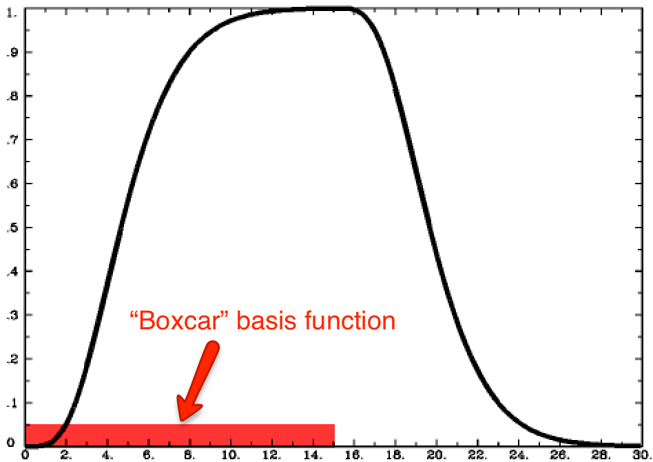
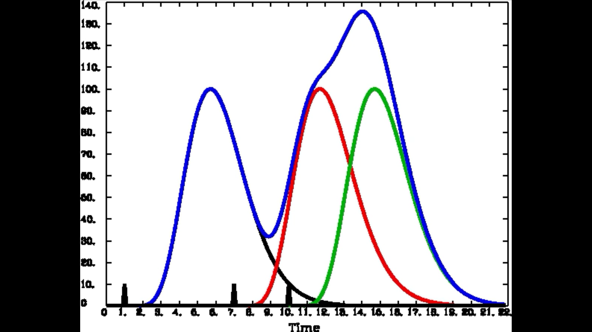

.. _03_Stats_HRF_Overview.rst

Chapter 3: The Hemodynamic Response Function (HRF)
=============

--------------

From the BOLD Response to the HRF
*********

Another assumption we make is what the BOLD response looks like. This is important not only for modeling the link between neural activity and blood flow, and from there to the observed signal - a phenomenon known as **neurovascular coupling** - but for how we define our statistical models for what brain regions are associated with which condition. 

In the 1990's, empirical studies of the BOLD signal demonstrated that, after a stimulus was presented to the subject, any part of the brain responsive to that stimulus - say, the visual cortex in response to a visual stimulus - showed an increase in BOLD signal. The BOLD signal also appeared to follow a consistent pattern, peaking around six seconds and then falling back to baseline over the next several seconds. This pattern can be modeled with a mathematical function called a **Gamma Distribution**. When the Gamma Distribution is constructed with parameters to best fit the BOLD response observed by most empirical studies, we refer to it as the canonical Hemodynamic Response Function, or **HRF**.

When applied to fMRI data the Gamma Distribution is called a **basis function**. We call it a basis function because it is the fundamental element, or basis, of the model we will create and fit to the time series of the data. Furthermore, if we know what the shape of the distribution looks like in response to a very brief stimulus, we can predict what it should look like in response to stimuli of varying durations. We now turn to examples of each to illustrate this concept.

The HRF for a Single Impulse Stimulus
^^^^^^^

If the duration of a stimulus is very short, such as a snap of the fingers, we can say that it is an **impulse stimulus** - in other words, it has no duration. As you can see in the following figure, the shape of the BOLD signal looks like a typical Gamma Distribution, with a peak close to the beginning of the time axis (i.e., the x-axis) and a long tail to the right. 

.. figure:: HRF_SingleStim.png
  :scale: 30%

  The HRF generated by a single impulse stimulus. In this figure, the stimulus occurs at timepoint 0 on the x-axis.
  
The HRF for a Single Boxcar Stimulus
^^^^^^^

Although many studies use stimuli lasting only a second or less, some studies present stimuli for longer periods of time. For example, imagine that the subject looks at a flashing checkerboard for fifteen seconds. In this case the shape of the HRF will be more spread out with a sustained peak proportional to the duration of the stimulus, falling back to baseline only after the stimulus has ended. This stimulus is called a **boxcar stimulus**, because it looks like a boxcar on a train.

In this case the Gamma Distribution is **convolved** with the boxcar stimulus. Convolution is the averaging of two functions over time; as a result, the Gamma Distribution broadens as it is averaged with the boxcar stimulus, and returns to its previous state when the stimulus is removed. 

.. note::

  In the Single Impulse case, the Gamma Distribution is also convolved with a stimulus. Since an impulse stimulus is infinitesimally small, it is represented as a vertical line on the time axis. This is why it is sometimes called a **stick function**.

  
  Illustration of the HRF generated by a boxcar stimulus lasting for fifteen seconds. Note that the BOLD signal begins descending back to baseline around the fifteen-second mark.

What if the HRFs overlap?
^^^^^^^

We have seen what the BOLD response looks like after a stimulus is presented, and we have seen how to model this with an HRF. But what happens if another stimulus is presented before the BOLD response for the previous stimulus has returned to baseline?
  
In that case, the individual HRFs are convolved. This creates a BOLD response that is a moving average of the individual HRFs, and it becomes more complex as more stimuli are presented.

  
  Convolution of the HRFs for individual stimuli. The overall BOLD response (blue) is a moving average of the individual HRFs outlined in black, red, and green. The vertical black lines on the x-axis represent impulse stimuli.

Putting it all together: Animations of each Case
*********

To help you understand what you have just read, watch the following animation a couple of times. It will show how each of the cases described above unfolds over time, which will aid your comprehension. 

.. figure:: HRF_Demo.gif

.. note::

  Be aware that the concepts you have just learned are probably more difficult to understand than what you have learned previously in this course. Even if you don't feel that you fully understand the HRF and convolution, go on with the rest of the module. After you have read the remaining chapters and have done the practical exercises, come back to this chapter and then see if it makes more sense.

