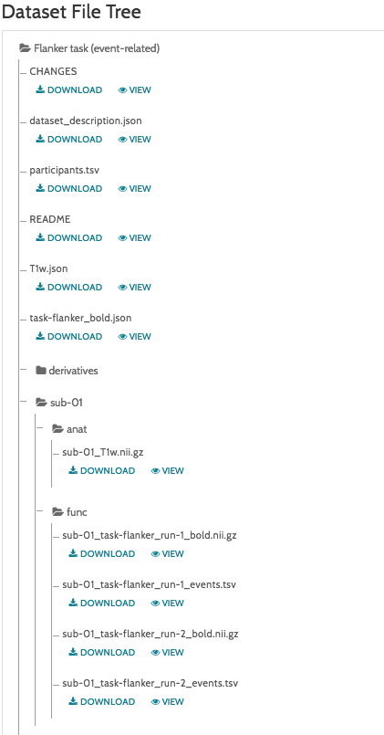

.. _fMRI_01_DataDownload:

==============
fMRI Tutorial #1: Downloading the Data
==============

Overview
--------------

For this course we will be analyzing an fMRI dataset that used the Flanker task. The dataset can be found `here <https://openneuro.org/datasets/ds000102/versions/00001>`__ on the `OpenNeuro <https://openneuro.org>`__ website, an online repository for neuroimaging data.

    The OpenNeuro page for the Flanker dataset includes a Dataset File Tree, which includes the folders ``anat`` (containing the anatomical image) and ``func`` (containing the functional images and onset times for each run). There are additional files containing subject data such as sex and age (``participants.tsv``) and scanning parameters (``task-flanker_bold.json``). All of the datasets on OpenNeuro are formatted this way, and having a standardized directory tree makes scripting much easier, as we will see in a later tutorial.
    
    
Download the dataset by clicking on the "Download" button at the top of the page. The dataset is about 2 Gigabytes, and comes in a zipped folder. Extract it by double-clicking on the folder, and then move it to your Desktop.

.. figure:: OpenNeuro_DownloadButton.png

    

Video
--------------
Downloading the dataset should be straightforward, but if you would like to see a video about how to do it, click here.
