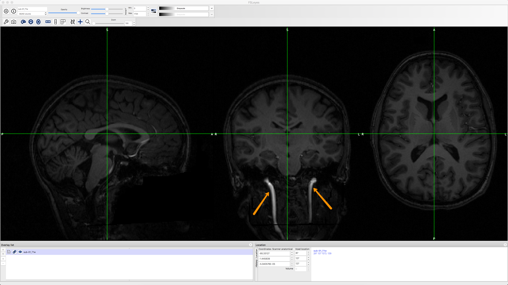
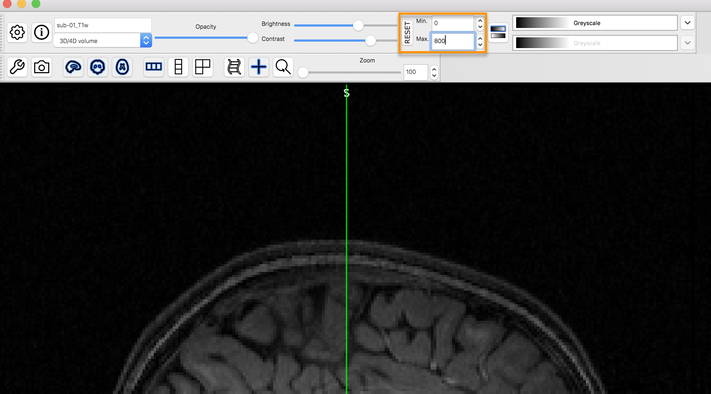
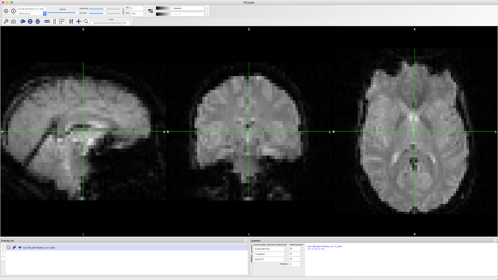

.. _fMRI_03_LookingAtTheData:

================
fMRI Tutorial #3: Looking at the Data
================

Overview
---------

Now that you've downloaded the dataset, let's see what it looks like. If the dataset has been downloaded to your Downloads directory, navigate to the Desktop and type the following:

::

    mv ~/Downloads/ds000102_0001/ Flanker
    
Which will rename the folder to ``Flanker`` and put it on your Desktop.

.. figure:: Move_Flanker_Folder.png

    After downloading the Flanker dataset, type the command above to move it to your Desktop.
    
    
As you saw in the previous :ref:`Data Download page <fMRI_01_DataDownload>`, the dataset has a standardized structure: Each subject folder contains an anatomical directory and a functional directory labeled ``anat`` and ``func``, and these in turn contain the anatomical and functional images, respectively. (The ``func`` directory also contains **onset times**, or timestamps for when the subject underwent either a Congruent or Incongruent trial.) This format is known as `BIDS <http://bids.neuroimaging.io/>`__, or Brain Imaging Data Structure, which makes it easy to organize and find your data.

.. figure:: Flanker_DataStructure.png

    Example of the BIDS format. Note that the ``func`` directory contains functional data - in this case, two runs of functional data - and corresponding "events.tsv" files, which contain **onsets**, or timestamps of which condition happened at what time. You can open these as a text file or as a spreadsheet.

--------

Inspecting the Anatomical Image
----------
    
Whenever you download imaging data, check the anatomical and functional images to inspect them for any problems - scanner spikes, incorrect orientation, poor contrast, and so on. It will take some time to develop an eye for what these problems look like, but with practice it will become quicker and easier to do.

Let's take a look at the anatomical image in the ``anat`` folder for ``sub-08``. Navigate to the sub-08 folder and then type

::

    fsleyes anat/sub-01_T1w.nii.gz
    
This will open the anatomical image in ``fsleyes``, FSL's image viewer.

    The anatomical image displayed in fsleyes. The contrast seems low between the grey and white matter, but this is because the blood vessels of the neck (indicated by orange arrows) are much brighter than the rest of the brain.
    

    This can be fixed by changing the numbers in the contrast box. Here, the Maximum has been lowered to 800, capping the brightest signal at that value. This makes it easier to see the contrast between the tissues.
    
    
    
Inspect the image by clicking and dragging the mouse around. You can switch viewing panes by clicking in the corresponding window. Note that the other windows are updated in real time as you move your mouse around. This is because MRI data is collected as a three-dimensional image, and moving along one of the dimensions will change the other windows as well.

.. note::

    You may have noticed that this subject appears to be missing his face. That is because the data from OpenNeuro.org have been **deidentified**: Not only has information such as name and date of scanning been removed from the header, but the faces have also been erased. This is done in order to ensure the subject's anonymity.
    

As you continue to inspect the image, here are two things you can watch out for:

1. Lines that look like ripples in a pond. These are called **Gibbs Ringing Artifacts**, and they may indicate an error in the reconstruction of the MR signal from the scanner. These ripples may also be caused by the subject moving too much during the scan. In either case, if the ripples are large enough, they may cause preprocessing steps like brain extraction or normalization to fail.

.. Also include pictures from the QC talk?

2. Abnormal intensity differences within the grey or the white matter. These may indicate pathologies such as aneurysms or cavernomas, and they should be reported to your radiologist right away; make sure you are familiar with your laboratory's protocols for reporting artifacts. For a gallery of pathologies you may see in an MRI image, click `here <http://www.mrishark.com/brain1.html>`__.

----------

Inspecting the Functional Images
----------
    
When you are done looking at the anatomical image, click on ``Overlay -> Remove All`` from the menu at the top of your screen. Then, click on ``File -> Add from File``, navigate to ``sub-08``'s func directory, and select the image ending in ``run-1_bold.nii.gz``. This image also looks like a brain, but it is not as clearly defined as the anatomical image. This is because the **resolution** is lower. It is typical for a study to collect a high-resolution T1-weighted (i.e., anatomical) image, and lower-resolution functional images, in part because we collect the functional images much more quickly.

Many of the quality checks for the functional image are the same as with the anatomical image: Watch out for extremely bright or extremely dark spots in the grey or white matter, as well as for image distortions such as abnormal stretching or warping. One place where it is common to see a little bit of distortion is in the orbitofrontal part of the brain, just above the eyeballs. There are ways to reduce this distortion, but for now we will ignore it.

.. Reference the timeseries glossary

Another quality check is to make sure there isn't excessive motion. Functional images are often collected as a time-series; that is, multiple volumes are concatenated together into a single dataset. You can rapidly flip through all of the volumes like pages of a book by clicking on the movie reel icon in fsleyes. Note any sudden, jerky movements in any of the viewing panes. During preprocessing, we will quantify how much motion there was in order to decide whether to keep or to discard that subject's data.

--------

Video
--------

Follow along `here <https://www.youtube.com/watch?v=eRDat10yGSs>`__ for a demonstration of quality checking fMRI data. When you are finished, click on the Next button to learn about preprocessing the data.
