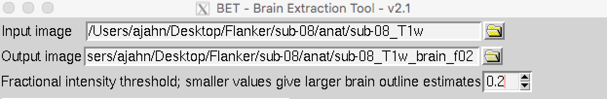
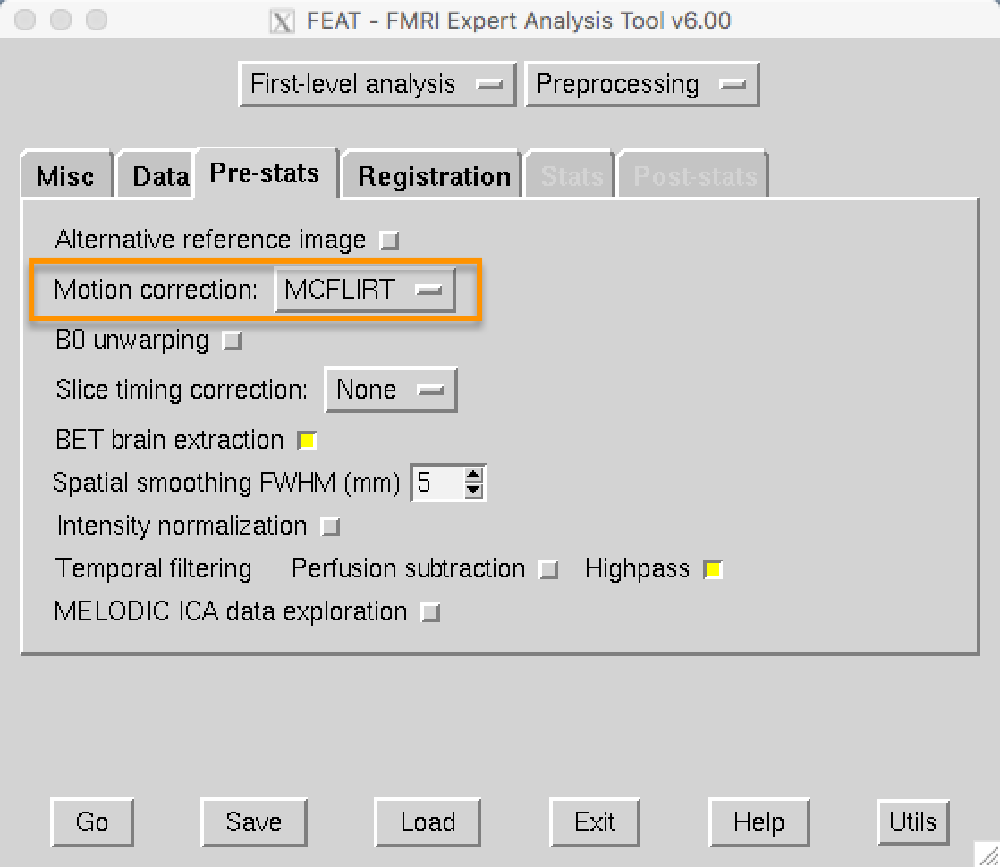

.. _fMRI_04_Preprocessing.rst

=============
fMRI Tutorial #4: Preprocessing
=============

.. note::
  This chapter is much longer than the other chapters; to make it easier to read and to find what you need it is divided into sections detailing each preprocessing step. Many of the examples are run from the ``Flanker/sub-08`` directory; I recommend navigating to that directory with your Terminal before reading the rest of the chapter.

Overview
-------------

Now that we're familiar with where our data is located and what it looks like, we will do the first step of fMRI analysis: **Preprocessing**.

Think of preprocessing as cleaning up images. When you take a photo with a camera, for example, there are several things you can do to make the image look better:

* Remove red eye;
* Increase color saturation;
* Remove shadows.

.. figure:: Before_After_Editing.png

  A picture we take with a camera may be dark, blurry, or noisy (left panel). After cleaning up the image by enhancing contrast, reducing blur, and increasing brightness, we end up with a more defined and clearer picture.

Similarly, when we preprocess fMRI data we are cleaning up the 3-dimensional images that we acquire every :ref:`TR <Repetition_Time>`. An fMRI volume contains not only the signal that we are interested in - changes in oxygenated blood - but also signals that we are not interested in, such as head motion, random drifts, breathing, and heartbeats. We call these other signals **noise**, since we want to separate them from the signal that we are interested in. Some of these can be regressed out of the data by modeling them (discussed later), whereas others can be reduced or removed by preprocessing.

Preprocessing Steps
--------------

The major preprocessing steps are:

* Brain extraction (or "skull stripping")
* Motion correction
* Slice timing correction
* Smoothing
* Temporal Filtering
* Registration
* Normalization

.. note::
  Different software packages will do these steps in slightly different order - for example, FSL will normalize the statistical maps after the model has been fit. There are also analyses which omit certain steps - for example, some people who do multi-voxel pattern analyses don't smooth their data. In any case, the list above represents the most common steps that are performed on a typical dataset.
  
  
We use the term **preprocessing** because we are trying to clean up the images as best we can before fitting a model to the data. Once it has been processed, we can fit a statistical model and make claims about which conditions lead to changes in oxygenated blood.

Brain Extraction (or "skull stripping")
^^^^^^^^^^

Since fMRI studies focus on brain tissue, our first step is to remove the skull and non-brain areas from the image. FSL has a tool for this called **bet**, or the Brain Extraction Tool (along with a newer version called ``bet2``). It is the first button listed on the FSL GUI (window A, in the figure below). If you click on this button, another window opens that allows you to specify the Input image to skullstrip and the Output image that has been skullstripped (B), and an expandable sub-window that allows you to specify advanced options (C).

.. figure:: FSL_BET_GUI.png

.. note::
  For BET and many of the other FSL tools, you are required to specify an input image and an output image: Some operation is performed on the input image (skullstripping, for example) and the output image is the result of that operation. Usually the other options are set to defaults that work well for the majority of datasets, but you can override them if you want.
  

If you launched the FSL GUI from the ``sub-08`` directory, click on the Folder icon next to the ``Input image`` field and navigate to the ``anat`` directory. Select the file ``sub-08_T1w.nii.gz`` and click the OK button. Notice that the ``Output image`` field is automatically filled in with the word ``brain`` appended to your Input image. This is FSL's default, but you can change the name if you like. For this tutorial, we will leave it as is.

Now click the ``Go`` button at the bottom of the window. You will see some text written to your Terminal showing which commands are being used to run ``bet2``. It is important to understand how the GUI corresponds to the Terminal - later on we will take advantage of this by creating template through the GUI and then modifying that template in the Terminal and automating it to preprocess all of the subjects in our dataset.

Looking at the data
********

When the Terminal says "Finished", ``bet2`` is done. Since you have created a new image you should **look at your data**, which we will do after each preprocessing step.

.. warning::
  Newcomers often hear the phrase "Look at your data" intoned like a mantra. Without knowing how to look at one's data, the words become meaningless at best, a false comforter at worst. Each of the preprocessing steps in this chapter will be followed by recommendations of what to look for and concrete examples of what is OK and what is a problem - and what to do about it. Although we cannot cover every possible example, as you gain experience you will develop your judgment of what is Good, what is Passable, and what is Bad.
  

Click on the ``FSLeyes`` button at the bottom of the GUI. When it opens, click on ``File -> Add from File`` and hold shift to select both the original anatomical image and the skullstripped image you just created. As you saw in the :ref:`previous chapter <fMRI_03_LookingAtTheData>`, you will want to change the contrast to clearly distinguish the grey matter from the white matter.

By loading both images we can compare the image before and after the skull was removed. In the ``Overlay List`` panel in the lower left corner of FSLeyes, you can click the "eye" icon to hide the corresponding image. For example, if you click on the eye icon next to ``sub-08_T1w``, the original T1 anatomical image will become invisible, and you will only see the skullstripped brain. If you click on the eye again, you will see the original T1. Click around the image with your mouse and practice hiding and revealing the original T1. Observe where there is either too much brain or too little skull that was removed. Remember that we are trying to create an image that has had the skull and face stripped clean away, with only the brain (e.g., cortex, subcortical structures, brainstem, and cerebellum) remaining.

.. figure:: Before_After_BET.png

  The anatomical image before skullstripping (Left) and after (Right). Note that in the frontal cortex, part of the brain has been stripped away. Make sure to check the brain before and after skullstripping in all three viewing panes to see where there are problems.

If you're not happy with the skullstripping, what can you do about it? Recall that the BET window contained options that we could change if we liked. One of the fields, labeled ``Fractional intensity threshold``, is set to 0.5 as a default. The nearby text explains that smaller values give larger brain outline estimates (and, conversely, larger values give smaller brain outline estimates). In other words, if we think that too much brain has been removed, we should set this to a smaller number, and vice versa if we think too little skull has been removed.

Since it appears that BET had removed too much brain, try changing the fractional intensity threshold to 0.2. Also make sure to change the output name to something that will help you remember what you did - for example, ``sub-08_T1w_brain_f02``. Click the Go button to re-run skullstripping.

When it has finished, load the newest skullstripped image in FSLeyes. Click on the eye icon next to the original anatomical image, and also the eye icon next to the newest skullstripped image that we have just created. Note where more cortex has been preserved, especially in the frontal cortex and parietal cortex. You may also have noticed that more dura mater and bits of skull remain in this image. As a general rule, it is better to err on the side of leaving too much skull, as opposed to removing too much cortex - bits of skull here and there won't cause future preprocessing steps to fail (such as normalization), but once cortex is removed, you cannot recover it.

-------------

Intermezzo: The FEAT GUI
^^^^^^^^^^^

The rest of the preprocessing steps will be carried out in the FEAT GUI. It is the button in the middle of the FSL GUI, and it will open up a window with several tabs.

.. figure:: FEAT_GUI.png

  Clicking on the FEAT FMRI analysis button (A) opens up the FEAT GUI. For now we will focus on the ``Data``, ``Pre-stats``, and ``Registration`` tabs, which preprocess the data. From the upper-right dropdown menu (B), select ``Preprocessing``. This will grey out the Stats and Post-stats tabs, and only allow preprocessing. Click on the ``Select 4D data`` button (C) to load your imaging data. This will open up a new window (D), which has a folder icon that allows you to select a functional imaging run (E).
  
The next preprocessing steps (motion correction through normalization) are all done in the FEAT GUI. We will discuss each of the steps in turn, provide FEAT with the required inputs, and then run all of the steps in one go.

-------------

Motion Correction
^^^^^^^^^^

If you've ever tried to take a photo of a moving object, usually the image is blurry. If the object is motionless, by contrast, you will get a much clearer and sharply defined image.

.. figure:: Hand_Motion.png

  A moving target leads to a blurry image (Left), whereas a stationary target leads to a more clearly defined image (Right). 
  
The concept is the same when we take three-dimensional pictures using MRI. In the subject is moving, the images will look blurry; if they are relatively still, the images will look more defined. But that's not all: If the subject moves a lot, we also risk measuring signal from a voxel that moves. We are then in danger of measuring signal from the voxel for part of the experiment and, after he moves, from a different region or tissue type. [Note: Need to expand on this]

Lastly, motion can introduce confounds into the imaging data because motion generates signal. If the subject moves every time in response to a stimulus - for example, if he jerks his head every time he feels an electrical shock - then it can become impossible to distinguish whether the signal we are measuring is in response to the stimulus, or because of the movement.

One way to "undo" these motions is through **rigid-body transformations**. To illustrate this, pick up a nearby object: a phone or a coffee cup, for example. Place it in front of you and mentally mark where it is. This is the **reference point**. Then move the object an inch to the left. This is called a **translation**, which means any movement to the left or right, forward or back, up or down. If you want the object to come back to where it started, you would simply move it an inch to the right. Similarly, if you rotated the object to the left or right, you could undo that by rotating it an equal amount in the opposite direction. These are called **rotations**, and like translations, they have three **degrees of freedom**, or ways that they can move: around the x-axis (also called **pitch**, or tilting forwards and backwards), around the y-axis (also known as **roll**, or tilting to the left and right), and around the z-axis (or **yaw**, as you would when shaking your head "no").

.. figure:: RigidBodyDemonstration.gif

We do the same procedure with our volumes. Instead of the reference point we used in the example above, let's call the first volume in our time-series the **reference volume**. If at some point during the scan our subject moves his head an inch to the left, we can detect that movement and undo it by moving that volume an inch to the right. The goal is to detect movements in any of the volumes and **realign** them as closely as possible to the reference volume.

(Insert 

.. figure:: MotionCorrectionExample.gif

  The reference volume  is typically the first volume of the time-series. If during the scan the subject moves to the right (B), that motion can be "undone" by realigning that volume to the reference volume with an equal and opposite movement to the left (C).
  
In the FEAT GUI, motion correction is specified in the ``Pre-stats`` tab. FEAT's default is to use FSL's MCFLIRT tool, which you can see in the dropdown menu. You have the option to turn off motion correction, but unless you have a reason to do that, leave it as it is.

Slice-Timing Correction
^^^^^^^^^^

Unlike a photograph, in which the entire picture is taken in a single moment, an fMRI volume is acquired in slices. Each of these slices takes time to acquire - anywhere from tens to hundreds of milliseconds. As you'll see later on, when we model the data at each voxel we assume that all of the slices were acquired simultaneously. To make this assumption valid, the :ref:`time-series <Time_Series>` 

Smoothing
^^^^^^^^^^

Temporal Filtering
^^^^^^^^^^

Registration
^^^^^^^^^^

Normalization
^^^^^^^^^^

The last step of preprocessing is **Normalization**. Although most people's brains are similar - everyone has a cingulate gyrus and a corpus callosum, for example - there are also differences in brain size and shape. As a consequence, if we want to do a group analysis we need to ensure that each voxel for each subject corresponds to the same part of the brain. If we are measuring a voxel in the visual cortex, let's say, we would want to make sure that every subject's visual cortex is in alignment with each other.

This is done through **warping** the brain. Just as you would fold clothes to fit them inside of a suitcase, each brain needs to be transformed to have the same size, shape, and dimensions. We do this by warping to a **template**, or a brain that has standard dimensions and coordinates - standard, because most researchers have agreed to use them. That way, if you warp your brains to that template and find an effect at coordinates X=3, Y=20, Z=42, someone else who has warped to the same template can check their results against yours.

.. figure:: MNI_Template.png

  An example of a commonly used template, the :ref:`MNI152 brain <MNI>`. This is an average of 152 healthy adult brains, which represent the population that most studies draw from. If you are studying another population - such as children or the elderly, for example - you should consider using a template created from representatives of that population.

To warp the brain to a template, we will use an **affine transformation**. This is similar to the rigid-body transformation described above in Motion Correction, but it adds two more transformations: zooms and shears. Whereas translations and rotations are easy enough to do with an everyday object such as a pen, zooms and shears are more unusual - Zooms either shrink or enlarge the image, while shears take the diagonally opposite corners of the image and stretch them away from each other. The animation below summarizes these four types of **linear transformations**.

.. figure:: AffineTransformations.gif

.. note:: As with rigid-body transformations, zooms and shears each have three degrees of freedom: You can zoom or shear an image along the x-, y-, or z-axis. In total, then, affine transformations have twelve degrees of freedom. These are also called linear transformations because a transformation applied in one direction along an axis is accompanied by a transformation of equal magnitude in the opposite direction. A translation of one millimeter *to* the left, for example, implies that the image has been moved one millimeter *from* the right. Likewise, an enlargement of one millimeter along the z-axis means that the image is enlarged in both directions simultaneously. 
Transformations without these constraints are called **nonlinear transformations**. For example, a nonlinear transformation can enlarge the image in one direction while shrinking in the other direction, like squeezing a sponge. These types of transformations will be discussed later.
