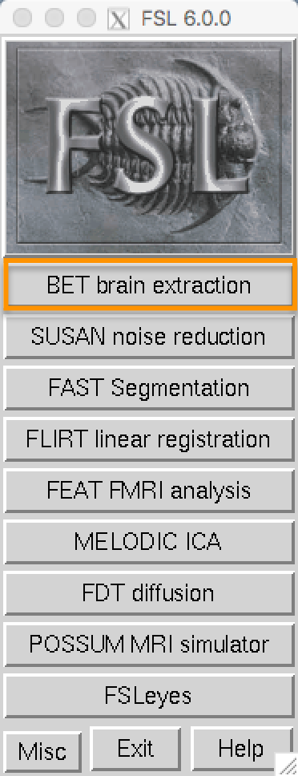
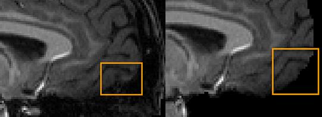

.. _fMRI_04_Preprocessing.rst

=============
fMRI Tutorial #4: Preprocessing
=============

.. note::
  This chapter is much longer than the other chapters; to make it easier to read and to find what you need it is divided into sections detailing each preprocessing step. Many of the examples are run from the ``Flanker/sub-08`` directory; I recommend navigating to that directory with your Terminal before reading the rest of the chapter.

Overview
-------------

Now that we're familiar with where our data is located and what it looks like, we will do the first step of fMRI analysis: **Preprocessing**.

Think of preprocessing as cleaning up images. When you take a photo with a camera, for example, there are several things you can do to make the image look better:

* Remove red eye;
* Increase color saturation;
* Remove shadows.

  A picture we take with a camera may be dark, blurry, or noisy (left panel). After cleaning up the image by enhancing contrast, reducing blur, and increasing brightness, we end up with a more defined and clearer picture.

Similarly, when we preprocess fMRI data we are cleaning up the 3-dimensional images that we acquire every TR. An fMRI volume contains not only the signal that we are interested in - changes in oxygenated blood - but also signals that we are not interested in, such as head motion, random drifts, breathing, and heartbeats. We call these other signals **noise**, since we want to separate them from the signal that we are interested in. Some of these can be regressed out of the data by modeling them (discussed later), whereas others can be reduced or removed by preprocessing.

Preprocessing Steps
--------------

The major preprocessing steps are:

* Brain extraction (or "skull stripping")
* Motion correction
* Slice timing correction
* Smoothing
* Temporal Filtering
* Registration
* Normalization

.. note::
  Different software packages will do these steps in slightly different order - for example, FSL will normalize the statistical maps after the model has been fit. There are also analyses which omit certain steps - for example, some people who do multi-voxel pattern analyses don't smooth their data. In any case, the list above represents the most common steps that are performed on a typical dataset.
  
  
We use the term **preprocessing** because we are trying to clean up the images as best we can before fitting a model to the data. Once it has been processed, we can fit a statistical model and make claims about which conditions lead to changes in oxygenated blood.

Brain Extraction (or "skull stripping")
^^^^^^^^^^

Since fMRI studies focus on brain tissue, our first step is to remove the skull and non-brain areas from the image. FSL has a tool for this called **bet**, or the Brain Extraction Tool (along with a newer version called ``bet2``). It is the first button listed on the FSL GUI (window A, in the figure below). If you click on this button, another window opens that allows you to specify the Input image to skullstrip and the Output image that has been skullstripped (B), and an expandable sub-window that allows you to specify advanced options (C).

.. note::
  For BET and many of the other FSL tools, you are required to specify an input image and an output image: Some operation is performed on the input image (skullstripping, for example) and the output image is the result of that operation. Usually the other options are set to defaults that work well for the majority of datasets, but which you can override if you want.
  

If you launched the FSL GUI from the ``sub-08`` directory, click on the Folder icon next to the ``Input image`` field and navigate to the ``anat`` directory. Select the file ``sub-08_T1w.nii.gz`` and click the OK button. Notice that the ``Output image`` field is automatically filled in with the word ``brain`` appended to your Input image. This is FSL's default, but you can change the name if you like. For this tutorial, we will leave it as is.

Now click the ``Go`` button at the bottom of the window. You will see some text written to your Terminal showing which commands are being used to run ``bet2``. It is important to understand how the GUI corresponds to the Terminal - later on we will take advantage of this by creating template through the GUI and then modifying that template in the Terminal and automating it to preprocess all of the subjects in our dataset.

Looking at the data
********

When the Terminal says "Finished", ``bet2`` is done. Since you have created a new image you should **look at your data**, which we will do after each preprocessing step.

.. warning::
  Newcomers often hear the phrase "Look at your data" intoned like a mantra. Without knowing how to look at one's data, the words become meaningless at best, a false comforter at worst. Each of the preprocessing steps in this chapter will be followed by recommendations of what to look for and concrete examples of what is OK and what is a problem - and what to do about it. Although we cannot cover every possible example, as you gain experience you will develop your judgment of what is Good, what is Passable, and what is Bad.
  

Click on the ``FSLeyes`` button at the bottom of the GUI. When it opens, click on ``File -> Add from File`` and hold shift to select both the original anatomical image and the skullstripped image you just created. As you saw in the :ref:`previous chapter <fMRI_03_LookingAtTheData>`, you will want to change the contrast to clearly distinguish the grey matter from the white matter.

By loading both images we can compare the image before and after the skull was removed. In the ``Overlay List`` panel in the lower left corner of FSLeyes, you can click the "eye" icon to hide the corresponding image. For example, if you click on the eye icon next to ``sub-08_T1w``, the original T1 anatomical image will become invisible, and you will only see the skullstripped brain. If you click on the eye again, you will see the original T1. Click around the image with your mouse and practice hiding and revealing the original T1. Observe where there is either too much brain or too little skull that was removed. Remember that we are trying to create an image that has had the skull and face stripped clean away, and with only the brain (e.g., cortex, subcortical structures, brainstem, and cerebellum) remaining.

If you're not happy with the skullstripping, what can you do about it? Recall that the BET window contained options that we could change if we liked. One of the fields, labeled ``Fractional intensity threshold``, is set to 0.5 as a default. The nearby text explains that smaller values give larger brain outline estimates (and, it is implied, larger values give smaller brain outline estimates). In other words, if we think that too much brain has been removed, we should set this to a smaller number, and vice versa if we think too little skull has been removed.
