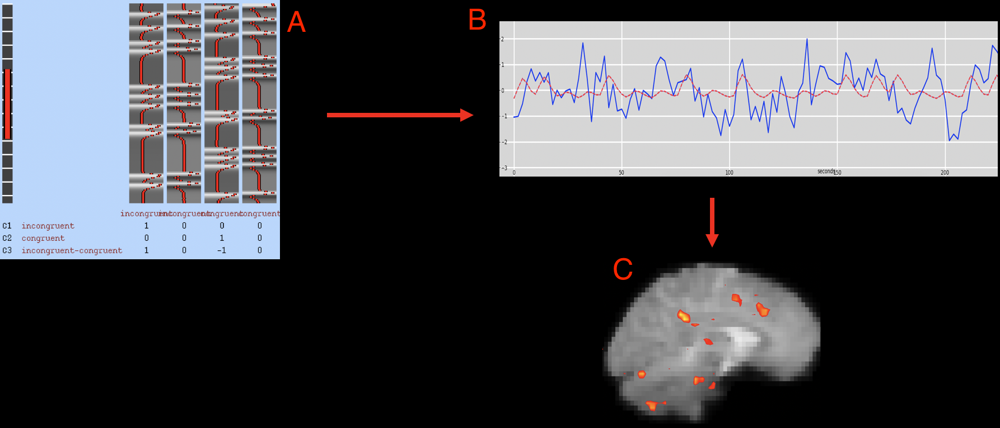

.. _fMRI_05_1stLevelAnalysis.rst

fMRI Tutorial #5: Statistics and Modeling
===============

-----------

Overview
********

Now that the first functional run has been preprocessed, we can **fit a model** to the data. To understanding how model fitting works, we need to review some fundamentals such as the General Linear Model, the BOLD response, and what a time-series is. Each of these topics are discussed in the following table of contents.

After you have reviewed those concepts, you are then ready to run a first-level analysis using FEAT. The figure below illustrates how we will be fitting a model to the data.

   After a model has been constructed indicating what the BOLD response should look like (A), that model is then fit to the time-series at each voxel (B). The goodness of fit can then be represented on the brain with as statistical maps, also known as "blobs" (C). Brighter intensities indicate a better model fit. These statistical maps can then be thresholded to show only the voxels with a statistically significant model fit.

.. toctree::
   :maxdepth: 1
   :caption: First-Level Analysis

   Statistics/01_Stats_TimeSeries
   Statistics/02_Stats_HRF_History
   Statistics/03_Stats_HRF_Overview
   Statistics/04_Stats_General_Linear_Model
   Statistics/05_Creating_Timing_Files
   Statistics/06_Stats_Running_1stLevel_Analysis
   Statistics/07_Stats_1stLevel_Checkpoint

.. note::

   Understanding model fitting and first-level analysis can be challenging. Don't be discouraged if you don't understand everything the first time you read the chapters; keep at it, and the concepts will become clearer with time and practice.
