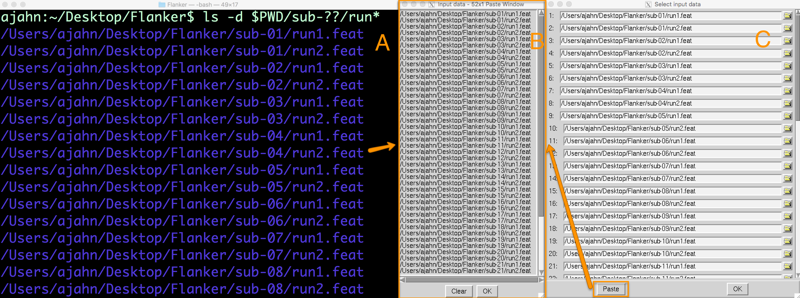
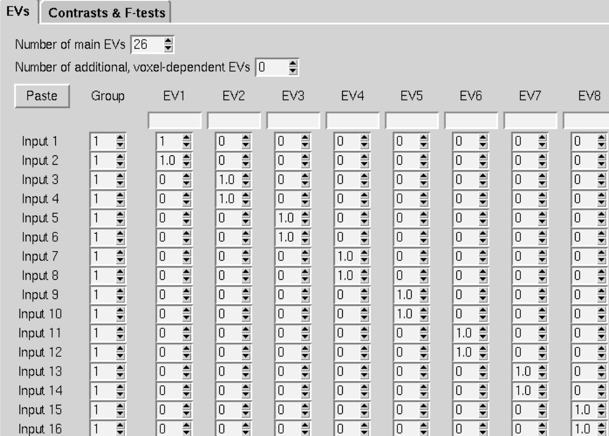
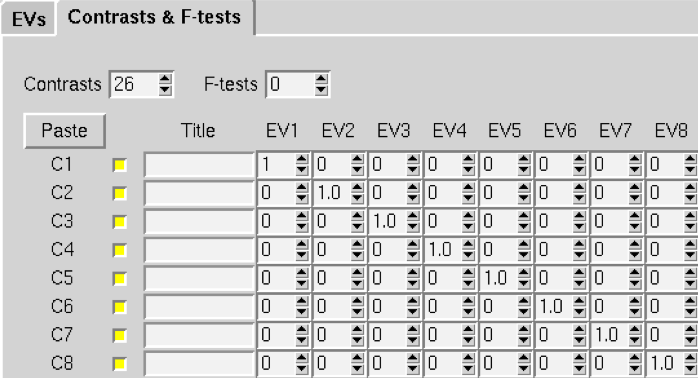
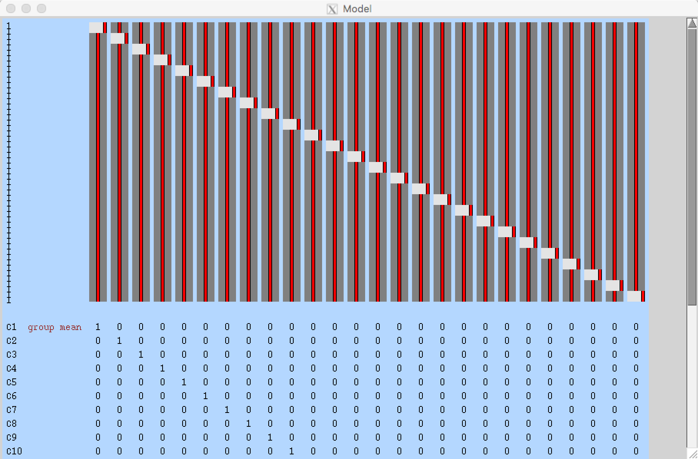

.. _fMRI_07_2ndLevelAnalysis:

fMRI Tutorial #7: 2nd-Level Analysis
====================================

Overview
********

Once you have preprocessed and analyzed all of the runs for all of the subjects in the Flanker dataset, you are ready to run a **2nd-level analysis**. Whereas AFNI and SPM define a 2nd-level analysis as synonymous with a group analysis, in FSL a 2nd-level analysis is the averaging together within each subject the parameter estimates and contrast estimates from the 1st-level analyses.

From the Flanker directory, open the FEAT GUI from the command line by typing ``Feat_gui``. Then from the dropdown menu select ``Higher-Level Analysis``. This changes the input field to ``Select FEAT directories``.

.. note::

  The dropdown menu on the Data tab allows you to choose either ``Inputs are lower-level FEAT directories`` (the default), or ``Inputs are 3D cope images from FEAT directories``. Choosing the FEAT directories will allow you select which cope images to analyze, although directly selecting the cope images can give you more flexibility if you didn't analyze the data with FSL's default processing stream (i.e., the data are not organized in a FEAT directory).
  
  
Selecting the FEAT Directories
******************************

Since we had 26 subjects with 2 runs each, we have 52 FEAT directories total. Change the ``Number of inputs`` to 52, and then click the button ``Select FEAT directories``.

You *could* select each of the FEAT directories by hand, clicking on the Folder icon and selecting each one individually. But as we saw with scripting our analysis, this usually isn't a good idea - it is impractical for large datasets, and the odds of making a mistake increases with the number of subjects.

Instead, we will use `wildcards <https://andysbrainbook.readthedocs.io/en/latest/unix/Unix_07_Scripting.html#wildcards>`__ to make this quicker and easier. Go back to the Terminal that you launched the FEAT GUI from, navigate to the Flanker directory, and type ``ctrl+z``, and then type ``bg`` and press Enter. This will allow you to type commands in the Terminal while keeping the FEAT GUI open. At the command line, type the following:

::

  ls -d $PWD/sub-??/run*
  
This will print an absolute path to each FEAT directory. The ``-d`` option means to only list directories, and ``$PWD`` expands to an absolute path pointing to the current working directory. Within the current directory, any directory starting with ``sub-`` and ending with two digits (represented by the ``?`` wildcards) is added to the path. Finally, within each subject directory, any directory beginning with the string ``run`` will be appended to the path name (e.g., run1.feat and run2.feat).

This will create a list with 52 entries, one corresponding to each run for each subject in the study. Highlight the entire list and copy it by pressing ``command+c``. This will copy the list to your clipboard. Then go back to the ``Select input data`` window, and click on the ``Paste`` button. Click in the ``Input data`` window, and then press ``ctrl+y`` and click ``OK``. This will paste the list of directories into the corresponding rows in the ``Select input data`` window.

  A list of FEAT directories can be generated in the Terminal using a combination of variables and wildcards (A). Clicking on the ``Paste`` button in (C) will open up an ``Input data`` window, in which the list of directories can be pasted (B).
  

In the Data tab, you will see that there are now 3 lower-level copes that you can choose to analyze. If you leave all three of the boxes selected, it will run a 2nd-level analysis for each one, which correspond to:

1. The contrast estimate for the Incongruent condition;
2. The contrast estimate for the Congruent condition;
3. The contrast estimate for Incongruent minus Congruent (i.e., taking the difference of the parameter estimates)

In the ``Output directory`` field, type ``Flanker_2ndLevel``. This is where the results of the 2nd level analysis will be saved.

Creating the GLM
****************

The ``Stats`` tab will look different from when you used it for 1st-level analysis - you can now choose between different types of **inference**, or how you want the results to generalize to the population. The dropdown menu has the following options:

1. Fixed Effects: Do not generalize from the sample - just take the average;
2. Mixed Effects: Simple OLS (Ordinary Least Squares): This will perform a t-test on the average parameter estimates calculated for each subject, without taking into account the variability between the runs for each subject;
3. Mixed Effects: FLAME 1: Weight each subject's parameter estimate by the variance of that contrast estimate. In other words, a subject with relatively low variance will be weighted more, and a subject with relatively high variance will be weighted less; 
4. Mixed Effects: FLAME 1+2: A more rigorous version of FLAME 1. It takes much longer, and is only helpful for analyzing small samples (e.g., 10 subjects or fewer);
5. Randomise: A non-parametric test (discussed in a later chapter).

Since we simply want to take the average of the parameter estimates across the runs within each subject, we will use the **Fixed Effects** option. Once you have selected that, click on ``Full Model Setup``.

This will display a window with the number of rows representing the number of individual parameter estimates - in our case, 52. For the ``Number of main EVs``, change this to 26, which is the number of subjects in our dataset. Then change the numbers in each column to 1 where you want to take the average for the parameter estimates for that subject. In our case, the first two rows for column 1 would be changed to 1, and next two rows for column 2 would be changed to 1, and so on.

  A screenshot of part of the GLM. You will follow this same pattern for all 26 subjects.
  
When you have finished, click on the ``Contrasts & F-tests`` tab, and change the number of ``Contrasts`` to 26. Change all of the numbers on the diagonal to 1; this will create a single contrast estimate for each subject that is the average of that subject's parameter estimates.

When you have finished setting up the GLM and contrasts and click ``Done``, you should see something like this:

As with the 1st-level analysis, we will ignore the ``Post-stats`` tab for now, since we are not performing a population inference.

Now click the ``Go`` button at the bottom of the GUI, and wait a few minutes for the analysis to run. When it finishes, click the ``Next`` button to move on to third-level analysis.

---------

Video
*****

For a screencast about how to create a 2nd-level analysis, click `here <https://www.youtube.com/watch?v=pT2Ry-mk_Ns>`__.
