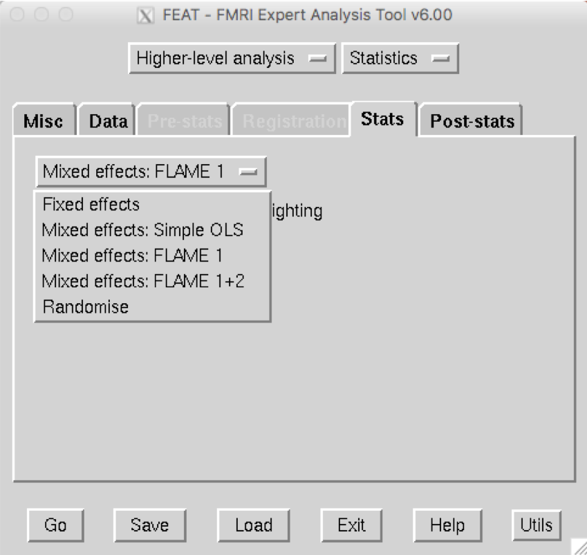
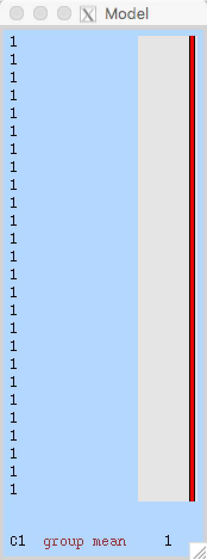
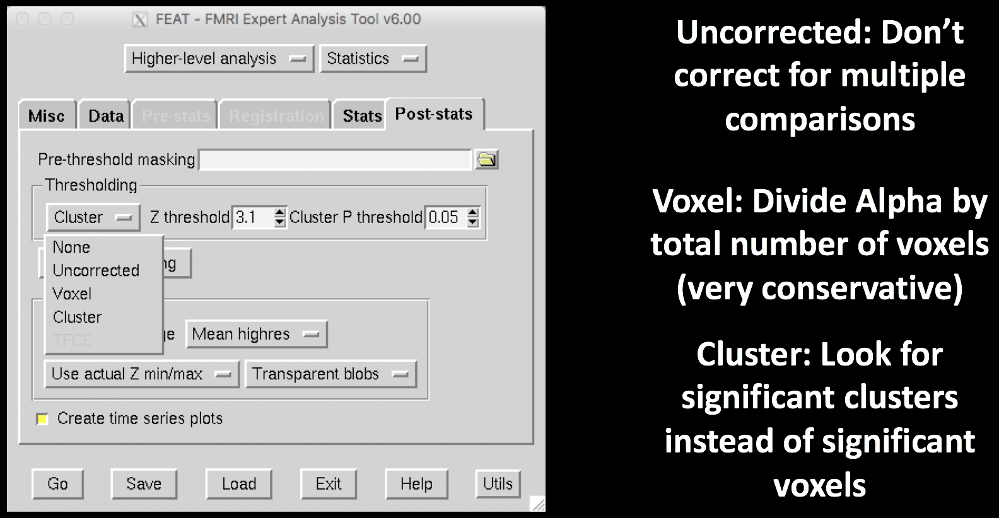
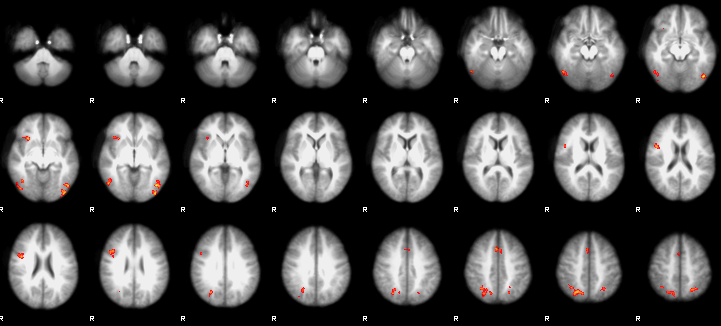
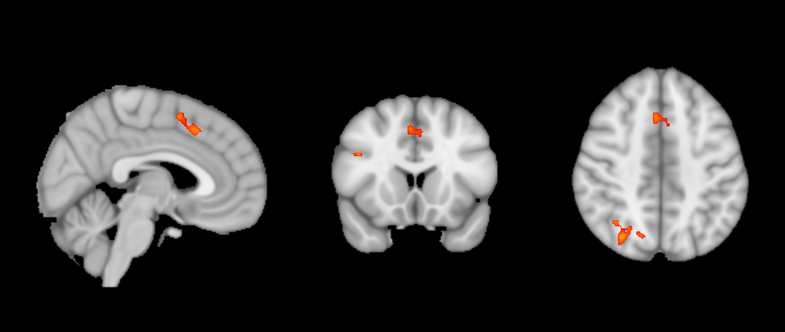

.. _fMRI_08_3rdLevelAnalysis:

fMRI tutorial #8: 3rd-Level Analysis
===================

-------------

Overview
*********

Our goal in analyzing this dataset is to generalize the results to the population that the sample was drawn from. In other words, if we see changes in brain activity in our sample, can we say that these changes would likely be seen in the population as well?

In order to test whether such a generalization probably exists, we will run a **3rd-level analysis**. In FSL, a 3rd-level analysis is a group-level analysis - we calculate the standard error and the mean for a parameter estimate or a contrast estimate, and test whether the average estimate is statistically significant.

FSL can only run one model at a time. In this example, we will run a 3rd-level analysis for the contrast of Incongruent-Congruent (labeled as ``cope3`` from the 2nd-level analysis, because it was the third contrast that was specified). As an exercise at the end of this chapter, you will be asked to run 3rd-level analyses for the individual parameter estimates of Incongruent and Congruent.

Loading the Data
*********

From the Flanker directory, open the FEAT GUI. As with the 2nd-level analysis, select ``Higher-level analysis``. Now, instead of selecting FEAT directories, choose ``Inputs are 3D cope images from FEAT directories``, and change the number of inputs to 26. The 2nd-level analysis generated an average contrast of parameter estimate, or **cope**, for each subject for each contrast that was specified in our model. As with selecting the FEAT directories during the 2nd-level analysis, we can copy and paste a list of the cope images: Click on ``Select cope images`` and then click the ``Paste`` button. In the Terminal, navigate to the directory ``Flanker_2ndLevel.gfeat/cope3.feat/stats``, and type ``ls $PWD/cope* | sort -V``. This will list all of the cope images in numerical order, even though they are not zero-padded. Copy and paste the list into the ``Input data`` window by typing ``ctrl+y``. After clicking ``OK``, label the output directory as ``Flanker_Level3_inc-con``.

Creating the GLM
***********

Click on the ``Stats`` tab. For a 3rd-level analysis, we will used Mixed Effects. This models the variance so that our results are generalizable to the population our sample was drawn from. FLAME 1 (FSL’s Local Analysis of Mixed Effects) provides accurate parameter estimates by using information about both within-subject and between-subject variability; FLAME1+2 is considered even more accurate, but the additional benefit is usually minimal, and it takes much longer.

The last option, ``Randomise``, uses a non-parametric approach, which is valid when the assumptions about normality do not hold. Later on, we’ll discuss why this is appropriate in some cases.

Since we're using a simple design, we can quickly create a GLM using the ``Model setup wizard`` button. We've already taken the contrast for each subject, so we can select ``single group average``. This is known as a **summary statistics** approach, as we are calculating a t-statistic based on single numbers generated from each subject. When you click ``Process``, you should see a Model representation that looks like this:

The Post-Stats Tab
**********

Now we finally discuss the ``Post-Stats`` tab. The only defaults you would probably want to consider changing are the Thresholding options. ``None`` won’t do any thresholding (i.e., show the parameter estimate at every voxel, regardless of significance); ``Uncorrected`` will allow any individual voxels to pass the threshold specified in Z-threshold (e.g., here we would only show voxels that have a value greater than 3.1); ``Voxel`` will divide the alpha threshold by the number of voxels (e.g., assume an alpha threshold of 0.05 and 10,000 voxels; our corrected alpha would be 0.05/10,000, or 0.000005, and we would only deem voxels as significant if they passed that threshold); and lastly ``Cluster``, which uses a cluster-defining threshold (CDT) to determine whether a cluster of voxels is significant. The logic behind this approach is that neighboring voxels are not independent of one another, and this reduced degrees of freedom is taken into account when estimating significance.

For example, if we leave our Z-threshold at 3.1 and our Cluster p-threshold at 0.05, we will look for clusters composed of voxels that each individually pass a z-threshold of 3.1. FSL runs simulations to see how often we would get clusters of certain sizes with each of their constituent voxels passing that z-threshold, and creates a distribution of cluster sizes for that CDT (similar to what happens when we compute a t-distribution based on degrees of freedom). Cluster sizes that occur less than 5% of the time in the simulations for that CDT are then determined to be significant.

For most analyses, the default of a Cluster correction analysis with a CDT of z=3.1 and a cluster threshold of p=0.05 is appropriate. For a detailed comparison of the false positive rates among the different software packages and different cluster correction settings, see the original `Eklund et al. 2016 paper <https://www.pnas.org/content/113/28/7900>`__; for a video overview, click `here <https://www.youtube.com/watch?v=bcoK3ZokPV8>`__.

Now click ``Go``. This will take about 5-10 minutes, depending on how powerful your computer is.

Reviewing the Output
*************

In the FEAT HTML output, you will see the thresholded z-statistic image overlaid on a template MNI brain. These are axial slices, and they give you a quick overview of where the significant clusters are located.

To take a closer look, open ``fsleyes`` and load a standard template, such as ``MNI152_T1_1mm_brain``. Then load the thresh_zstat1.nii.gz image, located in ``Flanker_3rdLevel_inc-con.gfeat/cope1.feat``. This file only shows those clusters that were determined to be significant based on the criteria you specified in the Post-stats tab. 

Change the color scheme to "Red-Yellow", and change the "Min." value to 3.1. You can also click on the Gear icon and change the interpolation to make the results look smoother. Lastly, click on a cluster in the dorsal medial prefrontal cortex area, and turn the crosshairs off by clicking on the crosshairs icon. These are all cosmetic choices, and you can change them as you like. You can then take a snapshot of this montage with the Camera icon, and include the image as a figure in your manuscript.

  The end result: an image showing the significant clusters from the analysis.
  

------

Exercises
*******

------

Video
********
