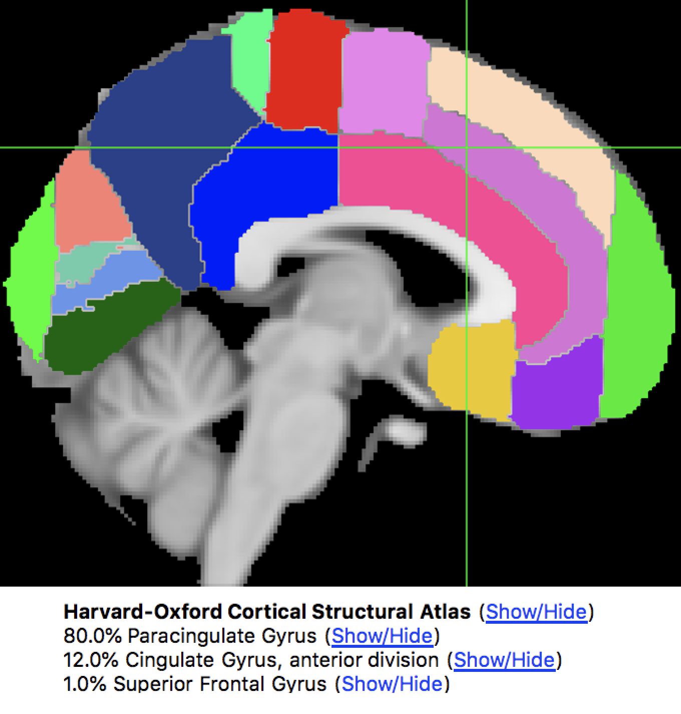
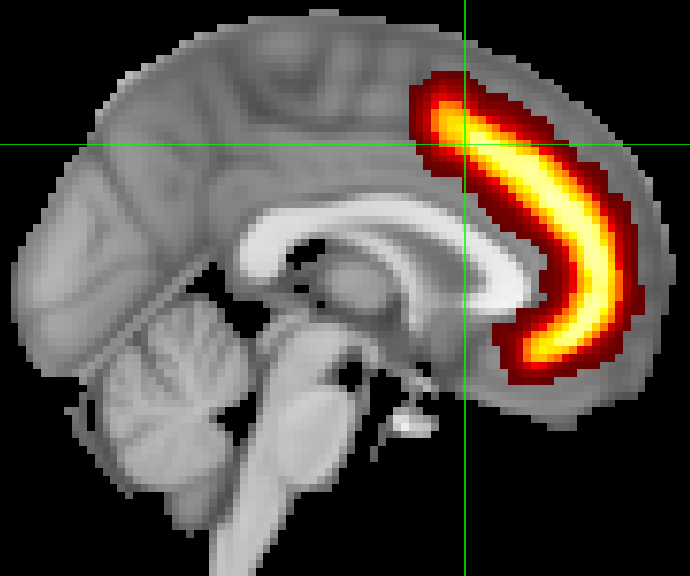
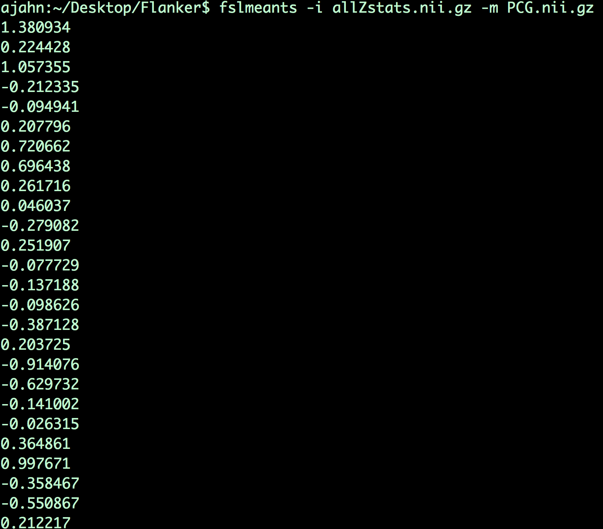

.. _fMRI_09_ROIAnalysis:

fMRI Tutorial #9: ROI Analysis
=====================

---------

Overview
********

You've just completed a group-level analysis, and identified which regions of the brain show a significant difference between the Incongruent and Congruent conditions of the experiment. For some researchers, this may be all that they want to do.

This kind of analysis is called a **whole-brain** or **exploratory** analysis. These types of analyses are useful when the experimenter doesn't have a hypothesis about where the difference may be located; the result will be used as the basis for future research.

When a large number of studies have been run about a specific topic, however, we can begin to make more specific hypotheses about where we should find our results in the brain images. For example, cognitive control has been studied for many years, and many fMRI studies have been published about it using different paradigms that compare more cognitively demanding tasks to less cognitively demanding tasks. Often, significant increases in the BOLD signal during cognitively demanding conditions are seen in a region of the brain known as the **dorsal medial prefrontal cortex**, or dmPFC for short. For the Flanker study, then, we could restrict our analysis to this region and only extract data from voxels within that region. This is known as a **region of interest (ROI)** analysis. A general name for an analysis in which you choose to analyze a region selected before you look at whole-brain results is called a **confirmatory analysis**.

Whole-brain maps can hide important details about the effects that we’re studying. We may find a significant effect of incongruent-congruent, but the reason the effect is significant could be because incongruent is greater than congruent, or because congruent is much more negative than congruent, or some combination of the two. The only way to determine what is driving the effect is with ROI analysis, and this is especially important when dealing with interactions and more sophisticated designs.

Using Atlases
*******

One way to create a region for our ROI analysis is to use an **atlas**, or a map that partitions the brain into anatomically distinct regions.

FSL has many atlases already installed, which you can access through fsleyes. If you click on Settings -> Ortho View 1 -> Atlas Panel, it will open a new window called ``Atlases``. By default, the Harvard-Oxford Cortical and Subcortical Atlases will be loaded. You can see how the atlas partitions the brain by clicking on the ``Show/Hide`` link next to the atlas name. The voxel at the center of the crosshairs in the viewing window will be assigned a probability of belonging to a brain structure.

  The Harvard-Oxford Cortical atlas, displayed on an MNI template brain. The Atlas window shows the probability that the voxel is located at a certain anatomical region.
  
To save one of these regions as a file to extract data from, also known as a **mask**, click on the ``Show/Hide`` link next to the region you want to use as a mask - in our example, let's say that we want to use the Paracingulate Gyrus as a mask. Clicking on the link will show that region overlaid on the brain, as well as load it as an overlay in the Overlay List window. Click on the disk icon next to the image to save it as a mask. Save it to the Flanker directory and call it ``PCG.nii``.

.. warning::

  Your results will have the same resolution as the template you used for normalization. The default in FSL is the MNI_152_T1_2mm_brain, which has a resolution of 2x2x2mm. When you create a mask, it will have the same resolution as the template that it is overlaid on. When we extract data from the mask, the data and the mask need to have the same resolution. To avoid any errors due to different image resolutions, use the same template to create the mask that you used to normalize your data.
  

Extracting Data from an Anatomical Mask
************

Once you've created the mask, you can then extract each subject's contrast estimates from it. Although you may think that we would extract the results from the 3rd-level analysis, we actually want the ones from the 2nd-level analysis; the 3rd-level analysis is a single image with a single number at each voxel, whereas in an ROI analysis our goal is to extract the contrast estimate for each subject individually.

For the Incongruent-Congruent contrast estimate, for example, you can find each subjects' data maps in the directory ``Flanker_2ndLevel.gfeat/cope3.feat/stats``. The data maps have been calculated several different ways, including t-statistic maps, cope images, and variance images. My preference is to extract data from the z-statistic maps, since these data have been converted into a form that is normally distributed and, in my opinion, is easier to plot and to interpret.

To make our ROI analysis easier, we will merge all of the z-statistic maps into a single dataset. To do this, we will use a combination of FSL commands and Unix commands. Navigate into the ``Flanker_2ndLevel.gfeat/cope3.feat/stats`` directory, and then type the following:

::

  fslmerge -t allZstats.nii.gz `ls zstat* | sort -V`
  
This will merge all of the z-statistic images into a single dataset along the time dimension (specified with the ``-t`` option); this simply means to daisy-chain the volumes together into a single larger dataset. The first argument is what the output dataset will be called (``allZstats.nii.gz``), and the code in backticks uses an asterisk wildcard to list each file beginning with "zstat", and then sorts them numerically from smallest to largest with the ``-V`` option.

Move the allZstats.nii.gz file up three levels so that it is in the main Flanker directory (i.e., type ``mv allZstats.nii.gz ../../..``). Then use the fslmeants command to extract the data from the PCG mask:

::

  fslmeants -i allZstats.nii.gz -m PCG.nii.gz
  
This will print 26 numbers, one per subject. Each number is the contrast estimate for that subject averaged across all of the voxels in the mask. 

  Each number output from this command corresponds to the contrast estimate that went into the analysis. For example, the first number corresponds to the average contrast estimate for Incongruent-Congruent for sub-01, the second number is the average contrast estimate for sub-02, and so on. These numbers can be copied and pasted into a statistical software package of your choice (such as R), and then you can run a t-test on them.
  
Extracting Data from an Sphere
************

You may have noticed that the results from the ROI analysis using the anatomical mask were not significant. This may be because the PCG mask covers a very large region; although the PCG is labeled as a single anatomical region, we may be extracting data from several distinct functional regions. Consequently, this may not be the best ROI approach to take.

Another technique is called the **spherical ROI** approach. In this case, a sphere of a given diameter is centered at a triplet of specified x-, y-, and z-coordinates. These coordinates are often based on the peak activation of another study that uses the same or a similar experimental design to what you are using. This is considered an **independent** analysis, since the ROI is defined based on a separate study.

The following animation shows the difference between anatomical and spherical ROIs:

.. figure:: ROI_Analysis_Anatomical_Spherical.gif

To create this ROI, we will need to find peak coordinates from another study; let's randomly pick a paper, such as Jahn et al., 2016. In the Results section, we find that there is a Conflict effect for a Stroop task - a distinct but related experimental design also intended to tap into cognitive control - with a peak t-statistic at MNI coordinates 0, 22, 40.

.. figure:: ROI_Analysis_Jahn_Study.png

The next few steps are complicated, so pay close attention to each one:

1. Open fsleyes, and load an MNI template. In the fields under the label "Coordinates: MNI152" in the ``Location`` window, type ``0 20 44``. Just to the right of those fields, note the corresponding change in the numbers in the fields under ``Voxel location``. In this case, they are ``45 73 58``. Write down these numbers.

2. In the terminal, navigate to the Flanker directory and type the following:

::

  fslmaths $FSLDIR/data/standard/MNI152_T1_2mm.nii.gz -mul 0 -add 1 -roi 45 1 73 1 58 1 0 1 Jahn_ROI_dmPFC_0_20_44.nii.gz -odt float

This is a long, dense command, but for now just note where we have inserted the numbers 45, 73, and 58. When you create another spherical ROI based on different coordinates, these are the only numbers you will change. (When you create a new ROI you should change the label of the output file as well.) The output of this command is a single voxel marking the center of the coordinates specified above.

3. Next, type:

::

  fslmaths Jahn_ROI_dmPFC_0_20_44.nii.gz -kernel sphere 5 -fmean Jahn_Sphere_dmPFC_0_20_44.nii.gz -odt float

This expands the single voxel into a sphere with a radius of 5mm, and calls the output "Jahn_Sphere.nii.gz". If you wanted to change the size of the sphere to 10mm, for example, you would change this section of code to ``-kernel sphere 10``.

4. Now, type:

::

  fslmaths Jahn_Sphere_dmPFC_0_20_44.nii.gz -bin Jahn_Sphere_bin_dmPFC_0_20_44.nii.gz
  
This will binarize the sphere, so that it can be read by the FSL commands.

.. note::

  In the steps that were just listed, notice how the output from each command is used as input to the next command. You will change this for your own ROI, if you decide to create one.

5. Lastly, we will extract data from this ROI by typing:

::

  fslmeants -i allZstats.nii.gz -m Jahn_Sphere_bin_dmPFC_0_20_44.nii.gz 
  

The numbers you get from this analysis should look much different from the ones you created using the anatomical mask. Copy and paste these commands into the statistical software package of your choice, and run a one-sample t-test on them. Are they significant? How would you describe them if you had to write up these results in a manuscript?

-------

Exercises
********

1. The mask used with fslmeants is **binarized**, meaning that any voxel containing a numerical value greater than zero will be converted to a "1", and then data will be extracted only from those voxels labeled with a "1". You will recall that the mask created with fsleyes is **probabilistic**. If you want to weight the extracted contrast estimates by the probability weight, you can do this by using the ``-w`` option with fslmeants. Try typing:

::

  fslmeants -i allZstats.nii.gz -m PCG.nii.gz -w
  
And observe how the numbers are different from the previous method that used a binarized mask. Is the difference small? Large? Is it what you would expect?

2. Use the code given in the section on spherical ROI analysis to create a sphere with a 7mm radius located at MNI coordinates 36, -2, 48.

3. Use the Harvard-Oxford subcortical atlas to create an anatomical mask of the right amygdala. Label it whatever you want. Then, extract the z-statistics from cope1 (i.e., the contrast estimates for Incongruent compared to baseline).

--------

Video
*********

Click `here <https://www.youtube.com/watch?v=p70utwa-NkU>`__ for a demonstration of how to use both anatomical and spherical masks for an ROI analysis.
