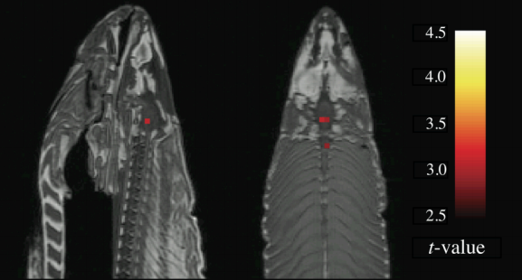
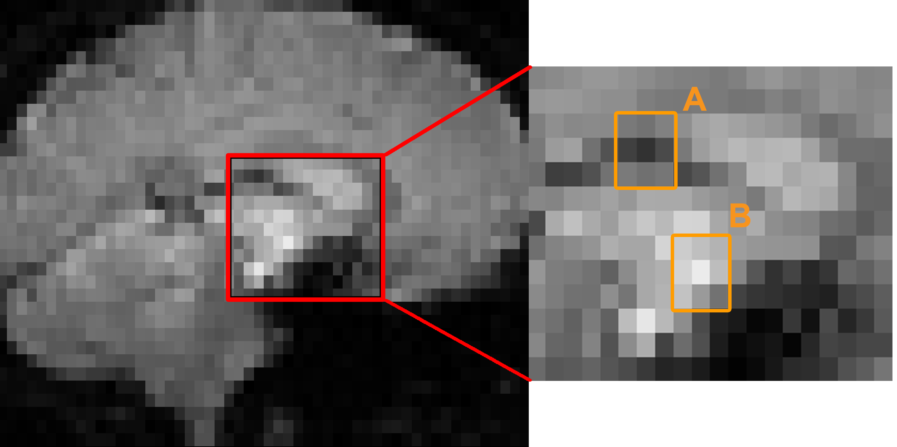
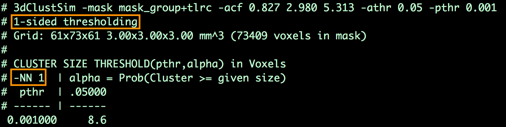
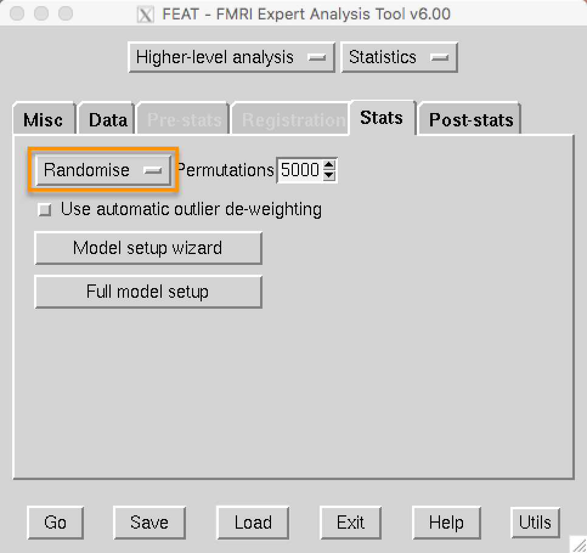
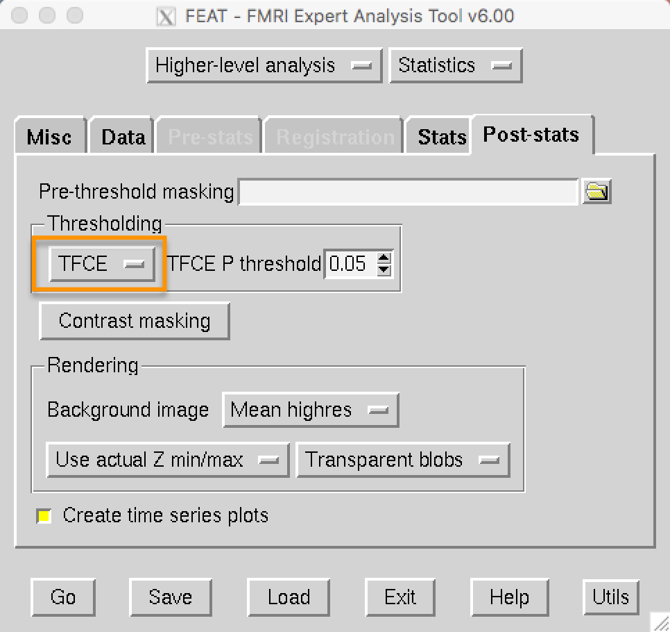
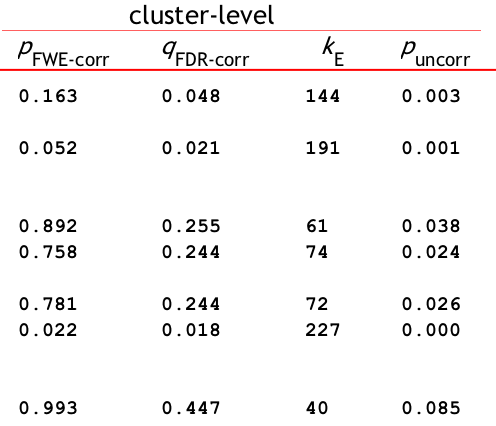
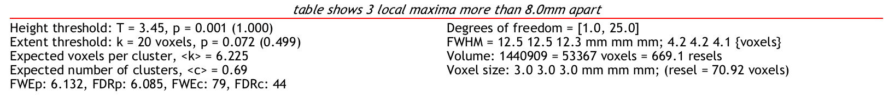

.. _Appendix_A_ClusterCorrection:

Appendix A: Cluster Correction
==============

-------------

The Problem of Multiple Comparisons
***********************************

In the fMRI tutorial you just completed, you learned that group-level contrast maps are created through a **mass univariate analysis**: in other words, we carry out as many statistical tests as there are voxels. Given that a typical fMRI dataset contains hundreds of thousands of voxels, this can lead to a large number of false positives. To control for the number of false positives, therefore, and to keep them at the conventional level of 5%, we will need to do something called **multiple comparisons correction**.

.. note::

  For most statistical tests, we set the **false positive rate**, also known as the **alpha level**, to 0.05, or 5%. This is the probability that we will reject the null hypothesis if the null hypothesis is true; in other words, it is the probability that we will observe a false positive.
  

Failing to correct for multiple comparisons can lead to results that are unreliable and sometimes absurd. To illustrate this, and to make a point that presumably could not be made any other way, a researcher named Craig Bennet put a dead salmon into a scanner, showed it pictures of humans talking, playing, and socializing, and then analyzed the data as if it were any other study - only without correcting for multiple comparisons. The significant voxels consequently found in the salmon's brain were clearly artifacts caused by noise; the message being that a certain number of voxels will pass a significance threshold regardless of whether there is a true effect or not.

  The famous "Dead Salmon" picture from Bennet et al. (2009). 

Bonferroni Correction
************

If we want to carry out several tests - as is commonly done in many studies - then what can be done to protect ourselves from mistaking false positives for true effects? The most straightforward method is called **Bonferroni Correction**, named after the Italian mathematician Carlo Bonferroni. Simply take your alpha level - traditionally set at 5% - and divide it by the number of tests.

This works well enough for behavioral studies consisting of a handful of tests, but quickly becomes unreasonable when applied to imaging data. For example, if your group-level contrast map contains 100,000 voxels and your alpha level is 0.05, an individual voxel will have to pass a corrected alpha level of 0.05/100,000 = 0.0000005 in order to be judged statistically significant. Either the effect must be phenomenally strong, or the study highly powered, for a voxel to reach this threshold; but effects are often not that strong, and imaging studies are usually not that highly powered. But if we want to use another correction method, first we will need to make the case for why Bonferroni Correction isn't appropriate for imaging studies.

Problems with Bonferroni Correction
*************

One of the assumptions of Bonferroni correction is that each test is independent. To take our fMRI dataset as an example, that would mean that each voxel is completely independent of every other voxel in the brain; knowing the value of one voxel doesn't tell you anything about any other voxel.

But are the voxels completely independent? Let's take a look at a typical fMRI image. Notice that a given voxel is similar to its neighbors: Bright voxels tend to be surrounded by brighter voxels, and darker voxels tend to be surrounded by darker voxels. Since we can make a relatively close estimate about what the signal intensity will look like for a voxel given its neighbors, the voxels are not completely independent. (The same logic extends to the timecourse at each voxel as well.)

  A typical fMRI image (left) with the inset showing an enlarged picture of the voxels at the center (right). Notice that the center voxel of region A is surrounded mostly by darker voxels, while the center voxel of region B is surrounded mostly by lighter voxels.
  
Bonferroni correction, then, is too severe. Although you are virtually guaranteed to keep your false positive rate below 5%, this is likely to result in a high false negative rate - that is, failing to reject the null hypothesis when there actually is an effect. And although the debate goes on as to which type of false result is worse, in our case it would be preferable to do without Bonferroni correction altogether.
  
  
Cluster Correction
***************

Fortunately, there is an alternative known as **cluster correction**, which is the most popular correction method in fMRI analysis (`Woo et al., 2014 <https://www.sciencedirect.com/science/article/pii/S1053811914000020>`__). Cluster correction takes advantage of the fact that the voxels in a typical dataset are not completely independent: Instead of testing each voxel individually, *clusters* of voxels are tested for significance.

To illustrate this, let's take a coronal slice from the incongruent-congruent group-level contrast you created in the fMRI tutorial. Notice how the brighter colors can be grouped into distinct clusters; if we tilt this slice into a three-dimensional view, we can see how clusters of voxels clump together into what looks like mountain ranges. Seen from this angle, the height of an individual voxel is determined by its z-value: Higher z-values correspond to higher peaks. The threshold that we apply is a cross-section through the mountains at a certain height - for example, a z-value of 3.1, corresponding to a p-value of 0.001 - and we only observe the peaks that remain after applying this threshold. This is known as **thresholding** the image, or, more specifically, setting a **cluster-defining threshold**, since only those voxels that are at or above that threshold will remain - and this threshold is the value that you see in the Post-stats tab of the FEAT GUI.

.. figure:: Zstat_Peak_Demo.gif

You may think that's all we need to do; but a cluster-defining threshold is not the same as an alpha level. It could be that clusters as large as the ones in our group analysis are just as likely to be found in images created from pure noise. What we need to ask ourselves at this point is, How many clusters of a given size would be expect to observe due to chance? Let's say that our cluster in the medial prefrontal cortex is 50 voxels large; how often would we expect a cluster that size to be generated by noise?

To answer this we run simulations - in other words, we create artifical datasets with the same dimensions and smoothness as our task dataset, but which are composed of pure noise. We then write down the size of the largest cluster, and repeat the process with another simulated dataset. If we do this thousands of times, we can create a distribution of maximum cluster sizes - and from this, we can calculate the percentage of the time we would observe a cluster as large as the one we generated from our task dataset.  If that percentage is lower than our alpha level of 5%, we can reject the null hypothesis.

AFNI's 3dFWHMx and 3dClustSim
^^^^^^^^^^^^^^^^^^^^^^^^^^^^^

AFNI's cluster correction method requires the user to estimate the smoothness of the data, and to then use those smoothness estimates to determine a threshold for significant clusters.

To do this, you will first need to run 3dFWHMx on a subject's errts file, which contains the residuals of everything that wasn't modeled - in other words, noise. For example, from sub-01's sub-01.results directory, type:

::

  3dFWHMx -mask mask_group+tlrc -input errts.sub-01_REML+tlrc -acf
  

Which will output numbers like the following:

::

  0.827124 2.9802 5.31313    7.16512
  
The first three numbers are the parameters needed to create the **autocorrelation function**, a model of how correlated a given voxel is with its neighbors; the last number is the estimated smoothness of the data, in millimeters. Note that it will be higher than the smoothing kernel that you use, since the kernel is applied to smoothness that is already in the data.

These numbers can then be used with 3dClustSim, e.g.:

::

  3dClustSim -mask mask_group+tlrc -acf 0.827 2.980 5.313 -athr 0.05 -pthr 0.001
  
In which ``athr`` indicates the overall alpha threshold for the clusters, which we will leave at the conventional level of 0.05, and ``pthr`` indicates the uncorrected cluster-forming p-threshold.

This will generate a table that shows the number of contiguous voxels that are neeeded for a cluster to be deemed statistically significant. For example, the output may look like this:

Which indicates that, for a cluster-defining threshold of p=0.001, a cluster is significant if it is composed of 8.6 or more voxels. (To be safe, round up to the next highest integer, even if the determined cluster size is 8.1. In this example, we would only include those clusters of 9 or more voxels.)

In addition, the table includes permutations of different "NN" and "N-sided" values. Below is a glossary of what these abbreviations mean:

::

  NN1 - Voxels are contiguous (i.e., part of the same cluster) if the faces touch
  NN2 - Faces OR edges need to touch
  NN3 - Faces OR edges OR corners need to touch

  1-sided - Voxels are contiguous if they have the same sign (e.g., only looking at voxels where A>B)
  2-sided - Voxels are contiguous if they are either positive or negative
  bi-sided - Separate the clusters if the voxels have different signs

FSL's Randomise
^^^^^^^^^^^^^^^

FSL has a command called ``Randomise``, which creates a distribution from the data by randomly permuting the signs of the contrasts that are specified. For example, if you had a between-subjects design with 20 subjects in each group, and you had created the design matrix through the FEAT GUI, you could run something like this:

::

  randomise -i allZs.nii.gz -o allZs -d Unfair-Fair_Rejected-Accepted.mat -con Unfair-Fair_Rejected-Accepted.con -n 1000 -T
  
"allZs.nii.gz" is a file of the combined zstat images from both groups, created using fslmerge. The .mat and .con files are created using the Setup Model Wizard from the FEAT GUI. Usually about 5000 permutations or more should be selected in order to create a robust distribution.

Alternatively, if you are running permutations on a one-sample t-test, you can use shorthand to omit the design and contrast files:

::

  randomise -i allZstats.nii.gz -o allZstats_randomise.nii -1 -T -n 500
  
Randomise can also be run from the 3rd-level analysis. If you navigate to your 3rd-level directory, open FEAT, and load the design.fsf file, click on the ``Stats`` tab and change ``FLAME1`` to ``Randomise``:

On the post-stats tab under ``Thresholding``, ``TFCE`` is now an option that you can choose:

SPM's Cluster Correction
^^^^^^^^^^^^^^^^^^^^^^^^

SPM will automatically calculate whether a given cluster is significant, given the cluster-defining threshold you specify in the "Results" window. 

You can see the threshold at the very bottom of the results screen, next to FWEc. In this case, using a voxel-wise threshold of p=0.001, a cluster of 79 voxels or more is needed to be statistically significant. Here's a breakdown of what the different labels mean:

::

  FWEp: 6.132 -> an individual voxel needs a z-value of 6.132 or greater to pass a Bonferroni-corrected p=0.05 alpha threshold
  FDRp: 6.085 -> an individual voxel needs a z-value of 6.085 or greater to pass an FDR-corrected p=0.05 alpha threshold
  FWEc: 79 -> For the currently selected cluster-forming threshold (e.g., p=0.001), a cluster needs to be composed of 79 or more contiguous voxels to pass an FWE correction of p=0.05
  FDRc: 44 -> For the currently selected cluster-forming threshold (e.g., p=0.001), a cluster needs to be composed of 44 or more contiguous voxels to pass an FDR correction of p=0.05

If you want to use AFNI's 3dClustSim on the preprocessed SPM data - for example, because you `trust AFNI's cluster correction threshold more than SPM's <https://www.pnas.org/content/113/28/7900.short>`__ - you will need to `save the residuals <https://andysbrainbook.readthedocs.io/en/latest/SPM/SPM_Short_Course/SPM_Statistics/SPM_06_Stats_Running_1stLevel_Analysis.html#estimating-the-model>`__ when running the 1st-level analysis.

When you have created the residuals, using the following code to concatenate the residuals into a single dataset:

::

  3dTcat -prefix allRes.nii Res*
  
Then run 3dFWHMx on the concatenated residual dataset:

::

  3dFWHMx -mask mask.nii -acf -input allRes.nii
  
Then follow the steps above for running 3dClustSim on the resulting ACF values.

------------

Video
*************

For an overview of cluster correction and how it works, watch `this video <https://www.youtube.com/watch?v=hM0dC4OTCvU>`__.
