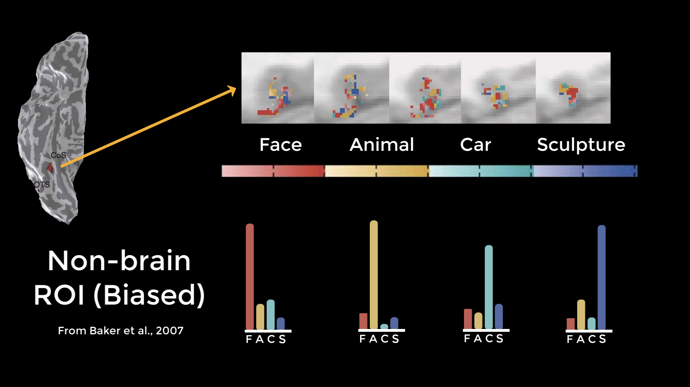
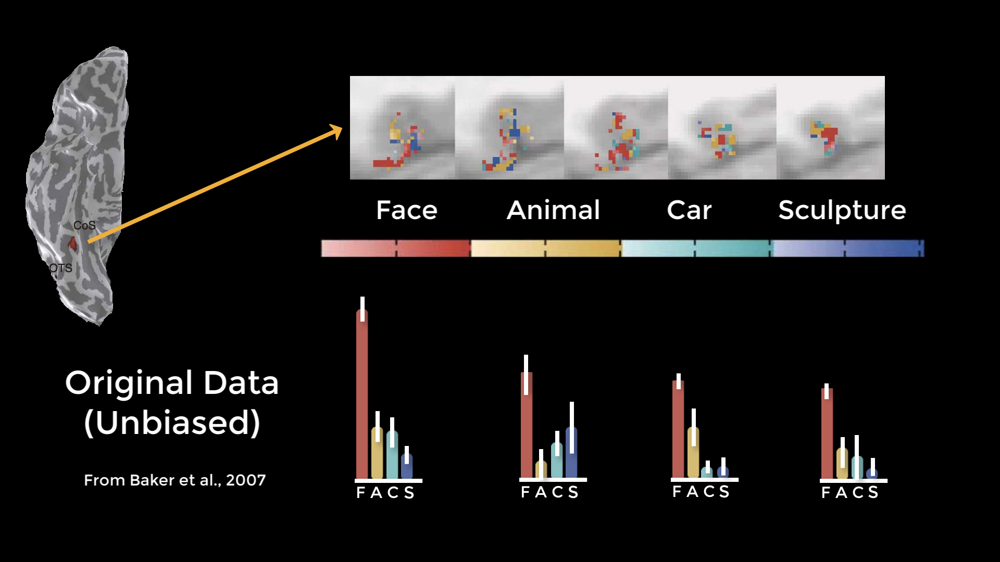
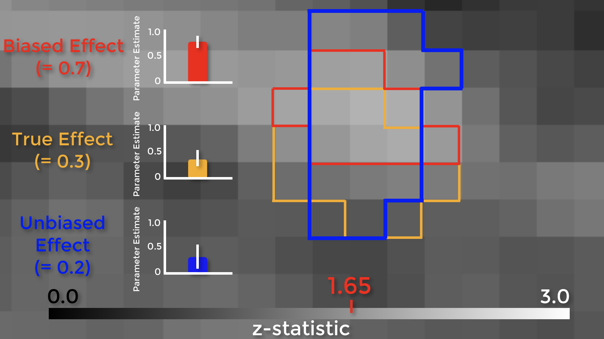

.. _Appendix_B_BiasedAnalysis:

===========================
Appendix B: Biased Analysis
===========================

---------------

What is a Biased Analysis?
**************************

In 2009, a paper was published “Puzzlingly High Correlations in fMRI Studies,” better known as the “Voodoo Correlations” paper. The paper claimed that some correlations in imaging studies were inflated because of “Nonindependence,” or “Circular Analysis."

Circular analysis occurs when data are selected based on some criteria, and then tested for significance on that same criteria. To give an example, imagine that we wanted to test whether drinking Four Loko helps undergraduates do better on their exams. Let’s say that we observed which students showed an improvement, and then ran our final group-level analysis on only those students. Obviously this would be a biased analysis, since we’re only focusing on those subjects that have the effect we’re looking for; it’s no longer a truly random sample.

Circular Analyses with fMRI Data
********************************

Circular analyses can also happen with imaging data, although it’s not as apparent when it happens. This was first pointed out in a study which examined activity in the fusiform face area in response to different stimuli. They extracted data from each condition’s significant voxels and discovered a pattern of selective activity. 

.. figure:: Grill-Spector_2006.png

  Figure from Grill-Spector et al., 2006. The cortical surface on the right is a ventral view of the right hemisphere; significant voxels for each of the conditions (Faces, Animals, Cars, and Sculptures) are shown in five contiguous axial slices (top row). The histograms depict percent signal change for each condition, which in this case suggests that the fusiform face area contains voxels selective not just for faces, but for other types of stimuli as well.

However, it was pointed out that if you chose an ROI outside of the brain which happened to contain significant voxels just by chance, and ran the same tests on those voxels, you would get the same pattern - which clearly shouldn’t happen. When they reran the analysis using independent ROIs, they found a pattern of noise - which you would expect with a non-brain ROI. When they ran an unbiased ROI analysis on the original data, they found that the original pattern disappeared.

  Results from an analysis by Baker et al. (2007) demonstrating that the same pattern of activity can be found in a region outside the brain. Although some voxels will contain large effects merely due to chance, these are the same voxels that are used in a biased analysis - suggesting that the results from the Grill-Spector paper may have been due to chance as well.
  
  

  A cross-validated analysis of the original Grill-Spector 2006 data. This unbiased analysis shows that the fusiform face area appears to be responsive to faces, but not selectively responsive to any of the other categories used in the experiment.

Biased Analyses and Inflated Effect Sizes
*****************************************

Let’s see how biased ROIs lead to inflated effect sizes. The figure below shows a group-level z-score map, zoomed in on a region of the medial prefrontal cortex. We can see the boundaries of each individual voxel, with a range of z-scores from 0 to 3. Assume that there is a real effect in the brain outlined in orange. If we extracted the parameter estimates for each subject from those voxels, the effect would be 0.3 – with some variation around that value. Now assume that we threshold our image at an uncorrected level of p<0.05, or a z-score of 1.65. The voxels highlighted in red are the only ones that pass that threshold.

Here’s the important part: notice that this region overlaps with some of the true effect voxels, but that it includes some noise voxels as well. Because the region by definition can only include voxels passing a certain threshold, it will only contain noise voxels that are above that threshold, which biases the effect to be larger than the true effect. If we used an independent ROI, for example with cross-validation, we would create a region that probably contains some true effect voxels, and also some noise voxels – but these noise voxels will not be biased to be artificially high or low. In this example the unbiased effect is slightly lower than the true effect, but in theory it could be higher or lower – it just won’t be biased either way.

In 2009, the Voodoo Correlations paper claimed that many studies were using biased analyses which led to inflated correlations - and also claimed that if they used unbiased analyses, the distribution of effects would be lower. In response, other researchers argued that if you correct for multiple comparisons, the effect does indeed exist. Also, if you’re doing an exploratory analysis to see where an effect is located, what’s the harm in looking within the significant voxels to see what is driving the effect? Isn’t it good to know what’s going on?

There are two problems with those arguments. First, the magnitude of the effect is just as important as detecting whether the effect is there, and biased analyses will systematically overestimate it. Why? Because small studies by definition can only detect large effects. The second is that if you publish a biased analysis, the reader may assume that it is an inferential analysis, even if it includes caveats about how it was done. If you insist on presenting them in a figure, at least don’t include error bars.

Demonstration
=============

Using the same data from the FSL chapter on ROI analysis, create a biased ROI around the peak of the contrast Inc-Con (which is at voxel coordiantes 47, 71, 59):

::

  fslmaths $FSLDIR/data/standard/MNI152_T1_2mm.nii.gz -mul 0 -add 1 -roi 47 1 71 1 59 1 0 1 biasedROI.nii.gz -odt float
  fslmaths biasedROI.nii.gz -kernel sphere 5 -fmean biasedROI_Sphere.nii.gz -odt float
  fslmaths biasedROI_Sphere.nii.gz -bin biasedROI_Sphere_bin.nii.gz
  
And then extract the data from this ROI using fslmeants:

::

  fslmeants -i allZstats.nii.gz -m biasedROI_Sphere_bin.nii.gz 

How to Create Unbiased ROIs
***************************

The two most popular ways of creating unbiased ROIs are:

1. From an atlas; or
2. By creating a sphere centered at the coordinates reported by another study.

AFNI and FSL each come with their own set of atlases (for SPM, you will need to download a separate toolbox first). To learn more about how to use each of these package's atlases, follow these links to the tutorials on :ref:`AFNI <AFNI_09_ROIAnalysis>`, :ref:`FSL <fMRI_09_ROIAnalysis>`, and :ref:`SPM <SPM_09_ROIAnalysis>`.

Spherical ROIs are created by noting the coordinates of the peak activation reported by another study. Ideally, this should be a study that uses an experimental identical to the one that you use, or at least is very similar. In most cases, you will have to find a study that uses an experiment that at least taps into the same cognitive process that you are studying. Methods for creating spherical ROIs can also be found in the same links just referenced.

A third way of creating unbiased ROIs is to use a meta-analysis map, which represents a combination of individual statistical maps reported by hundreds or thousands of studies. The most accessible meta-analysis generator is `Neurosynth <neurosynth.org>`__, which allows you to generate these maps in seconds. For more details on how to create these maps, see :ref:`this tutorial <Appendix_E_Meta_Analysis>`.

Lastly, you can create an ROI from a contrast generated in a specific run of the experiment, usually called a **localizer** scan (not to be confused with an anatomical localizer, which is often used to help acquire the final anatomical scan).

Other Types of Biased Analysis
******************************

We’ve only touched on a couple of different ways to do biased analyses, but there are other ways too - and you need to be on the lookout for them. Let’s say that you use an anterior cingulate cortex ROI for your confirmatory analysis - meaning that you selected the ROI beforehand, regardless of what the whole-brain results look like - but the results don’t pass correction. You then look at the whole-brain map, and see this. You then decide to use an ROI located more in the pre-SMA. This is also a biased analysis, because now you know where your effect is before you decide where to extract from.

Exercises
*********

1. Do a biased analysis in a software package of your choice by extracting the contrast estimates from a cluster in a statistical map defined by that contrast and thresholded at p<0.05. Compare this against doing an unbiased analysis, e.g. with an independent mask. 

2. Do the same thing as above, but with a map threshold at p<0.01. Does the effect get bigger? Smaller? Why?

3. Threshold your statistical map until you have a single voxel remaining in a given area (such as the ACC), and then save that voxel as a mask. Do a biased analysis using this mask, and see whether the resulting t-statistic matches the statistical threshold you used to create the mask in the first place.

---------

Video
*********

For a video overview of circular analysis, click `this link <https://www.youtube.com/watch?v=nVLeMY6TLkk>`__.
