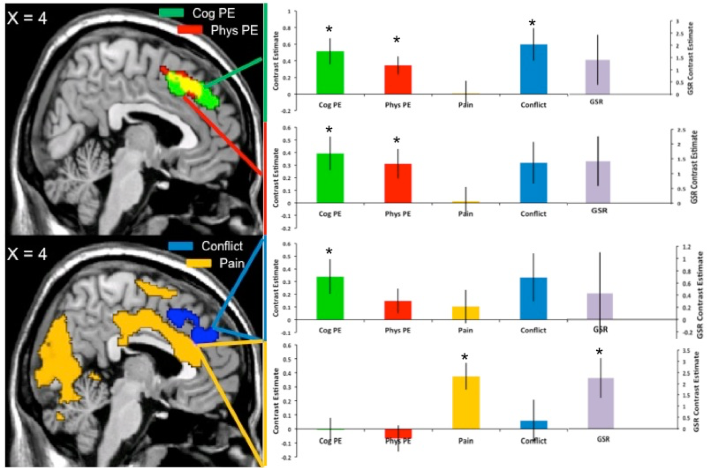

.. _Appendix_C_Figures:

===================
Appendix C: Figures
===================

.. note::

  This section is still under construction
  
---------------

Why Use Figures?
***************

Figures allow the writer to distill into a picture what would otherwise be a convoluted block of prose. The same idea is at work when we use equations. 

.. [give the example of that one guy talked about in Teacher in America who tried to write out an algebraic equation in prose].

Figures serve another purpose: They introduce a welcome break in the stream of academic prose. After reading one or two pages of single-spaced print, the reader welcomes the sight of a figure that summarizes what has just been read. The more attractive the figure, the more gratifying the reader finds it; and it is an enjoyable exercise [replace "enjoyable" with something else] to mentally compare the images generated from reading the text with the figures designed by the author.

Allow me to lay down a few principles on how a figure should be constructed. One, it should be readable at sight. This means using fonts large enough without being obtrusive, and print that clearly indicates which mathematical curve or histogram bar it corresponds to. I have in mind an early draft of a figure I made for a paper; the bar charts were made in Excel, the brain maps were designed in MRIcron, and the entire figure was put together in Powerpoint. 

Although the layout seemed to suggest an attempt at organization, that was outweighed by the illegible font. Nearly impossible to see from a distance, this signalized an amateurish understanding of image composition, and a lack of thought about the reader. Given that I took several tries to get the image to this state, and that I did try to make the image clearer in those few tries, the above principle comes with a corollary: Don't use Powerpoint to make figures. Needless difficulties arise when trying to construct anything more than the most elementary of compositions, and no matter what you do the figure will never look crisp. Newcomers should make the effort as soon as possible to learn the basics about more advanced editing software, such as Photoshop, Illustrator, or ggplot. Doubtless there are other ones, but the point is to choose a specialized editing software and then learn how to use it. The time spent doing so will be rewarded with a greater fluency in creating complex images.

This recommendation to use specialized software - to customize your image editing process, so to speak - leads to the next principle, which is: Never use the default settings. In particular, do not use the default settings for a program such as Excel or R. Both are excellent for quickly generating bar charts and line graphs, but the defaults represent average settings for an average figure - not messy, true, but not very interesting either.
