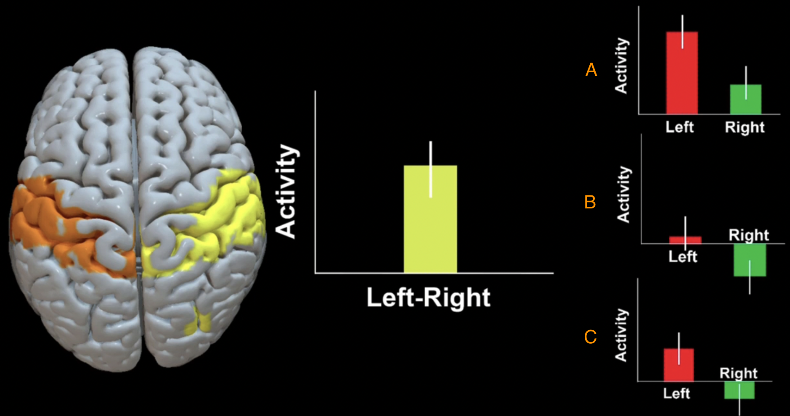

.. _Appendix_D_OtherStats:

=========================
Appendix D: Other Statistical Scenarios
=========================

---------------------

Once you've run an ROI analysis for a contrast, you will need to determine what is **driving** the contrast. For example, let's say that you have a simple motor task in which the participant presses a button with his Left finger or his Right finger. You collect several Left trials and several Right trials, and then contrast the two against each other. For a contrast of Left-Right, for example, you find a significant positive difference in the right motor cortex.

The first thought that comes to mind when seeing a significant difference is that the activation for the Left condition was greater than the Right condition (see the Figure below, panel A). This could be; but it could also be that the activity for the Left condition was around zero, and the Right condition was negative (panel B). Or it could be some combination of the two (panel C). It could even be the case that both conditions had negative activation relative to baseline, but that the Left condition was simply less negative than the Right condition.

  
  The contrast estimates extracted from the right motor cortex ROI show a significant difference between BOLD activity for the Left versus the Right condition (Yellow). The three panels on the right depict three scenarios that could lead to the difference seen in the contrast. The only way to determine which of these scenarios is the true one is to extract beta weights for each condition separately.
