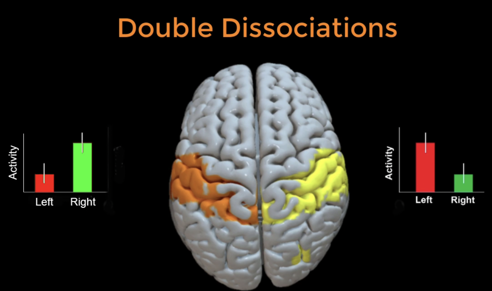

.. _Appendix_D_OtherStats:

=========================
Appendix D: Other Statistical Scenarios
=========================

---------------------

Unpacking a Contrast
********************

Once you've run an ROI analysis for a contrast, you will need to determine what is **driving** the contrast. For example, let's say that you have a simple motor task in which the participant presses a button with his Left finger or his Right finger. You collect several Left trials and several Right trials, and then contrast the two against each other. For a contrast of Left-Right, for example, you find a significant positive difference in the right motor cortex.

The first thought that comes to mind when seeing a significant difference is that the activation for the Left condition was greater than the Right condition (see the Figure below, panel A). This could be; but it could also be that the activity for the Left condition was around zero, and the Right condition was negative (panel B). Or it could be some combination of the two (panel C). It could even be the case that both conditions had negative activation relative to baseline, but that the Left condition was simply less negative than the Right condition.

.. figure:: AppendixD_UnpackContrast.png
  
  The contrast estimates extracted from the right motor cortex ROI show a significant difference between BOLD activity for the Left versus the Right condition (Yellow). The three panels on the right depict three scenarios that could lead to the difference seen in the contrast. The only way to determine which of these scenarios is the true one is to extract beta weights for each condition separately.
  
In this case, we would need two ROIs to extract from. (You could also do triple dissociations with three conditions and three ROIs, but we will not be covering that here.) Using our :ref:`Flanker task <AFNI_02_ExperimentalDesign>` as an example, we will extract beta weights for the Congruent and Incongruent conditions from two ROIs - one in the medial prefrontal cortex, and one in the left inferior frontal gyrus.
  
In AFNI
^^^^^^^

We will first create our ROIs using 3dUndump:

::
  # Create the mPFC ROI
  echo "0 20 44" | 3dUndump -orient LPI -master Congruent_betas+tlrc -srad 5 -prefix ConflictROI+tlrc -xyz - 
  

Then we can extract data from each of the ROIs using 3dmaskave, using redirection to save the output in separate text files and then joining them together with the ``paste`` command:

::

  3dmaskave -quiet -mask ConflictROI+tlrc. Incongruent_betas+tlrc. > Inc_ConflictROI.txt
  3dmaskave -quiet -mask ConflictROI+tlrc. Congruent_betas+tlrc. > Con_ConflictROI.txt
  paste Inc_ConflictROI.txt Con_ConflictROI.txt > mPFC_Inc_Con.txt
  echo -e "Inc_Conflict\tCon_Conflict\tInc_LIFG \tCon_LIFG" | cat - mPFC_Inc_Con.txt > tmp.txt #Add headers
  mv tmp.txt mPFC_Inc_Con.txt
  rm Inc*ROI.txt
  rm Con*ROI.txt

If you open the file ``DoubleDissTest_mPFC_LIFG_Inc_Con.txt`` in Excel

You can then open up the file ``DoubleDissTest_mPFC_LIFG_Inc_Con.txt`` in a statistical package such as R, and plot the following interaction:

Double Dissocations
*******************

Unpacking a contrast allows you to see what is driving the contrast; but what if you are using multiple ROIs? We can extend this same logic of unpacking a contrast and extend it to the ROIs as well, examining what the pattern of activity is like for each condition within each ROI. Using our previous example of left and right button presses, we may observe stronger activation for left button presses in the right motor cortex, and greater activation for right button presses in the left motor cortex. If we observe significant differences between the conditions in both regions and a significant condition x ROI interaction, we say that there is a **double dissocation**: Activity is greater in one region for one condition, with the opposite pattern of activity being observed in the other region.

Double dissociations are useful for determining the **selectivity** of a region for one condition as compared to another; in other words, if we've set up an experiment that matches both conditions except for one aspect - in this example, which button the subject is pressing - we can determine that the region is both selectively activated for one condition *and not for another, closely related condition*. Double dissociations are relatively rare to find, but they are very useful for advancing theories about what particular regions of the brain do.

In AFNI
^^^^^^^

We will first create our ROIs using 3dUndump:

::

  # Create the mPFC ROI
  echo "0 20 44" | 3dUndump -orient LPI -master Congruent_betas+tlrc -srad 5 -prefix ConflictROI+tlrc -xyz -
  
  # Create the LIFG ROI
  echo "-44 -21 7" | 3dUndump -orient LPI -master Congruent_betas+tlrc -srad 5 -prefix LIFG_ROI+tlrc -xyz -
  

Then we can extract data from each of the ROIs using 3dmaskave, using redirection to save the output in separate text files and then joining them together with the ``paste`` command:

::

  3dmaskave -quiet -mask ConflictROI+tlrc. Incongruent_betas+tlrc. > Inc_ConflictROI.txt
  3dmaskave -quiet -mask ConflictROI+tlrc. Congruent_betas+tlrc. > Con_ConflictROI.txt
  3dmaskave -quiet -mask LIFG_ROI+tlrc. Incongruent_betas+tlrc. > Inc_LIFG_ROI.txt
  3dmaskave -quiet -mask LIFG_ROI+tlrc. Congruent_betas+tlrc. > Con_LIFG_ROI.txt
  paste Inc_ConflictROI.txt Con_ConflictROI.txt Inc_LIFG_ROI.txt Con_LIFG_ROI.txt > DoubleDissTest_mPFC_LIFG_Inc_Con.txt
  echo -e "Inc_Conflict\tCon_Conflict\tInc_LIFG \tCon_LIFG" | cat - DoubleDissTest_mPFC_LIFG_Inc_Con.txt > tmp.txt #Add headers
  mv tmp.txt DoubleDissTest_mPFC_LIFG_Inc_Con.txt
  rm Inc*ROI.txt tmp.txt
  rm Con*ROI.txt

If you open the file ``DoubleDissTest_mPFC_LIFG_Inc_Con.txt`` in Excel

You can then open up the file ``DoubleDissTest_mPFC_LIFG_Inc_Con.txt`` in a statistical package such as R, and plot the following interaction:
