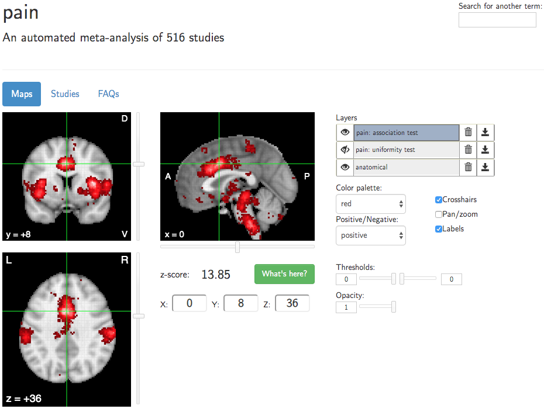
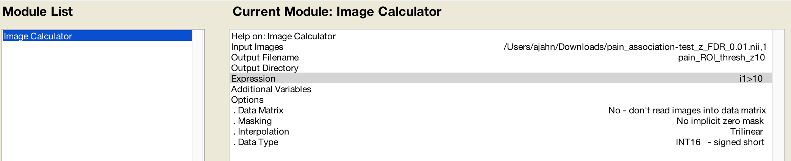

.. _Appendix_E_Meta_Analysis:

=========================
Appendix E: Meta-Analysis
=========================

--------------------

Overview
********

A meta-analysis is a measurement of how consistent results are. For example, if we analyzed the results of ten different studies that all investigated cognitive control, and nine out of ten studies found significant activation in the dorsal anterior cingulate cortex, we would be more confident that the dorsal anterior cingulate does indeed play some kind of role in cognitive control, than if we had interpreted the results of a single study.

Neurosynth
**********

Neurosynth allows the user to instantly generate meta-analysis maps for neuroimaging keywords. For example, entering the word "pain" would return a map that looks like this:

The voxels highlighted in red show where there is likely to be significant activation, based on the results from 516 studies that used the word "pain" to describe their experimental contrasts. The overlap of significant activation among all of the studies is then converted to a z-score at each voxel. The threshold sliders in the bottom right allow the user to show only those voxels that are above a particular z-score (or below a particular negative z-score), if you want to remove less significant voxels from the map.

Uniformity vs. Association Maps
^^^^^^^^^^^^^^^^^^^^^^^^^^^^^^^

Neurosynth creates two types of meta-analysis maps: **Uniformity** and **Association** maps. Uniformity is the more intuitive concept to understand: It is the likelihood of finding a significant result reported in that voxel, given the search term (e.g., "pain"). An Association map, on the other hand, computes at each voxel the likelihood of finding significant activation given the search term, relative to those studies that don't use the search term. The Association maps are consequently more restricted, on average, than the Uniformity maps

Using the Maps as ROIs
^^^^^^^^^^^^^^^^^^^^^^

Once you have downloaded a meta-analysis map, you may want to use it as a region of interest (ROI). As you saw in the chapter on :ref:`biased analyses <Appendix_B_BiasedAnalysis>`, using a biased ROI can lead to inflated parameter estimates; therefore, you need to make sure that the ROI is unbiased. This means that the ROI shouldn't be generated based on the data that you are extracting from the mask.

The Neurosynth meta-analysis maps are excellent candidates for an unbiased ROI. Once you have downloaded them, you have two options for using them as a mask:

1. Threshold the map so that you are only extracting data from a particular region; or
2. Note the peak voxel coordinates, and then use those coordinates to create a spherical ROI.

The first option can be done by using any of the image calculators from AFNI, SPM, or FSL. For example, if I download an association map of pain, I could create a mask that only includes voxels with a z-score of 10 or greater:

::

  3dcalc -prefix pain_ROI_thresh_z10.nii -a pain_association-test_z_FDR_0.01.nii.gz -expr 'step(a-10)'
  
In this AFNI command, the ``step`` function signalizes that the expression within the parentheses should be evaluated, and any voxels that return a positive value will be set to 1. The ``-a`` option loads the downloaded Neurosynth map into a variable called ``a``, and this is then passed into the step function. Each voxel in the meta-analysis map has 10 subtracted from it; if the remaining value is positive, that voxel is set to 1.

An equivalent command with FSL's image calculator would be:

::

  fslmaths pain_association-test_z_FDR_0.01.nii.gz -thr 10 -bin pain_ROI_thresh_z10.nii
  

Note that the option ``thr`` thresholds the image, and ``bin`` binarizes the remaining voxels - in other words, sets them to 1.

In SPM, you will need to use the ``imcalc`` tool, which you can find in the SPM GUI. Click on the ``ImCalc`` button, and load the downloaded meta-analysis map as the Input Image. Set the Output Filename to "pain_ROI_thresh_z10", and in the Expression field, type ``i1>10``. This will threshold the image to set to 1 those voxels that have a value of 10 or greater:

Other Neurosynth Features
*************************

Functional Connectivity
^^^^^^^^^^^^^^^^^^^^^^^

Neurosynth is primarily a meta-analysis tool, but it can also be used to quickly generate :ref:`functional connectivity <CONN_01_FSL_Demo>` maps for seed regions in a template brain. If you click on the "Locations" tab, you will open a new window that says "Functional connectivity and coactivation maps". Click on any coordinate in the brain, and then click on "What's here?" After a few moments, a correlation map will be generated, based on 1,000 subjects collected by `Yeo et al. (2011) <https://www.physiology.org/doi/full/10.1152/jn.00338.2011>`__. You can threshold the image to only show correlations above a certain value, and you can also download the correlation map to use as a mask.

.. figure:: 01_Neurosynth_FuncConn_Demo.gif

Exercises
*********

1. Search for the term "conflict", and create a 5mm sphere around the peak coordinates of the Association mask that you download.
