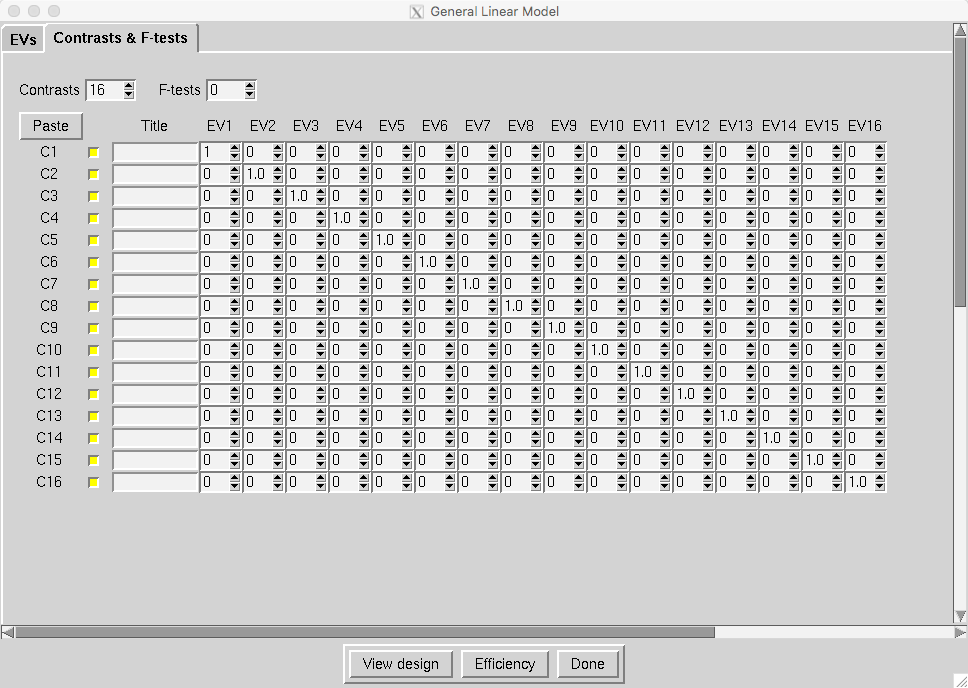
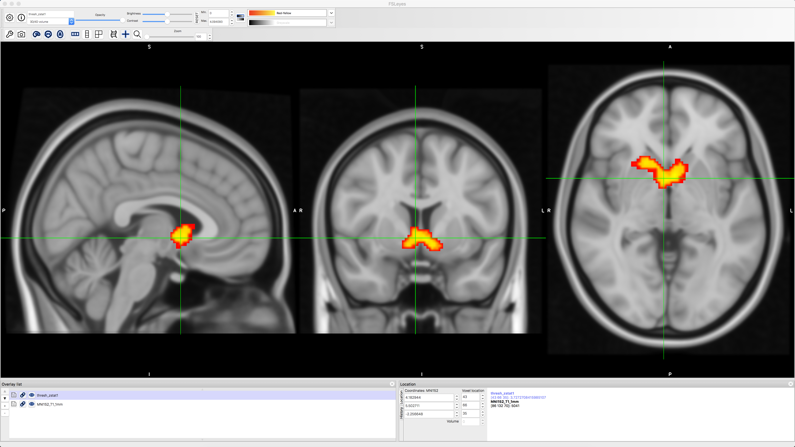

.. _Appendix_F_ParametricModulation:

=================================
Appendix F: Parametric Modulation
=================================

------------

Overview
********

This appendix demonstrates how to set up a **parametric modulation** analysis in FSL. An overview of what parametric modulation is can be found :ref:`here <PM_Overview>`, along with code for downloading the data. If you already have `Amazon Web Services <https://aws.amazon.com/cli/>`__ installed, then you can open a Terminal and type the following:

::

  aws s3 sync --no-sign-request s3://openneuro.org/ds000005 ds000005-download/
  mv ~/Downloads/ds000005-download ~/Desktop/Gambles
  
This will create a new folder on your Desktop called ``Gambles``, which we will use to store the data and the output from our analyses.

Preprocessing the Data
**********************

------------------

To prepare the data for a parametric modulation analysis, we will create a preprocessing pipeline similar to the one we used for the example dataset :ref:`here <fMRI_Intro>`. If you haven't already, go through the tutorial with the Flanker dataset; there you can find the details of each preprocessing and statistical analysis step, which we won't discuss here in depth.

Creating the Timing Files
^^^^^^^^^^^^^^^^^^^^^^^^^

 We will first create timing files that contain onsets for the Gamble, the parametric value for the potential Gain, and the parametric value for the potential Loss, for each run; in total, we will create nine regressors.

You can download a script to convert the timings into a format that FSL understands by clicking `here <https://github.com/andrewjahn/FSL_Scripts/blob/master/make_FSL_Timings_Gambles.sh>`__, clicking on the ``Raw`` button, and right-clicking anywhere on the screen and selecting ``Save As``. Save the file as a shell script into the ``Gambles`` directory. Once it has been downloaded, navigate to that directory with a Terminal and run the script by typing ``bash make_FSL_Timings_Gambles.sh``. You should see nine text files in each ``func`` directory:

.. figure:: Appendix_F_Onsets.png

Skull-Stripping the Brain
^^^^^^^^^^^^^^^^^^^^^^^^^

Before we open the FEAT GUI, we need to skull-strip the brain using ``bet2``. From the Gambles directory, navigate to the ``sub-01`` directory and type the following:

::

  bet2 anat/sub-01_T1w.nii.gz anat/sub-01_T1w_brain.nii.gz -f 0.2

Setting up the FEAT GUI
^^^^^^^^^^^^^^^^^^^^^^^

Now open the FEAT GUI by typing ``Feat_gui`` from the Terminal. Just as in the FSL tutorial, we will create a template design file that we can use in a for-loop to analyze all of the subjects.

In the ``Data`` tab, click on ``Select 4D data`` and navigate to the ``func`` folder; select the file ``sub-01_task-mixedgamblestask_run-01_bold.nii.gz`` and click OK. In the ``Output directory`` field, type ``run1``.

Leave the defaults as they are in the ``Pre-stats`` tab. In the ``Registration`` tab, select the file in the anat directory, ``sub-01_T1w_brain.nii.gz``. The search space is up to you, but to speed up the analysis, change ``Normal Search`` to ``Full Search`` for both the main structural image and the standard space image, and select ``12 DOF`` for both of them as well.

In the ``Stats`` tab, click on ``Full Model Setup``. Type the number ``3`` in the field ``Number of original EVs``, and label them in the following order:

1. Gambles
2. Gain_PM
3. Loss_PM

For each one, select ``Custom (3 column format)`` for the Basic Shape, and select the corresponding filename; e.g.,

1. Gambles -> gambles_run1.txt
2. Gain_PM -> gambles_gain_run1.txt
3. Loss_PM -> gambles_loss_run1.txt

In the ``Contrasts & F-tests`` tab, create ``4`` contrasts, and label them as follows with the corresponding contrast weights:

1. Gambles [1 0 0]
2. Gain_PM [0 1 0]
3. Loss_PM [0 0 1]
4. Gain-Loss_PM [0 1 -1]

When you are done, click on the ``Save`` button at the bottom of the GUI, and call it ``design_run1.fsf``. Save it in the ``Gambles`` directory. Do the same procedure for the other two runs, updating the functional run and the timing files, and saving the design files as ``design_run2.fsf`` and ``design_run3.fsf``. Save these files into the ``Gambles`` directory as well.

Next, download the file `run_1stLevel_Analysis_Gambles.sh <https://github.com/andrewjahn/FSL_Scripts/blob/master/run_1stLevel_Analysis_Gambles.sh>`__, saving it into the ``Gambles`` directory just like you did with the timing conversion script. Run it by typing:

::

  bash run_1stLevel_Analysis_Gambles.sh
  
You should see an HTML file open for each run that is analyzed, which will generate 48 tabs total. The entire analysis should take a four or five hours, depending on the speed of your machine.

Higher-Level Analysis
*********************

Setting up the Second-Level Analysis
^^^^^^^^^^^^^^^^^^^^^^^^^^^^^^^^^^^^

From the ``Gambles`` directory, type:

::

  ls -d $PWD/sub-??/run*
  
This will create a list of all of the first-level FEAT directories. Copy the output to your clipboard, and open up a new FEAT GUI. Select ``Higher-level analysis`` from the dropdown menu, and make sure that ``Inputs are lower-level FEAT directories`` is selected. Change the ``Number of inputs`` to ``48``, and then click on ``Select FEAT directories``. Click ``Paste``, and then press ``ctrl+y`` on the keyboard to paste the list of FEAT directories. Click ``OK``, and leave the boxes checked next to ``Use lower-level copes``. For the ``Output directory``, enter ``Gambles_2ndLevel``.

In the ``Stats`` tab, change the Mixed effects to ``Fixed effects``. Click on ``Full Model Setup``. Change the ``Number of main EVs`` to ``16``, and fill in the matrix with three 1's for each subject, as in the following figure:

.. figure:: Appendix_F_EVs.png

And update the ``Contrasts & F-tests`` tab so that there are 16 contrasts, and a contrast weight of 1 per subject:

Click OK, and then click the ``Go`` button. This will average the parameter estimate for each regressor across all three runs, and it will take an hour or two.

Setting up the Third-Level Analysis
^^^^^^^^^^^^^^^^^^^^^^^^^^^^^^^^^^^

Open a new FEAT GUI, and select ``Inputs are 3D cope images from FEAT directories`` from the dropdown menu. Change the ``Number of inputs`` to ``16``, and set the ``Output directory`` to ``Gambles_Gain_3rdLevel``. Use a Terminal to navigate to the directory ``Gambles_2ndLevel.gfeat/cope2.feat/stats``, and type:

::

  ls $PWD/cope* | sort -V

This will return a list of all of the cope images for the second contrast we specified, which is the parametric modulation of Gain. Copy this list, click on ``Select cope images``, click ``Paste``, and then type ``ctrl+y`` to paste the list. Click ``OK``. 

In the ``Stats`` tab, you can leave the default of ``Mixed effects: FLAME 1``. Click on ``Model setup wizard``, and select ``single group average``. Click ``Process``, and then click ``Go``. This analysis will take ten to twenty minutes.

Viewing the Results
*******************

To view the results, navigate to the directory ``Gambles_3rdLevel.gfeat`` and open fsleyes. Select ``File -> Add Standard`` and choose the template ``MNI152_T1_1mm``. Next, click on ``File -> Add from file``, and select ``thresh_zstat1``. Change the colorscale to ``Red-Yellow`` to better see the outline of the cluster, and click on the Gear icon and choose ``Linear interpolation`` to smooth the edges. You should see something like this:

We see that there is significant parametric modulation of Gain within the ventral striatum, as we would expect. However, we also know that FSL's FLAME1 method for cluster correction can be overly conservative; see, for example, Figure 1 of Eklund et al., 2016. We can instead use a non-parametric option such as randomise in conjunction with threshold-free cluster enhancement, in order to balance the width and the height of each cluster. This will strike a balance between false positives and false negatives; our false positive rate will be kept to 5%, but we will also see cluster that we wouldn't otherwise with traditional cluster correction methods.

To do this, navigate to the directory ``Gambles_2ndLevel.gfeat/cope2.feat/stats``, which contains the z-statistic images for the parametric modulation of Gain. Merge the files into a single dataset, and move it to the main ``Gambles`` directory:

::

  fslmerge -t allZs.nii.gz zstat*
  mv allZs.nii.gz ../../..
  cd ../../..
  
Now run ``randomise``, using the ``-1`` flag to indicate that it is a one-sample t-test, and the ``-T`` flag to do threshold-free cluster enhancement (TFCE). We will run 5000 simulations:

::

  randomise -i allZs.nii.gz -o allZs_randomise -1 -T -n 5000
  
Load the file ``allZs_randomise_tfce_corrp_tstat1`` in fsleyes, and change the ``Min.`` threshold fo 0.95. This will show all of the TFCE clusters at an alpha threshold of p=0.05. Note how many more clusters there are, and how these were hidden with the FLAME1 approach.

.. figure:: Appendix_F_Results_TFCE.png

Next Steps
**********

As an exercise, try running the same analysis with the parametric modulation of Loss; these are located in the 2ndLevels directory as ``cope3``. 
