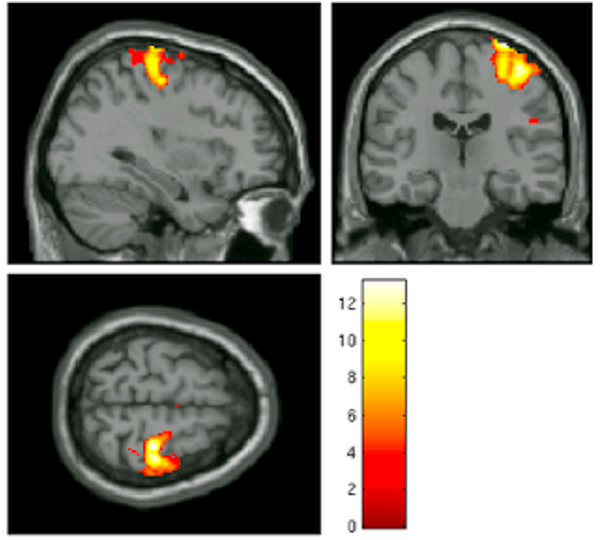
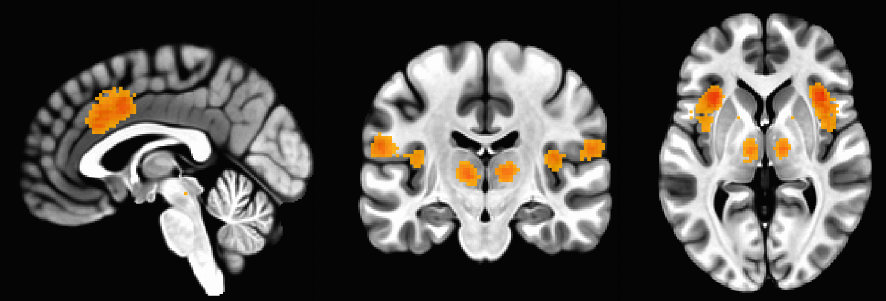
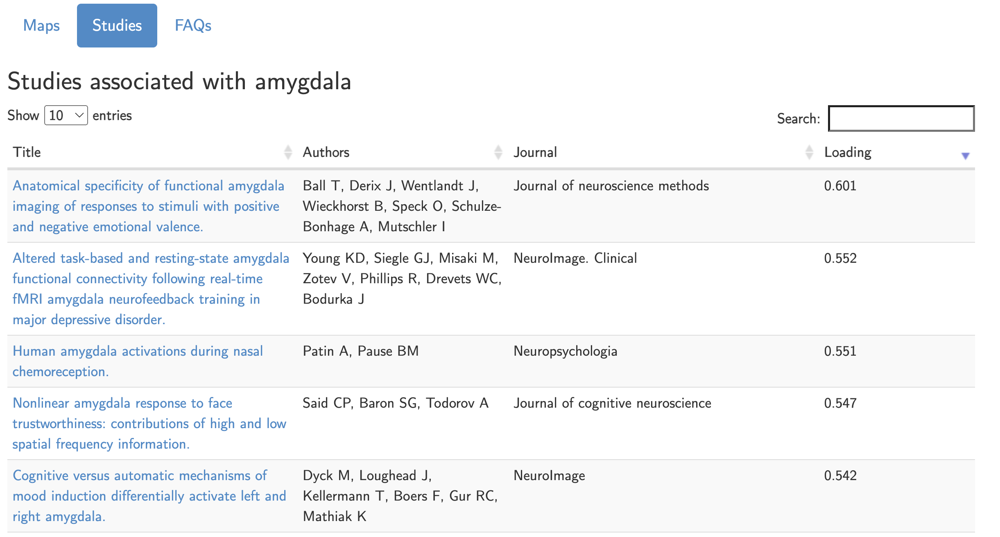

.. _Appendix_G_ReverseInference:

=============================
Appendix G: Reverse Inference
=============================

------------------

Overview
********

Imagine that you see an fMRI activation map that looks like the following:

Assuming that this is the only cluster that displayed any significant BOLD activity, and without knowing anything about the experiment that this data comes from, what would you assume the subject was doing at that time? Would you assume that the subject was listening to an audiobook, or that he was looking at a flashing checkerboard? What would be your best guess?

Most neuroimagers would think that the subject was making some kind of motion with his hand or fingers. Indeed, this image comes from a contrast of left button presses versus right button presses - a reliable way to elicit robust brain activity in the right motor cortex. This is not the only condition that could create such a contrast map, of course; it could be that the subject was merely imagining doing something with their left hand, or it could be that the subject was feeling some kind of stimulation in that hand, and due to imperfect normalization and a large smoothing kernel, the cluster may overlap with both the motor cortex and somatosensory cortices. In this case, though, the range of possibilities is relatively small, and the odds of guessing correctly are quite high. 

Now let's imagine that we see a BOLD contrast map that looks like this:

What would you assume now about what the subject was doing or experiencing? This becomes more difficult, since this is a pattern that could be elicited by many different scenarios: The coactivation of the dorsal anterior cingulate and the bilateral anterior insula are known to be active in response to cognitive control, pain, salience, surprise, and other common psychological phenomena that are studied using fMRI.

By assuming that one of these stimuli led to the brain activation map we are seeing, we are using a technique called **reverse inference** - that is, we are presented with a result or an end state, and we infer the cause from the data we are given. These kinds of deductions are made in everyday life: You see someone coughing and sneezing, and assume that they have a cold - although there are other possibilities, such as allergies. You wake up to find that the ground outside is wet, and you conclude that it must have rained last night - although it could also be the case that the sprinkler system was on.

When applied to neuroimaging, this becomes a trickier problem, both because of the inherent noisiness of the data, and because many regions of the brain show significant BOLD activity to more than one condition. The stakes are also high, because neuroimaging is an expensive technology: Billing rates between $500-$1000 per hour are common for research institutions, and that was before inflation. Furthermore, there is increasing interest in using fMRI as a tool for "mind-reading", or decoding from the patterns of activation in their brain what a person was thinking or feeling. For example, one topic that frequently comes up is whether fMRI images can be used as a tool for lie detection, and whether it should be admissible in court.

.. In general, forward inference provides stronger conclusions, because we have control over the conditions that the subject experiences and, if the experiment is well-designed, we will account for any potential confounds, allowing us to rule out alternative explanations. Reverse inference, on the other hand, is more susceptible to biased interpretations if we are not careful.

.. For example, take a study by Nam et al., 2020, which correlated the grey matter volume of the amygdala with the likelihood of marching in a protest. Larger amygdala volume was associated with a lower likelihood of engaging in a political protest, and the reason for that is open to interpretation. If, however, you measured an individual's amygdala and found that it was exceptionally small, you would not have warrant for concluding that the person had participated in a political protest; too many other potential variables are at play, and the explanatory power of just the amygdala's grey matter, taken by itself, is quite low.

Uses of Reverse Inference
*************************

So when is reverse inference warranted, and when is it suspect? Russ Poldrack addressed these questions in his `2006 paper <https://www.sciencedirect.com/science/article/pii/S1364661305003360>`__ in *Trends in Cognitive Sciences*. In short, you always need to be aware of the **base rate** of activation for a given region. The anterior cingulate, for example, has a base activation rate of 20%: That is, 20% of studies have found activation in this region, and within these 20% of studies, there were a wide range of experimental designs. If you used this as a prior probability, therefore, there is a high chance that the activity in that region may represent something other than what you think it does.

Your conclusions can be made more accurate, however, by looking at other pieces of evidence. If you had a behavioral measure, such as reaction time or eye-tracking, you could make a more persuasive case for one inference compared to another. For example, a participant's galvanic skin response is usually much higher for painful and stressful stimuli than it is for, say, a novel stimulus that is neither painful nor stressful. If you found a consistently high galvanic skin response while the subject was exhibiting higher BOLD activity in the anterior cingulate, you could make a stronger claim that the subject was probably experiencing pain or stress.

This brings up a related idea called **selectivity**: If a brain region is active for just one condition, and for nothing else, then it is selective. The more conditions or cognitive processes that activate a given region, the less selective it is for any one process. This is important for understanding the function architecture of the brain, including whether and why there might be any redundancies, and whether a region is necessary for a given process. Usually the only sure-fire way to determine whether a brain region is necessary for a given process is through lesion studies, or through a process that temporarily disrupts neural activity in a localized region, for example using transcranial magnetic stimulation. In the absence of those kinds of studies, however, we need to use well-designed and well-controlled studies, and we can also use large-scale datasets to make better predictions about the base rate of activation for a given region. This also has its drawbacks, however, as certain terms may be overrepresented due to trends in the field or used indiscriminately. Elsewhere, Russ Poldrack has argued for a cognitive ontology, a type of dictionary that uses specific terms to distinguish between different cognitive processes; however, this seems to not yet have gained a wide following.

In any case, what should you do when interpreting your results, and writing down what they mean in the discussion section of your paper? First, have some perspective about the base rate of the region and the term you're looking at. If you find a significant effect in the amygdala for your study, for example, type that term into a meta-analysis package like Neurosynth. The resulting map will display where most studies report amygdala activation; then, click on the center of mass for the meta-analysis map, and click the ``Studies`` button. You will see a list of all of the studies that were used to create this meta-analysis map; note that within the first ten studies that are displayed (out of over 1500), we see a range of different task designs that elicited effects in this region, such as positive and negative valence, emotional faces, fear, and face trustworthiness. Others that could be listed include disgust, salience, and novelty. Clearly, if you are making a strong claim about what effect your study represents, you will need a strong enough study design that has ruled out all the alternatives. Otherwise, any kind of *post hoc* inference will probably be biased by whatever narrative you find most persuasive - a fallacy that is common across all fields of science, and in our everyday lives.

  List of studies from Neurosynth.org that are associated with the search term "amygdala". Out of over 1500 studies, we can see in just the first five listed that there are a range of different studies that can elicit activation in the amygdala.

Recommendations
***************

With all of these potential fallacies, one should be on guard against explanations that seem too neat, too easy, and too obviously in line with the researcher's hypothesis. It is one thing to tentatively conclude that a result could mean one thing among many possible explanations; it's another to make sweeping claims about what a brain map represents, usually boiled down to a single term, without considering any of the alternatives. Whenever you reach the discussion section of a paper, as always, you should ask yourself: Is this conclusion supported by the evidence? What other possible explanations are there? Was the study designed to rule out these alternatives? Is it true that this blob I'm seeing in this figure supports the author's hypothesis, and nothing else?

Likewise, when writing your own manuscript, take time to think about the pitfalls raised above. In some cases, it might not be possible to distinguish between two possible causes, either due to the study design, or because other behavioral measurements were not collected; be upfront about that, and report as much of the data that is relevant. (You may also find it useful to highlight all of the effects for a given map, while outlining the statistically significant ones; see `Taylor et al. (2023) <https://www.sciencedirect.com/science/article/pii/S1053811923002896>`__ for guidelines about how to do this.) And if you are going to make a claim about the selectivity of a region, make sure to design your study so that you can perform double dissociations, which shows that one condition is significant in a particular region but not another, and vice versa for a separate condition. The method for how to do this, along with the criteria for claiming a double dissociation, can be found in this paper by `Richard Henson (2006) <https://citeseerx.ist.psu.edu/document?repid=rep1&type=pdf&doi=ef5cae9e7fd73452ed89e64c3d1e8d1dc79950b0>`__.

.. figure:: AppendixG_Henson_DoubleDissociation.png

  Figure I from Henson, 2006, illustrating different types of double dissociations, along with red herrings that are not true double dissociations. For example, panel C is technically a dissociation with an interaction effect, but since conditions C1 and C2 have virtually no signal, it is a trivial dissociation; think of using the ventricles as a control region, for example. The three panels on the bottom D, E, and F) all show different patterns of double dissociations, which usually include: 1) An effect of C1 in region R1; 2) an effect of C2 in region R2; 3) A significant difference of C1>C2 in R1; 4) A significant difference of C2>C1 in R2; and 5) A Condition x Region interaction term. Double dissociations are an effective tool for delineating the functional architecture of the brain.

