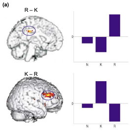
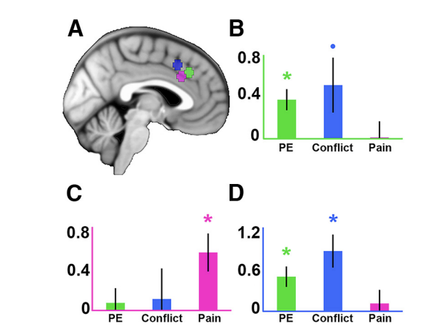
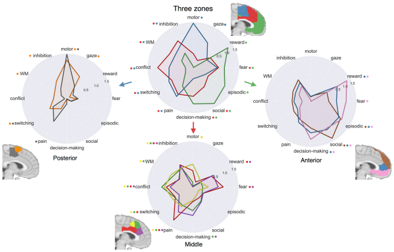

.. _Appendix_H_DoubleDissociations:

================================
Appendix H: Double Dissociations
================================

------------------

Overview: Associations vs. Dissociations
****************************************

Most neuroimaging studies report that an experimental condition led to activation in a particular region of the brain. This kind of result is called an **assocation**: Given condition X, we see activation in brain region Y. This is why so many publications start with the phrase, "The neural correlates of..." followed by whichever cognitive process they were studying.

These kinds of studies can be interesting, but if only associations are reported, we are limited in what we can say about the functional architecture of the brain. Furthermore, focusing only on associations can obscure important differences in brain activity within a given region under different conditions. In the :ref:`previous appendix on reverse inference <Appendix_G_ReverseInference>`, we discussed the inference of results by observing an end state, and then making a conclusion about what led to that result. This is especially common in exploratory association-type studies which are not guided by any hypotheses, and which consequently are more susceptible to faulty reverse inferences - that is, favoring one particular cause due to one's bias, even though there are other potential causes that could also be valid. An outside observer, who was not involved in the design of the experiment, is also more likely to be persuaded by faulty reverse inferences if they have no idea how the experiment was constructed.

In this chapter, we focus on a paper by Richard Henson (2006) which discusses how to use **forward inference** to infer **dissociations**; that is, we take the perspective of someone who is designing a study to use a specific cause to elicit a specific effect, and to rule out all other possible alternatives. This approach does involve assumptions, such as **pure insertion**, which assumes that including one condition does not affect the other conditions. In reality, it is probably more complicated than that, with possible interaction effects between the conditions; for example, the inclusion of a working memory task in addition to a Flanker task might lead to nonlinear increases in the overall cognitive effort during a scannign session, or unwanted spillover effects from one task to another - such as a working memory task becoming more difficult if it immediately follows a Flanker task. (Also see, for example, the Gratton effect.)

Examples of Dissociations
*************************

One of the most famous examples of a dissociation was the patient H.M., who had large sections of his hippocampus and parahippocampus removed in order to ameliorate his epileptic seizures. After the procedure, he was still able to recall long-term memories from before the surgery, but was unable to form new episodic memories afterwards - leading one to believe that the hippocampus plays a necessary role in the formation of new memories, but not for the retention of memories that have already been formed.

Lesion studies of Broca's Area and Wernicke's Area - roughly corresponding to the left inferior frontal gyrus and left posterior superior temporal gyrus - illustrate a **double dissocation**. In this case, damage to Broca's Area results in **non-fluent aphasia** - that is, the inability, or extreme difficulty, to speak or write. Damage to Wernicke's Area, on the other hand, leads to **fluent apahsia**, in which the patient is able to speak and write, but in a disordered, random manner. This has led neuroscientists to frame these areas as contributing to similar but distinct language functions - namely, producing versus understanding language - which enriches our understanding of the functional architecture of the brain.

Qualitative Differences in fMRI Data
************************************

In the absence of lesion studies, however, we can still establish dissociations using functional neuroimaging. According to Richard Henson, this is best done through measuring **qualitative differences**. In this figure taken from his paper, we see that simply finding a difference in the BOLD response between two conditions - say, Condition A > Condition B, in Region R1 - does not in itself suggest that this region is selective for Condition A, and not for Condition B; a stronger test would be to compare them directly using a paired-samples t-test. And to further bolster your claim, you should select a contrasting or a control region (let's call it R2) and run the same tests. If you get the same pattern of results, it suggests that activiation of Condition A is general (at least in two regions), and therefore precludes any conclusions about the selectivity of that region; if, on the other hand, you find the opposite pattern in R2, this is stronger evidence of a **double dissociation** - the finding that two regions show qualitatively different patterns of activity in response to two separate conditions. (Note that this also assumes that the conditions in your design are orthongal, which can be achieved by using a complete factorial design, for example.) Lastly, you should run a Region x Condition interaction; a significant interaction provides further statistical evidence that the activation in each region is activated by a specific condition in your design.

.. note::

  Also see panel (c) of Figure I, which depicts a significant Condition x Region interaction, but does not show any significant activity for any condition in Region R2. This is a genuine but trivial interaction, which could be obtained by using a region that doesn't contain any grey matter, such as the ventricles. 

To summarize, in order to claim that a double dissociation exists, your data should meet the following criteria:

1. Within R1, there is a significant positive effect of Condition A, but not of Condition B;
2. Within R2, there is a significant positive effect of Condition B, but not of Condition A;
3. Within R1, Condition A is significantly greater than Condition B;
4. Within R2, Condition B is significantly greater than Condition A;
5. There is a significant Region x Condition interaction term.

For example, Henson cites one of his previous studies (Henson et al., 1999), which examined differences in Remembering vs. Knowing words that were presented earlier in the experiment. Words were "Remembered" if the subject could recall details about when they saw the word; on the other hand, words were "Known" if they seemed familiar, but the subject couldn't recall any specific details about when they saw it. Using fMRI, Henson and colleagues found significantly greater activation in the posterior cingulate for Remembered words but not Known words, and greater activity in the lateral prefrontal cortex or Known words compared to Remembered words, along with a significant Region x Condition interaction. As a control condition, New words were also presented, and showed no significant activity in either region.

Another example comes from my own research about the dissociation of cognitive and pain effects in the dorsal anterior cingulate gyrus as compared to the more dorsal pre-supplementary motor area. Using independent ROIs created from the peak Z-scores from Neurosynth meta-analyses of the search terms "Pain", "Conflict", and "Prediction Error", parameter estimates were extracted for the Pain, Conflict, and Prediction Error conditions in the experiment. The more ventral ROI showed a significant effect of Pain, but not of the cognitive effects, while there was an opposite pattern of activity in the more dorsal ROIs. The Condition x ROI interaction was also significant, lending support to the hypothesis that there is a double dissociation between pain being associated with activity in the dorsal cingulate cortex, which lies below the cingulate sulcus, and cognitive effects associated with activity in the pre-supplementary motor area, which sits above the cingulate sulcus.

  Figure 5 from Jahn et al., 2016. 5mm spheres were drawn around the peak z-value for meta-analysis maps downloaded from Neurosynth using the keywords "pain", "conflict", and "prediction error". The ROI x Condition interaction was significant, F(4,100) = 11.33, p < 0.001.

Other Ways to Report Dissociations
**********************************

While the abovementioned procedure will continue to be useful for establishing double dissociations, other methods are also becoming popular for outlining the functional architecture of the brain. For example, transcranial magnetic stimulation, or TMS, temporarily disrupts neuronal activity in a restricted area on the surface of the brain, usually penetrating about 1-2 centimeters into the cortex. This can be thought of as a virtual, temporary, reversible lesion, which allows us to make claims about what part of the cortex is responsible for certain types of perception and cognitive processes. It remains to be seen how consistently deep these disruptive currents can reach, but in the meantime, fMRI is better able to establish dissociations about both subcortical structures and cortical areas buried deep within the gyri.

Also consider `this paper by de la Vega et al. (2016) <https://www.jneurosci.org/content/jneuro/36/24/6553.full.pdf>`__, which provided evidence suggesting a tripartite parcellation of the medial frontal cortex. By applying a cluster algorithm to the meta-analysis data from Neurosynth, the authors created "functional preference" graphs illustrating which sub-region of the medial prefrontal cortex was more active to a given condition. For example, their clustering procedure divided the medial frontal cortex into three anatomically distinct regions: The posterior, middle and anterior region. Motor and gaze were more likely to activate this region, for example, while the neural signature for condition such as conflict and pain were localized more to the middle region. Lastly, the anterior region showed a greater preference for conditions such as decision-making, reward, and social tasks.

  Figure 4 from de la Vega et al. (2016). These functional preference profiles show which conditions show greater log odds-ratio (LOR) within a given condition; a higher LOR "indicates that a psychological topic is predictive of activation in a given cluster". K-means clustering was used to divide the medial prefrontal cortex into distinct posterior, middle, and anterior regions.

This last figure is more informative than a simple p-value comparing two or more conditions, since it depicts not only the statistical significance but also the magnitude of the effect, and displays it across multiple conditions. This approach of displaying both the statistic and the effect size is useful for the reader to make a judgment about how strong the effects are compared to each other, as well as to help the reader realize that multiple conditions can show similar effects in the same region, with only one or two of them reaching statistical significance. For a more thorough discussion of reporting effect sizes versus t-statistics, see :ref:`this page <AppendixD_EffectSizes>`.

