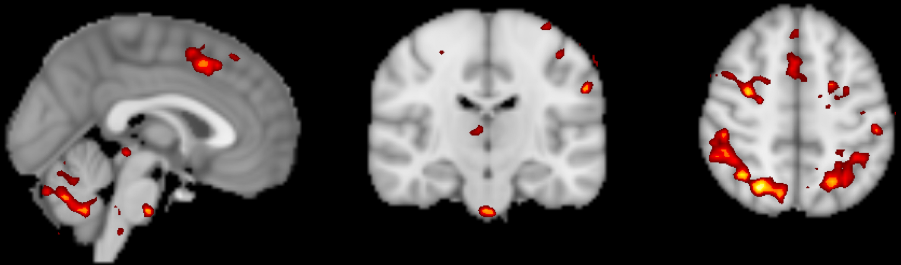

.. _fMRI_Intro:

==============
Introduction
==============

This course will show you how to analyze an fMRI dataset from start to finish. We will begin by **downloading a sample dataset** and inspecting the anatomical and functional images for each subject. We will then **preprocess the data**, which removes noise and enhances the signal in the images. Once the images have been preprocessed, we will create a model representing what we think the :ref:`BOLD response <BOLD_Response>`, a measure of neural activity, should look like in our images. During **model fitting** we compare this model with the signal in different areas of the image. This model fit is a measure of the strength of the signal under different conditions - for example, we can take the difference of the signal between conditions A and B of the experiment to see which condition leads to a larger BOLD response.

Once a model has been created for each subject and the BOLD response has been estimated for each condition, we can do any kind of group analysis we like: Paired t-tests, between-group t-tests, interactions, and so on. The goal of this course is to calculate a simple within-subjects contrast between two conditions, and test whether it is significant across subjects. You will also learn how to create figures showing whole-brain analyses similar to what you see published in the neuroimaging journals, and how to do a region of interest (ROI) analysis.

    A figure showing group-level results from the data used in this course, represented as a z-statistic map. Brighter colors indicate larger z-scores. You will begin by preprocessing the raw data and end with creating a statistical map like this one.
    

This course is designed to build your confidence in working with fMRI data, increase your fluency with the basic terms of fMRI analysis, and help you make educated choices during each step. Exercises at the end of each chapter will allow you consolidate what you've learned and prepare you for the next chapter. Once you have mastered these fundamentals, you will be able to apply them to other datasets of your choosing.

.. note::
    We will not be covering MRI physics in depth. For a review of that topic, I recommend chapters 1-5 of the book *Functional Magnetic Resonance Imaging*, by Huettel, Song, & McCarthy (3rd Edition). Also see Allen Elster's excellent `MRI Questions <http://mriquestions.com/index.html>`__ website for useful illustrations of MRI concepts.

