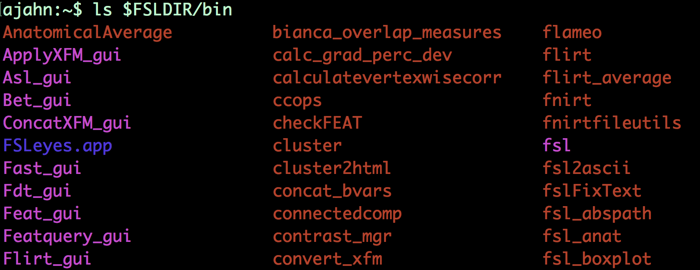
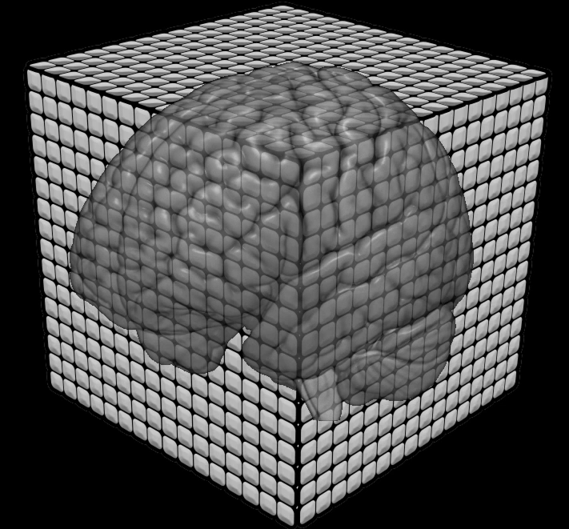

#############
Glossary
#############

As a neuroimager you will need to be fluent with the vocabulary of neuroimaging, coding, statistics, and a few other fields.
This page is a list of some of the most common terms, and will be updated regularly.

Basic Terms
-------------
    
**Library:** A directory that contains commands that are needed to run a program. Usually the library for Unix commands
is found is /usr/bin.

    Some of the commands found in the FSL library

Unix Terms
-------------

Below is a list of basic Unix terms that you should be familiar with. These words describe how we use Unix to navigate our 
directory tree and execute scripts. Also be aware that a **single dot (.)** is shorthand for the current working directory, 
and **two dots (..)** is shorthand for the directory immediately above the current working directory. These can be used with 
most commands that take arguments (e.g., try typing **"cd .."** or **"ls .."**).

- **Argument:** The input for a command. For example, in the command "ls myDirectory", myDirectory is an argument for the command ls.

- **cd:** Stands for "change directory".

- **Command Line:** Refers to the prompt at the terminal.

- **Conditional:** A logical statement that is usually expressed as if/else. For example, a conditional may specify that if a 
file is located in the current directory, then execute the following code.

- **cp:** Stands for "copy". Similar to the "mv" command, this will copy a file from one location to another, or rename a file. Takes two arguments: e.g., "cp file1.txt file2.txt" will rename file1.txt to file2.txt. "cp file1.txt myDirectory" will copy file1.txt to myDirectory.

- **Directory:** A folder storing other directories or files. The command "cd" is used to navigate to directories.

- **Loop:** A series of commands that iterates over the provided input. For example, 

.. code::

    $ foreach subj (sub-01 sub-02); echo $subj; end
    
    will consecutively assign the values sub-01 and sub-02 to the variable subj, and then execute the code that follows 
before the word end.

- **ls:** Short for "list". If you execute this command without any arguments, it will list the contents of the current directory.

- **mv:** Short for "move". Will move a file from one location to another, or rename a file. Takes two arguments: e.g.,

.. code::

    $ mv file1.txt file2.txt
    
will rename file1.txt to file2.txt.

- **Navigate:** Moving through directories. With a GUI, it's the same as double-clicking on a folder to see what is inside.

- **Script:** A text file containing several Unix commands that are executed consecutively. This will save you time, as the same commands do not need to be repeatedly entered by the user into the command line. Scripts are usually labeled with a .sh 
extension.

- **Shell:** The Unix interpreter. There are different shells - tcsh, zsh, and bash, to name a few - which all require slightly different syntax to execute commands. For example, if/else conditional statements are written differently in tcsh than in bash.

- **String:** A sequence of letters. "myVariable" is an example of a string; so is "asdf".

- **Terminal:** The Unix interface where commands are typed and executed. Macintosh computers come with a Terminal which 
emulates Unix commands.

- **Tilde (~):** Shorthand for the home directory (usually /Users/local/<username>). You can type "cd ~" or "cd" 
without any arguments to navigate back to the home directory

- **Variable:** A string that is linked to another value. For example, typing 

.. code::

    $ setenv x 1 

from the command line (in tcsh) will assign the value 1 to x. You can retrieve values by preprending a dollar sign ($) to the string; 
for example, 

.. code::

    $ echo $x 
    
in this case would return "1".

Imaging Terms
-------------

- **Volume:** A three-dimensional image composed of **voxels**. Volumes can be concatenated together to create a 4-dimensional dataset (with *time* being the 4th dimension).

- **Voxel:** The smallest resolution element of a volume. In the following picture, voxels are stacked together to create a **volume**. Each voxel contains a number, and when several volumes are concatenated together, this creates a **time-series**
at each voxel.

Experimental Design

Run

Session

Counterbalance

Presentation Software

fMRI experiments are created with presentation software, which presents stimuli and records responses. Some of the most popular packages are E-Prime, Presentation, and PsychoPy

E-Prime: Uses a graphical user interface (GUI) to allow the user to drag and drop objects - such as a slide presenting a picture or a video - onto a timeline. The objects are presented in order on the timeline, although the number and sequence of subsets of presentations are controlled by the List object. Users can program in E-Prime's object-oriented programming language (E-Basic) using the InLine object.

Presentation

PsychoPy

Analysis

Connectivity
