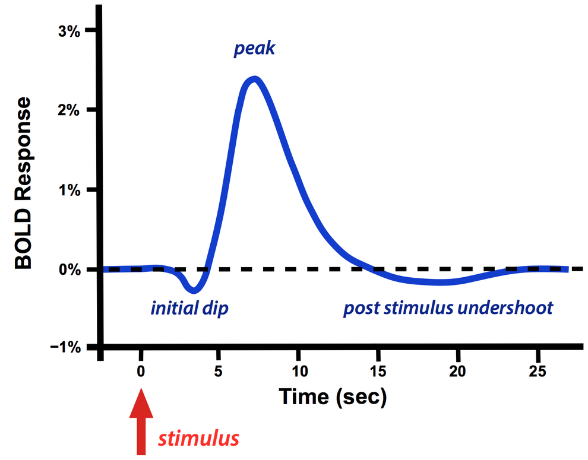

.. _BOLD_Response:

BOLD Response
=============

An acronym which stands for Blood Oxygenation-Level Dependent Signal. Nearby oxygenated blood interferes less with the signal emitted by Hydrogen atoms than does deoxygenated blood.
