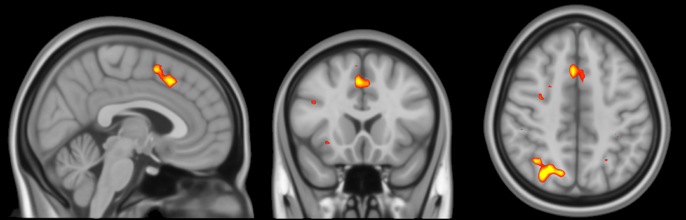

Welcome to Andy's Brain Book!
==================================================

This book, *Andy's Brain Book*, is the ReadTheDocs companion
to `Andy's Brain Blog <https://www.andysbrainblog.com>`__. It is intended for fMRI beginners, with more advanced imaging techniques being added later on. If this is your first time here, watch `this video <https://www.youtube.com/watch?v=zUxOdq3sAFU>`__ for a quick overview of the website.

This book, *Andy's Brain Book*, is intended for fMRI beginners, with more advanced imaging techniques being added later on.

If you are completely new to fMRI analysis, I recommend starting with the :ref:`installation page <fsl_mac_install>`. Good luck!

.. note::

    Reading this book is easier with a slightly larger font size; I recommend using a zoom of 125%. You can do this on a Macintosh by holding down the ``Command`` key and pressing ``+``, or from the browser menu you can click on ``View -> Zoom In``.
    

.. toctree::
   :maxdepth: 1
   :caption: Install

   installation/fsl_mac_install
   
   
.. toctree::
    :maxdepth: 1
    :caption: Unix for Neuroimagers
    
    unix/Unix_Intro
    unix/Unix_01_Navigation
    unix/Unix_02_CopyRemove
    unix/Unix_03_ReadingTextFiles
    unix/Unix_04_ShellsVariables
    unix/Unix_05_ForLoops
    unix/Unix_06_IfElse
    unix/Unix_07_Scripting
    unix/Unix_08_Sed
    unix/Unix_09_AutomatingTheAnalysis
    
    
.. toctree::
    :maxdepth: 1
    :caption: fMRI Short Course with FSL
    
    fMRI_Short_Course/fMRI_Intro
    fMRI_Short_Course/fMRI_01_DataDownload
    fMRI_Short_Course/fMRI_02_ExperimentalDesign
    fMRI_Short_Course/fMRI_03_LookingAtTheData
    fMRI_Short_Course/fMRI_04_Preprocessing
    fMRI_Short_Course/fMRI_05_1stLevelAnalysis
    fMRI_Short_Course/fMRI_06_Scripting
    fMRI_Short_Course/fMRI_07_2ndLevelAnalysis
    fMRI_Short_Course/fMRI_08_3rdLevelAnalysis
    fMRI_Short_Course/fMRI_09_ROIAnalysis
    fMRI_Short_Course/fMRI_10_Summary
    fMRI_Short_Course/fMRI_Appendices
    
    
.. toctree::
    :maxdepth: 1
    :caption: FreeSurfer
    
    FreeSurfer/FreeSurfer_Introduction
    
.. toctree::
    :maxdepth: 1
    :caption: E-Prime
    
    E-Prime/E-Prime_Overview
    
.. toctree::
    :maxdepth: 1
    :caption: AFNI

    AFNI/AFNI_Overview
    
.. toctree::
    :maxdepth: 1
    :caption: SPM

    SPM/SPM_Overview
    

.. note::

    The following modules are under construction. Check back soon for more updates!
    
       

    
.. toctree::
    :maxdepth: 1
    :caption: Functional Connectivity with the CONN Toolbox
    
    FunctionalConnectivity/CONN_Overview
 
.. toctree::
   :maxdepth: 1
   :caption: fMRI Concepts

   Practicals/DesignOptimization
    
.. toctree::
    :maxdepth: 1
    :caption: Diffusion Analysis with MRtrix
    
    MRtrix/MRtrix_Introduction
   
.. toctree::
    :maxdepth: 1
    :caption: ASL Analysis
    
    ASL/ASL
    ASL/ASL_Techniques
    ASL/fASL_02_Download
    ASL/fASL_03_Task
    ASL/04_fASL_GUI
    ASL/05_fASL_Results
    ASL/06_fASL_Quantification
    
    
.. toctree::
    :maxdepth: 1
    :caption: Frequently Asked Questions
    
    FrequentlyAskedQuestions/FrequentlyAskedQuestions.rst
    
    
.. toctree::
    :maxdepth: 1
    :caption: Statistics
    
    Statistics/GIMME
    
.. toctree::
    :maxdepth: 1
    :caption: Miscellaneous
    
    Miscellaneous/ConvertingDICOMs
    
.. toctree::
    :maxdepth: 1
    :caption: Multi-Voxel Pattern Analysis (MVPA)
    
    MVPA/MVPA_Overview
    
.. toctree::
    :maxdepth: 1
    :caption: Open Science
    
    OpenScience/OS_Overview

.. Glossary
.. ==================

.. * :ref:`terms`

.. note::
    This book is under construction. More chapters will be added in the coming weeks; my goal is to have a complete draft of the fMRI Short Course by the first week of June.
    
    4.24.2019: Finished the sections Unix Tutorial #4, fMRI Short Course chapters on smoothing and quality checking FEAT output, and added a playlist covering all of the sections done in the Preprocessing module.
    
    5.06.2019: Added sections to FAQ about resampling, biased analyses, and flipped orientations. Wrote the chapters for the Statistics part of the short course; videos coming soon.
    
    5.25.2019: Finished the Unix Module, and added videos for 2nd and 3rd level analysis in the fMRI short course.
    
    5.31.2019: First draft of the Unix and fMRI courses are complete.
    
    10.14.2019: E-Prime module is complete.

    10.16.2019: FreeSurfer module complete.
    
    1.13.2020: SPM written module complete (videos not up yet)
    
    4.13.2020: SPM videos uploaded
