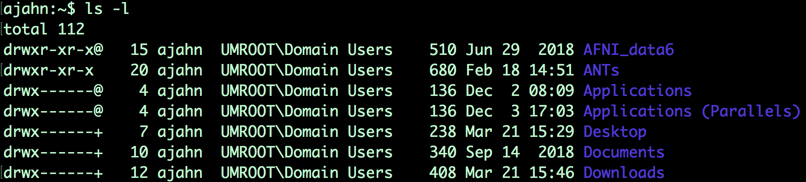
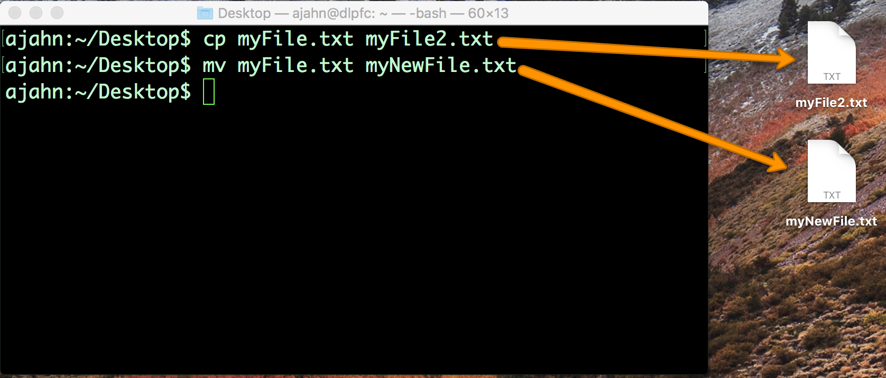

.. _Unix_02_CopyRemove:

============
Unix Tutorial #2: Copying and Removing Files
============

.. note::
  Topics covered: File manipulation; arguments; options; copying, deleting, and renaming files
  
  Commands used: cp, mv, rm

Now that you have experience getting around your directories with ``cd`` and ``ls``, let’s expand our repertoire with the commands ``cp``, ``mv``, and ``rm``. These are **file manipulation** commands, analogous to right clicking on a file and copying and pasting it, renaming or moving it to a folder, or moving it to the trash bin. The cp and mv commands are more complex than the commands in the previous tutorial, since they require two inputs, or **arguments**. We will also use these commands to introduce the concept of **options**, or flags, which give your commands greater flexibility.

  An example of using the ``ls`` command with the ``-l`` option, which lists files and directories in "long" format. This option extends the ability of the ``ls`` command to not only list the file name, but also show details about when the file was last updated, who has permission to edit the file, and how large the file is.
  

To see the similarities between using the graphical interface and using the command line, create a text file in an editor of your choice, such as TextEdit. Save the file to your Desktop - in this example, I'll call it myFile.txt - and try the following commands, remembering to press the Enter key after each line:

.. code::
  cp myFile.txt myFile2.txt
  mv myFile.txt myNewFile.txt
  rm myFile2.txt
  
The first line creates a copy of myFile.txt and labels it myFile2.txt; the second line renames myFile.txt to myNewFile.txt; and the last line removes myFile2.txt. As you type these in the command line you should see the files being copied, renamed, and deleted - just as you would if you were using your mouse with the graphical user interface.

  An illustration of how commands typed in the Terminal have the same effect as copying and renaming files through the GUI.

Video
----------

Click `here <https://www.youtube.com/watch?v=2F0DLbP5ans&list=PLIQIswOrUH69xOiblvvEz5KBwWaNRMEUp&index=3>`__ to see a video walkthrough about copying and removing files. This video will also show you how to move, rename, and delete folders. When you've finished watching it, try these exercises to consolidate what you've learned.

-----------

Exercises
-----------

1.  Make a new directory in your home directory and either create a couple of new files in that directory, or copy files in to that directory from another directory.

2.  Now copy the directory to the Desktop, but append a forward slash to the end of the directory tha tyou are copying. For example, if the directory is called myFileder, type cp -R myFolder/ Desktop. What happens?

3.  Type ``man cp`` and find the section about the -R option. Try using one of the other options with the cp command, and observe what happens.
