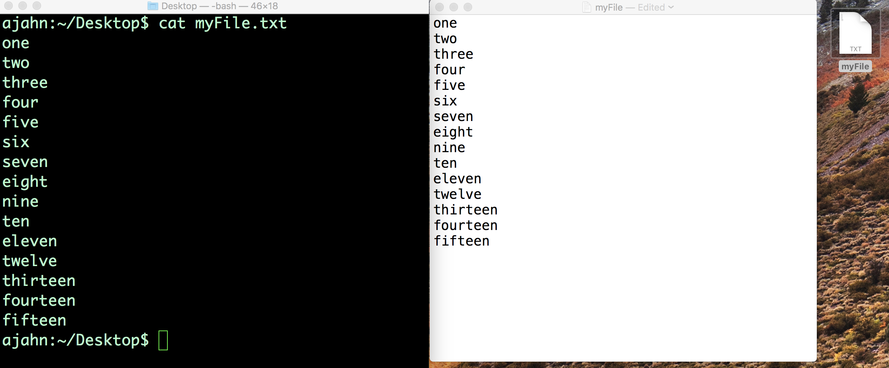

.. _Unix_03_ReadingTextFiles:

=======
Unix Tutorial #3: Reading Text Files
=======

.. note::
   Topics covered: File manipulation, redirection, streams, stdin, stdout, stderr
   
   Commands used: cat, less, head, wc

The command line is useful for both viewing and manipulating text files. **Manipulation** means editing text - for example, replacing words in text files, or appending text from the command line to the end of a file (also known as **redirection**). This is useful for creating **scripts**, text files containing one or more commands that are run consecutively. In later tutorials, you will use these techniques to automate your analyses, which can save enormous amounts of time.

You can display the contents of a file using the ``cat`` command, which stands for concatenate. Let's say we have a file on our Desktop called myFile.txt, which contains the words one through fifteen (i.e., one, two, three...fifteen), with each number on a separate line. Use the command line to navigate to the Desktop, and then type ``cat myFile.txt``. This will print the contents of the file to your command line. This is the same idea as using the GUI to double-click on the text file to see its contents.

   Using the command line and the GUI to read the contents of a text file. On the left is the command line using the ``cat`` command, which prints the contents to the Terminal. On the right is the contents of the file displayed after using the mouse to double-click the file.

We refer to the output from this command as **stdout**, or standard output. The commands that are typed into the Terminal are called **stdin**, or standard input. This touches on the concept of **streams**, or the flow of information into and out of the command line, and we will use these ideas to give us more flexibility in manipulating text files. For now, think of **stdin** as anything you type into the Terminal, and **stdout** as what is returned if the command is run without any errors. If the command that you type does result in an error - for example, because the command was misspelled or because not enough arguments were provided - the text that is output to the Terminal is called **stderr**, or standard error.

.. figure:: Streams.png

   Illustration of streams in Unix. Whatever is typed into the Terminal is **stdin**, and, if it runs without error, whatever is output is called **stdout**. If there is an error, the output is instead called **stderr**.

   
The ``cat`` command is useful for viewing the contents of smaller files, but if the file contains hundreds of lines of text, it is overwhelming to have everything printed to the Terminal at once. To see only a part of the file, we can use the commands ``head`` and ``tail`` to see the first few or the last few lines of the file, respectively. Using myFile.txt as an example, typing

::

   head myFile.txt

Would return the first five lines; whereas typing

:: 

   tail myFile.txt

Would return the last five lines. Although the default is to return five lines, these commands have an option to display any amount of lines that you choose. For example,

::

   head -10 myFile.txt
   tail -10 myFile.txt

Would return the first ten lines and the last ten lines. Try these out yourself, changing the number of lines that are displayed.

Redirection
----------

In addition to displaying the results of a command, **stdout** can be used to move or append the output to a file, a concept known as **redirection**. For example, if you type 

::

   echo sixteen > tmp.txt

The word “sixteen” goes into the file tmp.txt instead of being written to standard output. Notice that it creates the file tmp.txt even if it doesn’t exist. However, if we try that again with another string - for example,

::

   echo seventeen > tmp.txt

It will overwrite the file with whatever we printed to standard output. If you want to append standard output to the end of a file without overwriting the other data in the file, use two greater-than signs. For example, type

::

   echo eighteen >> tmp.txt

If you type ``cat tmp.txt``, you will see both seventeen and eighteen.

Although these examples are trivial, redirection is invaluable for quickly editing text files and for writing **scripts**, which allow you to run analyses for hundreds or thousands of subjects with only a few lines of code.

Video
----------

Click `here <https://www.youtube.com/watch?v=JdXFq6lMlX4&index=4&list=PLIQIswOrUH69xOiblvvEz5KBwWaNRMEUp>`__ for a video walkthrough of commands for reading text files. This video will also show you how to read help files using the ``less`` command and a paging window.

----------

Exercises
----------

1. Create a new file called "tmp.txt" and type whatever you want into the file. Use ``cat`` to string together both the myFile.txt and tmp.txt files, and redirect the output to create a new file. Print the contents of the new file to stdout.

2. If you have AFNI installed on your machine, use ``less`` on the command ``3dcalc`` to find strings matching "Example." Now try it using the less command with an option to ignore whether the letters in the string are upper case or lower case. Hint: To find this option, search for the string "case" in the ``man`` file for ``less``. (If you have FSL installed instead of AFNI, try the same exercise with the command ``fslmerge``.)

3. Unix has a built-in command called ``sort`` which will sort text numerically or alphabetically. What happens when you use myFile.txt as an argument for ``sort``? What about typing this command:

::

   cat myFile.txt | sort

In your own words, explain the difference between the two methods.
