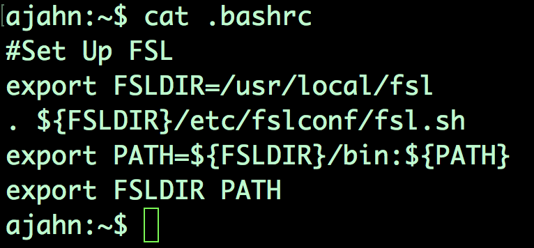
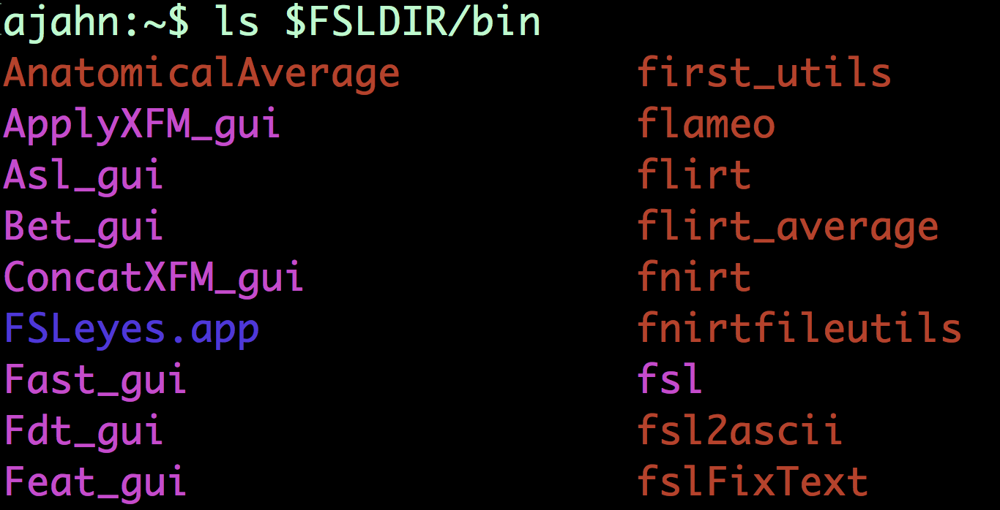

.. _Unix_04_ShellsVariables:

=============
Unix Tutorial #4: Shells and Path Variables
=============

.. note::
  Topics covered: paths, variables, shells, FSL, installation, syntax, redirection
  Commands covered: set, setenv, export, tcsh, bash
  
  
Now that you’ve become more familiar with Unix commands, we can download an fMRI package and install it with Unix. If you haven’t already downloaded FSL, watch `this video <https://youtu.be/E9FwDCYAto8?t=14>`__. After you’re done, come back to this tutorial. 

When you downloaded and installed FSL, you may have seen a few things you didn’t completely understand. For example, if you go to your home directory and type “cat .bashrc”, you’ll see this block of code. 

To understand what this means, you’ll need to understand shells, paths, and variables. Let's begin with **shells**. Think of the shell as an environment in which you can type Unix commands. Or, think of it as an interpreter that translates what you type into the actual operations performed by the computer. We used a shell in the previous tutorials, but you may not have been aware of it. When you open the terminal, it uses a shell to interpret what you’re typing. Also, there are many different shells, and each one has a different **syntax**, or specific way that the words in your command need to be organized in order to be understood correctly - just like the syntax of human languages. 

There are two shells you will come across: the Bourne shell, with a widely-used version called **bash**, or Bourne-again shell; and the C-shells, of which one popular variation is the t-shell, or **tcsh**. The commands we’ve used so far - cd, ls, pwd, and so on - are called **built-in commands**, and they can be used the same way in both shells. But there are important differences when you do a more advanced operation, such as setting a variable.

**Setting a variable** means assigning a value to a string. Variables are used as shorthand for a value, which can be either a number or a string. They are called variables because the value can vary, or be udpated as needed. 

For example, let’s assign the value 3 to the variable ``x``. If you are in the bash shell, which is the default on most computers, you can do this by typing ``x=3``. To check the value stored in the variable, type ``echo $x``. The dollar sign is a **reserved character** that has a special meaning and cannot be used as a variable. A dollar sign indicates that what comes immediately after it - in this case, x - is a variable. The command returns 3, the value stored in the variable x.

Compare this with a different shell - the t-shell. Switch your terminal to the t-shell by typing ``tcsh`` and pressing enter. If we typed the same command as before, you’ll get an error that says “command not found.” That’s because the syntax for assigning a variable is different in the t-shell. To do the same variable assignment, we have to type ``set x=3``; then type ``echo $x`` to make sure it set the correct value. If you become lost and want to know which shell you are currently in, type ``echo $0``.

Right now we’re in what is called a subshell; we were initially in the bash shell, and then we switched to a t-shell. When you open up a new Terminal, think of that terminal as the Unix world; we call this “world” the **environment**. To keep the ``x`` variable constant same no matter which shell we’re in, we would type ``export x 3``; in tcsh, we would type ``setenv x 3``. Note that if you set this global variable, it’s available only to the current shell and to subshells; if you set a global variable in the current subshell and then return to a previous shell, you will not have access to it. To leave the current subshell and return to the previous shell, type ``exit`` and press enter. 

Now that we know what variables are, we can see how they are being used in the FSL setup. The code in the .bashrc file - which stands for “bash run commands”, and is the code that is run anytime you create a new shell in bash - updates something called the **path variable**. The path variable is a list of directories that are searched anytime you run a command; you can see this list of directories by typing ``echo $PATH``. Notice that there are several absolute paths pointing to different directories, with the colon acting as a separator between paths. When you type a command and press enter, the shell looks for that command within each directory in your path. If it’s not there, it returns an error saying that the command is not found.

Paths allow you to use FSL commands from anywhere in the Terminal. FSL, like all the other software packages, has a **library**, or directory that contains all of the functions needed to run FSL - such as fslinfo, fslmaths, flirt, and so on. To run those commands, we would need to either be in that directory, or we would need to specify the absolute path to the command that we want to run. To give us the flexibility to run FSL commands anywhere, we’ll set the path variable to indicate where the FSL library is.

  Once you have installed FSL, type ``ls $FSLDIR/bin`` to see a list of all of the available commands (or binaries - hence the directory name) in the FSL library. If your path is set correctly, you can run these commands from anywhere in your directory structure.

Note that the FSL installation script automatically creates these paths in both bash and tcsh. Other packages - such as AFNI and FreeSurfer - do not automatically create these paths, and you’ll have to add the lines they give you either using redirection, or by opening up the run command files in a text editor (for example, by typing “open .bashrc”). Now that you understand what paths and variable are and how they are created, you’ll be able to create and modify them as needed.

-----------

Exercises
---------

1. Change your default shell with ``chsh -s tcsh``. What happens when you open a new Terminal and type ``echo $0``? How would you change your default shell back to bash? 

2. Look at these lines in your .bashrc file: ``export FSLDIR=/usr/local/fsl``, and ``export PATH=${FSLDIR}/bin:${PATH}``. (For these lines of code, the curly braces don’t add anything; e.g., ${PATH} is the same thing as $PATH.) In your own words, how would you define what these lines do? 

3. From your default Terminal (assuming you are in bash), launch a tcsh subshell. Then set an environmental variable, x=3. From your current shell, launch a bash subshell and type ``echo $x``. Then type ``exit``, and ``exit`` again to return to your original shell. Type ``echo $x``. What is returned? Why? Using a Venn diagram, illustrate why this happens.

Video
---------

Click `here <https://www.youtube.com/watch?v=KAs94hs_aXY>`__ for a video walkthrough explaining what shells and path variables are.
