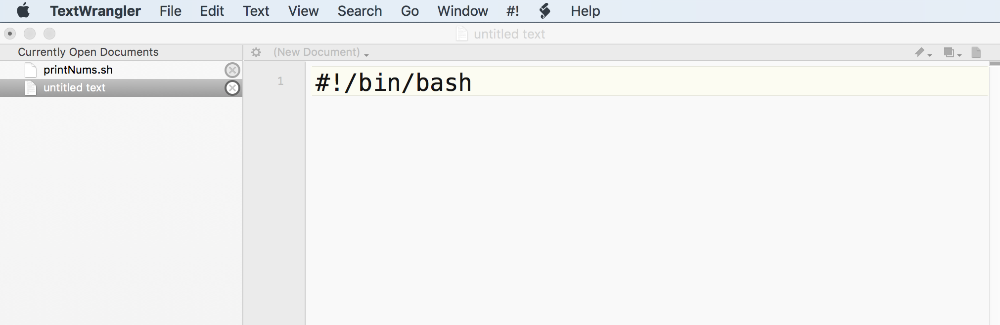

.. _Unix_07_Scripting:

Unix Tutorial #7: Scripting
================

.. note::
 
  Began construction on 05.18.2019, still ongoing
  
  Topics covered: wildcards, scripting
  
  Commands covered: awk

---------------

Combining Commands
***************

So far you have learned how to use for-loops and conditional statements to both automate and make decisions about when to run blocks of code. You'll soon find, however, that large and complex blocks of code are tedious to write out by hand every time you want to run them. It is also difficult to debug a long string of code that you wrote in the Terminal.

Instead, we can put everything into a **script**, or file that contains code. This allows you to make your code compact and easy to move between directories if you need to. It also makes debugging much easier.

Downloading a Text Editor for Coding
****************

Before we begin scripting, you should download an appropriate code editor. Windows users can download Notepad++, and Mac users should download `TextWrangler <https://www.barebones.com/products/textwrangler/>`__ from the Apple Store. It is important to use one of these rather than the default text editor; otherwise, you may run into problems with the carriage returns, which is demonstrated in a video `here <https://www.youtube.com/watch?v=m4p3fYO6dCI>`__.

Writing your First Script
****************

Once you’ve downloaded TextWrangler, open it and write this code on the first line, also known as a **shebang**: ``#!/bin/bash``. It signifies that the following code should be interpreted with the bash shell and follow bash syntax.

 Example of the shebang in a file edited in TextWrangler. The shebang is always written on the first line of the file starting with a pound sign and exclamation mark, followed by an absolute path to the shell that is used to interpret the code.

Next, write one of the for-loops you saw previously, such as this:

::

 for i in 1 2 3; do 
   echo $i; 
 done
 
It is good coding practice to indent the body of a for-loop or conditional statement, usually with a tab or a few spaces. This allows the eye to quickly see the structure of the code and guess where certain commands are located. It is also helpful to include comments with the pound sign: Anything written after the pound sign will not be interpreted by the shell, but is useful for the reader to know what the command is doing. For example, before the loop we could write a comment  about how the following code will print the numbers 1 through 3. Some coders prefer to put a space between each major section of code; this is a stylistic choice that is up to you.

Now click on ``File -> Save As`` and call it ``printNums.sh``, with the .sh extension signifying that the file is a shell script. Save it to the Desktop. In a Terminal, navigate to the Desktop and then type ``bash printNums.sh`` to run it. You can also run the command by typing ``./printNums.sh``. This will run all of the code in the script, just as if you had typed it out by hand. This is a simple example, but you can see how you can add as many lines of code as you want.

Running Larger Scripts
***************

Let’s see how we can run a larger script containing many lines of code. Go to `this link <https://www.github.com/andrewjahn/FSL_Scripts>`__ and click on ``make_FSL_Timings.sh``. Click on the ``Raw`` button to see the raw text. You can either right click anywhere on the page and save this as a script, or you can copy and paste the code into TextWrangler. Save it as ``make_FSL_Timings.sh``, and move it to the Flanker directory. 

Let’s take a look at what this code does. Notice that we have a shebang indicating that the script is written in Bash syntax; we also have comments after each pound sign marking the major sections of the code. The first block of code is a conditional statement that checks whether a file called ``subjList.txt`` exists; if it doesn’t, then list each subject directory and redirect that list of subjects to a file called subjList.txt.

Wildcards
^^^^^^^^^^^^^^^

This brings up an important concept: **Wildcards**. There are two types of wildcards you will often use. The first is an asterisk, which looks for one or more characters. For example, navigate to the Flanker directory and type ``mkdir sub-100``. If you type ``ls -d sub-*`` It will return every directory that starts with sub-, whether it is sub-01 or sub-100. The asterisk wildcard doesn’t discriminate whether the directory is six characters long or six hundred; it will match and return all of them, as long as they start with sub-. The other type of wildcard is the question mark, which matches a single occurrence of any character. If you type ``ls -d sub-??``, it will only return directories with two integers after the dash - in other words, it will return sub-01 through sub-26, but not sub-100.

Text Manipulation with Awk
^^^^^^^^^^^^^^^^

The body of the for-loop contains something else that is new, a command called **awk***. Awk is a text processing command that prints columns from a text file. Here are the basics about how it works: If you go into a subjects’ func directory and type cat ``sub-08_task-flanker_run-1_events.tsv``, it will return all of the text in that file. For our fMRI analysis, we want the columns that specify the onset time and duration, as well as the number 1 as a placeholder in the last column. You can redirect the output of this command into the input for the awk command by using a vertical pipe. Then, you can use conditional statements in awk to print the onset times for specific experimental conditions, and redirect that output into a corresponding text file. This is discussed in more detail in the book chapter in the link below.

Now navigate back to the directory containing all the subjects, remove the sub-100 directory and run the script. It will take a few moments, but it will create timing files for all of your subjects; you can inspect them using the cat command, and they should all look something like this.

Scripts and wildcards give you more flexibility with your code, and can save you countless hours of labor - just imagine typing out each of the commands in our script for each subject. Later on we will use these scripts to automate the analysis of an entire dataset - but to do that, we will need to learn about one more command for manipulating text - the sed command.

-------------

Exercises
************

------------

Video
***********

