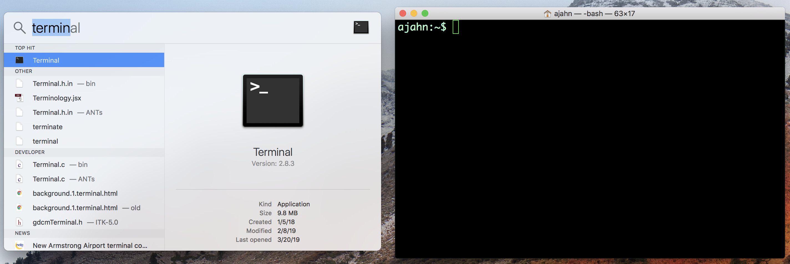

.. _Unix_Intro:

=============
What is Unix?
=============

Unix is an operating system, just like Macintosh or Windows. The major difference between Unix and other operating systems is that it uses a command line interface, or **command line** for short: Instead of pointing and clicking like you would in a Windows or Macintosh machine, you type the commands that you want to run. The command line is typed in a **Terminal**, a graphical interface in which you can only type text. The Terminal emulates (i.e., reproduces the function of) a `console <https://en.wikipedia.org/wiki/System_console>`__.

.. note::

    Linux operating systems (such as Ubuntu) come with a Terminal, as do recent versions of Macintosh operating systems. Windows users will need to download a Terminal emulator such as `Cygwin <https://www.cygwin.com/>`__.

    Command lines come with current versions of Macintosh operating systems. Click on the Finder magnifying glass, and type "Terminal". When you open it, you should see something like the window on the right.

While this may look strange and maybe even tedious, in fact using the command line will allow you to be quicker, more flexible, and more efficient when running programs and analyzing data. You will also need to know Unix in order to use neuroimaging packages that are run from the command line, such as AFNI or FSL. And as you'll see, becoming fluent in programming will save you time, minimize errors, and increase your value as a scientist. 

Video
------------

Click `here <https://www.youtube.com/watch?v=Odn_Ti-tKzI>`__ to see a video introducing you to Unix. When you have finished watching the video, click the "Next" button down below to begin the Unix tutorial series.
